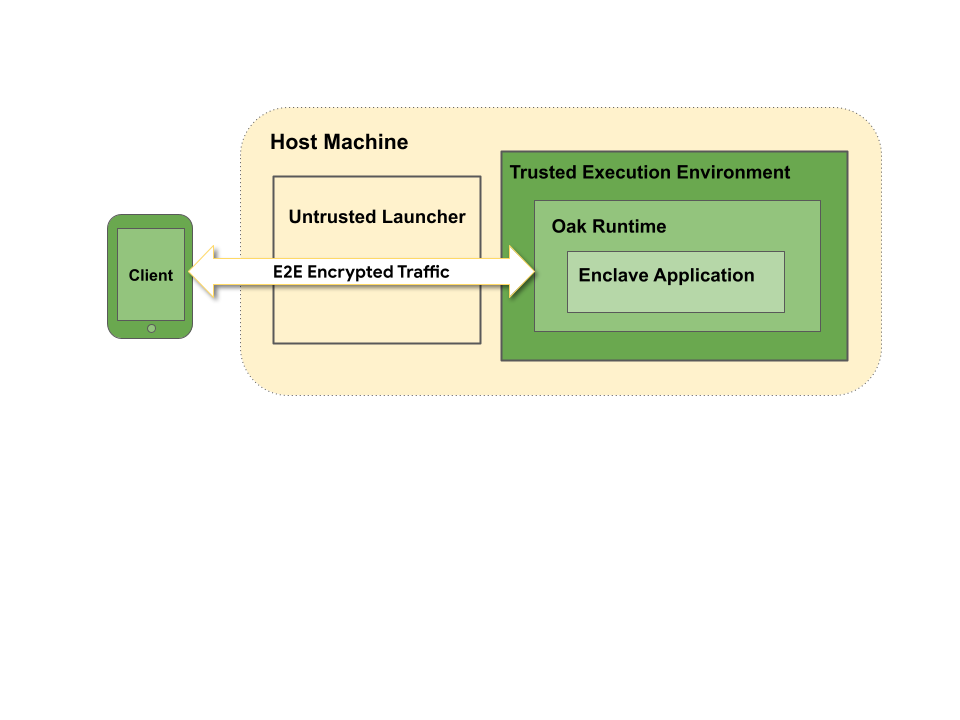

<!-- Oak Logo Start -->
<!-- An HTML element is intentionally used since GitHub recommends this approach to handle different images in dark/light modes. Ref: https://docs.github.com/en/get-started/writing-on-github/getting-started-with-writing-and-formatting-on-github/basic-writing-and-formatting-syntax#specifying-the-theme-an-image-is-shown-to -->
<!-- markdownlint-disable-next-line MD033 -->
<h1><picture><source media="(prefers-color-scheme: dark)" srcset="docs/oak-logo/svgs/oak-logo-negative.svg?sanitize=true"><source media="(prefers-color-scheme: light)" srcset="docs/oak-logo/svgs/oak-logo.svg?sanitize=true"></picture></h1>
<!-- Oak Logo End -->

Project Oak leverages
[Trusted Execution Environment (TEE)](https://en.wikipedia.org/wiki/Trusted_execution_environment)
to provide security and a radical level of transparency around how data is used
and by whom, even in a highly distributed system. Through a combination of
strong isolation from the host, end-to-end encryption,
[Remote Attestation](./docs/remote-attestation.md), open sourcing and
[Transparent Release](https://github.com/project-oak/transparent-release), Oak
allows developers to make verifiable (or falsifiable) claims about server-side
computation that are publicly inspectable.

The following is a simplified architectural diagram.

## Terminology

- **Trusted Computing**: The practice of protecting in-use data by performing
  computing in a confidential environment built on trusted hardware, and
  additionally, offering tools to allow the users and/or their delegate to
  inspect and verify the code (and associated workload) being run in that
  environment. People also often use the term “confidential computing” in
  similar ways.
- **Trusted Execution Environment (TEE)**: An environment for executing code in
  a secure area of a processor. It helps code and data loaded inside it to be
  protected with respect to confidentiality and integrity. Examples of TEE
  secure processors are AMD SEV-SNP and Intel SGX and TDX. Intel SGX is a
  process-based TEE, while AMD SEV-SNP and Intel TDX are VM-based TEEs. Oak uses
  VM-based TEEs only.
- **Remote attestation**: A process to verify the identity and integrity of the
  trusted computing environment and application running in that environment.
  Remote attestation plays a major role in the security guarantees of TEE. It
  ensures that the application is running inside a genuine TEE by proving its
  identity to the client. By using the hardware-based TEE, the root of trust
  relies on hardware built-in crypto keys signed by the hardware vendor. This
  allows the client to not place the trust solely in the service provider
  running the server application, but also in the hardware vendor.
- **Transparent release**: The processes and tools used to either reproduce the
  Oak build externally, or using a trusted builder (e.g.
  [slsa-github-generator](https://github.com/slsa-framework/slsa-github-generator))
  to generate and publish binaries and the non-forgeable metadata about a
  released binary. Along with remote attestation, this release process can be
  used to provide evidence of the integrity and trustworthiness of the runtime
  in the TEE.

## How does Oak work?

In present computing platforms (including virtualized, and cloud platforms),
data may be encrypted at rest and in transit, but they are exposed to any part
of the system that needs to process them. Even if the application is securely
designed and data is encrypted, the operating system kernel (and any component
with privileged access to the machine that handles the data) has unrestricted
access to the machine hardware resources, and can leverage that to bypass any
security mechanism on the machine itself and extract secret keys and data.

Oak is a trusted computing server platform designed to run in VM-based Trusted
Execution Environment (TEE). An application running on Oak, in the TEE hardware,
can process private data confidentially, without the service provider hosting
the server from accessing the data being processed. Oak uses Remote Attestation
and Transparent Release to permit a client to verify workload identity and trace
it to public source code. This enables the application running on Oak to make
external verifiable claims of privacy, security, integrity, information flow,
and functional correctness.

In an Oak environment, a client (e.g. Android, Chrome) connects to an Oak
server, and establishes an end-to-end encrypted channel with an instance of a
Enclave Application, which is remotely attested.

Oak libraries can be composed in different ways to set up a trusted server. One
configuration is the split architecture

- **Host Application**: a binary that runs on the normal (untrusted) server
  environment that acts as the front-end for the Enclave Application, and
  exposes a gRPC endpoint which is externally reachable by the client. This
  binary only ever sees encrypted data, its main job is to create and maintain
  an instance of the Enclave Application in the TEE, and forward the encrypted
  data to and from the Enclave Application. This binary does not need to be
  externally buildable / reproducible and does not need to be trusted by the
  client.
- **Enclave Application**: a binary built from open source code, running on the
  Oak platform. It runs inside the confidential VM on the TEE hardware. The
  Enclave Application handles user data in unencrypted form by decrypting user
  requests and encrypting responses. This is the binary that is associated with
  externally verifiable claims.

At startup, the Enclave Application generates an ephemeral key pair (or,
alternatively, obtains a persistent key pair from a separate Key Provisioning
Service, based on the use case), and binds its public key to a remote
attestation report generated by the TEE (e.g. AMD SEV-SNP or Intel TDX). This
also includes a measurement (i.e. hash) of the Enclave Application running in
the TEE. All this information is bound together in a statement signed by a
secret key that is fused in the hardware by the TEE manufacturer (e.g. AMD,
Intel), and that the service provider does not have access to. The corresponding
public key is published externally by the manufacturer.

A client can verify the identity of the Oak server and its properties before
sending any data to it, by checking the signature generated by the TEE
(controlled by the TEE hardware manufacturer), and encrypt data so that it can
only be decrypted by the attested instance of the Enclave Application.

This "trusted" architecture enables a client to be convinced of the claims made
by the Enclave Application, without having to trust the service provider hosting
the Enclave Application. Furthermore, the service provider would not be able to
swap the Enclave Application binary with a different (potentially malicious) one
without being detected. If the service provider were to introduce a backdoor in
the Enclave Application, it would have to sign the binary and publish it in a
verifiable log via the Transparent Release process, which would make the
backdoor irreversibly visible to external observers.

Oak provides two flavors of VM-based Enclave Applications:

- **Oak Restricted Kernel**: The restricted kernel is a very minimal microkernel
  that only supports a single CPU and a single application. It also places very
  severe restrictions on what the application can do by only exposing a very
  limited set of syscalls to the application. Restricted kernel applications are
  suitable for cases where review of the entire trusted code base inside the VM
  is critical, and the limited features and reduced performance is an acceptable
  trade-off.
- **Oak Containers**: The Enclave Application is provided as part of an OCI
  runtime bundle. This includes a full Linux kernel and a Linux distribution
  with a container runtime engine inside the Enclave VM. Using the OCI runtime
  bundle as a compatibility layer provides a more familiar development
  experience and more flexibility. Oak Containers also supports multiple CPUs in
  the VM and is therefore suitable for cases with high performance requirements.
  The draw-back of this approach is that the size of the entire trusted code
  base running in the enclave VM is significantly increased, and it is not
  feasible for a single reviewer to review the code for the entire Linux kernel
  and Linux distribution. The trust model for his approach relies on the
  security of the broader Linux ecosystem. The additional features and
  flexibility that the Linux kernel provides to the application also makes it
  more difficult to reason about the behavior of an application, which in turn
  makes the review process more complicated.

## Threat Model

We acknowledge that perfect security is impossible. Here we describe the primary
threats the Oak architecture is designed to defend against. We also list threats
that are currently out of scope.

Project Oak’s primary objective is to protect the user data from unauthorized
access from the service provider who host the service in their data center, and
offer proof to the users, or their delegate, that their data can only be used in
accordance with the pre-approved usage policies. Below is a list of actors and
potential adversaries.

### Untrusted

- most hardware (memory, disk, motherboard, network card, external devices)
- Host Operating System (kernel, drivers, libraries, applications)
- Hypervisor / VMM

The service provider may intend to access and exfiltrate users’ private data.
They own the server machines in the data center, therefore have server root
access and are capable of modifying the host machine OS, drivers, hypervisor,
etc. They can also inspect network traffic that contains users’ data.

In the Oak architecture, we treat the host hardware and the host OS operated by
the service provider as untrusted. The data that need to be protected need to be
encrypted when stored in the host OS’s memory system, with the decryption keys
managed by the TEE, not accessible by the service provider hosting the hardware
machines.

The Oak architecture allows applications to make stronger claims by reducing the
need to trust the service operators.

### Trusted-but-verifiable

- Oak trusted platform
- Enclave application

Both Oak platform, and the enclave application that runs on that platform, run
inside the TEE. They have access to unencrypted data. Oak establishes trust for
these components by open sourcing them, and enables external inspection and
verification via
[Transparent Release](https://github.com/project-oak/transparent-release).

### Trusted

- Hardware TEE manufacturer (e.g. AMD, Intel)

The hardware TEE is responsible for memory encryption and decryption, and
generating the remote attestation report, etc. Therefore TEEs, and their
manufacturers, are considered to be the trusted party by the Oak runtime.

### Out of scope

We consider side channels to be out of scope. While we acknowledge that most
existing TEEs have compromises and may be vulnerable to various kinds of attacks
(and therefore we do need to defend against side channels) we leave the
resolution to the respective TEE Manufacturers and other researchers.

We consider attacks that require physical access to the server to be out of
scope. They are expensive, impractical, therefore not scalable. Also, none of
the current Trusted Execution platforms provides full protection against
physical attacks. We rely on service provider's physical datacenter security to
restrict physical access to the servers.

We consider client-side security and protection of user data to be out of scope.
The Oak runtime is designed for server-side TEE.

## Getting involved

We welcome [contributors](docs/CONTRIBUTING.md)! To join our community, we
recommend joining the
[mailing list](https://groups.google.com/g/project-oak-discuss).
