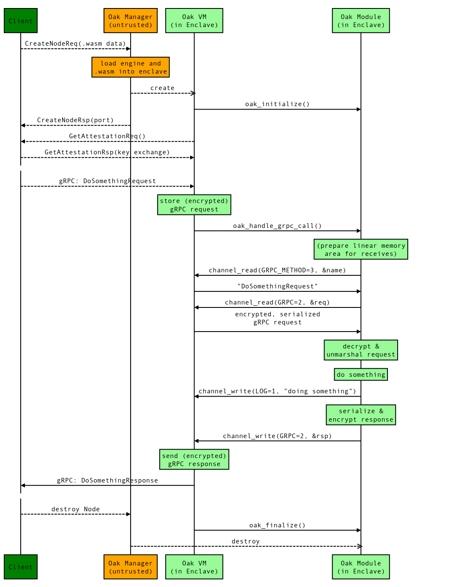
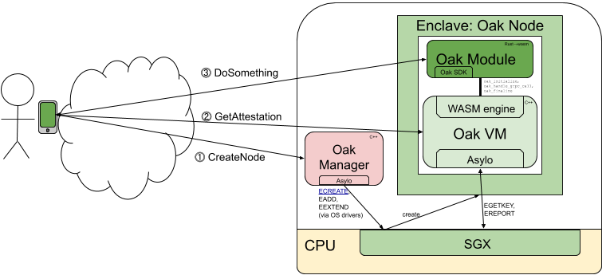

# Project Oak

The goal of Project Oak is to create a specification and a reference
implementation for the secure transfer, storage and processing of data.

In traditional systems, data may be encrypted at rest and in transit, but they
are exposed to any part of the system that needs to process them. Even if the
application is securely designed and data are encrypted, the operating system
kernel (and any component with privileged access to the machine that handles the
data) has unrestricted access to the machine hardware resources, and can
leverage that to bypass any security mechanism on the machine itself and extract
secret keys and data.

As part of Project Oak, data are end-to-end encrypted between _enclaves_, which
are isolated computation compartments that can be created on-demand, and provide
strong confidentiality, integrity, and attestation capabilities via a
combination of hardware and software functionality. Enclaves protect data and
code even from the operating system kernel and privileged software, and are
intended to protect from most hardware attacks.

Additionally, data are associated with policies when they enter the system, and
policies are enforced and propagated as data move from enclave to enclave.

## Terminology

-   **Enclave**: A secure CPU compartment that can be created on-demand,
    containing code and data; it enforces isolation from the host and other
    enclave instances running on the same system. It guarantees
    _confidentiality_ and _integrity_ of both data and code running within it,
    and it is capable of creating hardware-backed _remote attestations_ to prove
    to other parties a measurement (i.e. hash) of the code and data within the
    enclave itself. Also known as Trusted Execution Environment (TEE).
-   **Enclave Manufacturer**: The entity in charge of manufacturing the CPU or
    System on a Chip (SoC) supporting enclaves.
-   **Platform Provider**: The entity in charge of maintaining and running the
    combined hardware and software stack surrounding the TEE, for instance in a
    cloud context.
-   **Trusted Computing Base (TCB)**: The set of hardware, firmware, software
    components critical to the security of the system; bugs or vulnerabilities
    inside the TCB may jeopardise the security properties of the entire system.
-   **Independent Software Vendor (ISV)**: The entity or person providing the
    code for the service running on top of the Project Oak; in the most common
    case this may be a third party developer.

## Threat Model

-   **untrusted**:
    *   most hardware (memory, disk, motherboard, network card, external
        devices)
    *   Operating System (kernel, drivers, libraries, applications)
    *   platform provider (hardware, software, employees)
    *   third-party developers
-   **trusted-but-verifiable**:
    *   Project Oak codebase (and its transitive dependencies)
-   **trusted**:
    *   enclave manufacturer (and therefore at least some hardware / software)
-   **partly or conditionally trusted**:
    *   end users

Side channels are out of scope for Project Oak software implementation. While we
acknowledge that most existing enclaves have compromises and may be vulnerable
to various kinds of attacks (and therefore we do need resistance to side
channels) we leave their resolution to the respective enclave manufacturers and
other researchers.

End users are considered "partly trusted" in that we assume that when two users
exchange data, there is a pre-existing basic trust relationship between them; in
particular we assume that the recipient of the data is not going to
intentionally circumvent robust protection mechanisms on their device in order
to extract the received data.

## Oak VM

The **Oak VM** is currently the core software component of Project Oak; it is
responsible for executing Oak Modules and enforcing policies on top of data, as
well as producing remote attestations for clients. Other models are also
possible.

Each Oak VM instance lives in its own dedicated enclave and is isolated from
both the host as well as other enclaves and Oak VM instances on the same
machine.

## Oak Module

The unit of compilation and execution in Oak is an **Oak Module**. Each Oak
Module is a self-contained
[WebAssembly module](https://webassembly.org/docs/modules/) that is interpreted
by an Oak VM instance as part of an Oak Node.

### WebAssembly

The current version of the Oak VM supports
[WebAssembly](https://webassembly.org) as the first-class target language for
Oak Module development. Developers wishing to run their code as part of Project
Oak need to be able to compile their code to WebAssembly.

WebAssembly has a well-defined, unambiguous
[formal specification](https://webassembly.github.io/spec/core/valid/instructions.html),
and is targeted by most LLVM-based languages (including C++ and Rust), and
others, for example Go.

### WebAssembly Interface

Each Oak Module must expose the following **exported functions** as
[WebAssembly exports](https://webassembly.github.io/spec/core/syntax/modules.html#exports):

-   `oak_initialize: () -> nil`: Invoked when the Oak Manager initializes the
    Oak Node. The Oak VM guarantees that this is invoked exactly once.

-   `oak_finalize: () -> nil`: Invoked when the Oak Manager finalizes the Oak
    Node. Note that this is best effort, and not guaranteed to be invoked before
    the Oak Node is finalized (e.g. in case of sudden shutdown of the host this
    may fail to be invoked). No further interactions with the Oak Node are
    possible after finalization.

-   `oak_handle_grpc_call: () -> nil`: Invoked when a client interacts with the
    Oak Node over gRPC. Each client interaction results in a new invocation of
    this function, and the Oak VM guarantees that concurrent invocations only
    invoke it sequentially, therefore from the point of view of the Oak Node
    these calls will never overlap in time and each execution of this function
    has full access to the underlying internal state until it completes. In the
    future we may relax some of these restrictions, when we can reason more
    accurately about the semantics of concurrent invocations, and how they
    relate to the policy system.

Communication from the Oak Module to the Oak VM and to other modules is
implemented via **channels**. A channel represents a bi-directional stream of
bytes, that the Oak Module can write to and read from using the appropriate host
functions defined below. Each channel is identified by a **handle**, which is
used as a parameter to the corresponding host function calls. Note that channels
do not natively implement any kind of framing, i.e. they do not expose a concept
of messages, just raw bytes.

At each invocation, the following channels are implicitly available to the Oak
Node (see [/oak/server/oak_node.h](oak/server/oak_node.h)):

-   `logging` (handle: 1)
-   `grpc` (handle: 2)
-   `grpc_method` (handle: 3)

Each Oak Module may also optionally rely on zero or more of the following **host
functions** as
[WebAssembly imports](https://webassembly.github.io/spec/core/syntax/modules.html#imports)
(all of them defined in the `oak` module):

-   `channel_read: (i64, i32, i32) -> i32`: Reads data from the specified
    channel.

    *   arg 0: Channel handle
    *   arg 1: Destination buffer address
    *   arg 2: Destination buffer size in bytes
    *   return 0: Number of bytes read

    Similar to
    [`zx_channel_read`](https://fuchsia.googlesource.com/fuchsia/+/refs/heads/master/zircon/docs/syscalls/channel_read.md)
    in Fuchsia.

-   `channel_write: (i64, i32, i32) -> i32`: Writes data to the specified
    channel.

    *   arg 0: Channel handle
    *   arg 1: Source buffer address
    *   arg 2: Source buffer size in bytes
    *   return 0: Number of bytes written

    Similar to
    [`zx_channel_write`](https://fuchsia.googlesource.com/fuchsia/+/refs/heads/master/zircon/docs/syscalls/channel_write.md)
    in Fuchsia.

### Rust SDK

Project Oak provides a Rust SDK with helper functions to facilitate interactions
with the Oak VM from Rust code compiled to WebAssembly. This provides idiomatic
Rust abstractions over the lower level WebAssembly interface.

## Oak Node

An **Oak Node** is an instance of an Oak Module together with a policy
configuration, running on an Oak VM, potentially within an enclave.

Once a new Oak Node is initialized and its endpoint available, one or more
clients (according to the policy configuration) connect to it using individually
end-to-end encrypted, authenticated and attested channels. The remote
attestation process proves to the client that the remote enclave is indeed
running a genuine Oak VM and will therefore obey the policies set on the Oak
Node; the Oak VM itself may then optionally prove additional details about the
Oak Module and its properties, which may require reasoning about its internal
structure.

The Oak Module and the policies associated with an Oak Node are established once
and for all at the time the Oak Node is created by the Oak Manager, and they
cannot be modified once the Oak Node is running. Therefore each client only
needs to verify the attestation once before it starts invoking the Oak Node.

Each Oak Node also encapsulates an internal mutable state, corresponding the
[WebAssembly linear memory](https://webassembly.org/docs/semantics/#linear-memory)
on which the Oak Module operates. Concurrent invocations of the same Oak Node
are serialized so that they do not concurrently access the same underlying
memory, but individual invocations may modify the internal state in such a way
that it is observable in subsequent invocations, potentially by different
clients (assuming this is allowed by the policies associated with the Oak Node
in the first place). Clients may rely on this together with additional
properties related to the Oak Module to decide whether the Oak Node provides
sufficient guarantees for the data they intend to exchange with the Oak Node;
for instance a client may wish to send data to an Oak Node that allows multiple
invocations, but only if it can also be shown that the data can only be
retrieved in sufficiently anonymized form in subsequent invocations by other
clients.

## Oak Manager

The **Oak Manager** creates Oak Nodes running within a platform provider. Note
that the Oak Manager is not part of the TCB: the actual trusted attestation only
happens between client and the Oak Node running in the enclave at execution
time.

A node creation request contains the Oak Module and the policies to run as part
of the newly created Oak Node.

In response to the request, the Oak Manager sends back to the caller details
about the gRPC endpoint of the newly created Oak Node, initialized with the Oak
Module and policy configuration specified in the request.

The following sequence diagram shows a basic flow of requests between a client,
the Oak Manager and an Oak Node.

<!-- From (Google-internal): http://go/sequencediagram/view/5170404486283264 -->

The particular case where the TEE is provided by Intel SGX is shown in the
following system diagram.

<!-- From: -->
<!-- https://docs.google.com/drawings/d/1YJ8Rt-nunZ7NJ9diQswbwjEMAtGfzjGVY9ogwhA7hsI -->

## Policy Configuration

A baseline Oak Node with an empty policy configuration may be considered as a
pure function, executing some computation and returning its result to the
caller, with no side effects allowed.

In order to allow the Oak Node to perform side effects, capabilities are granted
to it that allow the Oak VM to expose the appropriate functionality to the Oak
Module based on the policy configuration specified as part of the creation
request.

### Read / Write

For each invocation of the Oak Node over gRPC, the client may send data to the
Oak Node in the request message, and get data back from the Oak Node in the
response message.

The `read` and `write` policies allow the Oak Node to have access to the input
or output data for a given invocation:

-   the Oak Node is allowed to read input data from the client iff the `read`
    policy is granted to it

-   the Oak Node is allowed to write output data to the client iff the `write`
    policy is granted to it

If neither of these policies is granted to the Oak Node, the Oak Node will still
be invoked, but it will not be able to either read from or write to the client
that performed the invocation.

TODO

### Persistent Storage

TODO

### Logging

TODO

## Remote Attestation

Remote attestation is a core part of Project Oak. When a client connects to an
Oak Node, the two first establish a fresh ephemeral session key, and then they
provide assertions to each other over a channel encrypted with such key; the
client relies on this assertion to determine whether it is connecting to a valid
version of the Oak VM (see below for what constitutes a valid version). In
particular, the attestation includes a _measurement_ (i.e. a hash) of the Oak
Module running in the remote enclave, cryptographically bound to the session
itself.

The client may then infer additional properties about the Oak Module running on
the remote enclave, e.g. by means of "static attestation" certificates that are
produced as a byproduct of compiling the Oak Module source code itself on an
enclave and having the enclave sign a statement that binds the (hash of the)
compiled Oak Module to some high-level properties of the source code.

TODO: Expand on this.

## Oak VM Updates

Under normal circumstances, a client connecting to an Oak Node validates the
attestation it receives from the Oak Node when establishing the connection
channel. The measurement in the attestation report corresponds to the hash of
the code loaded in enclave memory at the time the connection was established.
Because the Oak VM changes relatively infrequently, the list of known
measurements is small enough that the client is able to just check the inclusion
of the received measurement in the list.

Occasionally, a particular version of the Oak VM may be found to contain
security vulnerabilities or bugs, and we would like to prevent further clients
from connecting to servers using such versions.

TODO: Verifiable log of known versions, Binary Transparency, Key Transparency.

## Workflow

Sample flow:

-   ISV writes an Oak Module for the Oak VM using a high-level language and
    compiles it to WebAssembly.
-   The client connects to the Oak Manager, and requests the creation of an Oak
    Node running the compiled Oak Module.
    +   The module code itself is passed as part of the creation request.
-   The Oak Manager creates a new enclave and initializes it with a fresh Oak
    Node, and then seals the enclave. The Oak Node exposes a gRPC endpoint at a
    newly allocated endpoint (host:port). The endpoint gets forwarded to the
    client as part of the creation response.
    +   Note up to this point no sensitive data has been exchanged.
    +   The client still has no guarantees that the endpoint is in fact running
        an Oak VM, as the Oak Manager is itself untrusted.
-   The client connects to the Oak Node endpoint, and exchanges keys using the
    [Asylo assertion framework](https://asylo.dev/docs/reference/proto/identity/asylo.identity.v1.html).
    +   This allows the client to verify the integrity of the Oak Node and the
        fact that it is indeed running an actual Oak VM, and optionally also
        asserting further properties about the remote system (e.g. possession of
        additional secret keys, etc.).
    +   If the client is satisfied with the attestation, it continues with the
        rest of the exchange, otherwise it aborts immediately.
-   The client sends its (potentially sensitive) data to the Oak Node, alongside
    one or more policies that it requires the Oak Node to enforce on the data.
-   The Oak Node receives the data and performs the desired (and pre-determined)
    computation on top of them, and sends the results back to the client.

## Time

TODO: Roughtime

## Development

### Prerequisites

-   Docker: https://docs.docker.com/install
-   Bazel: https://docs.bazel.build/versions/master/install.html
-   Rust: https://rustup.rs/
    +   `curl https://sh.rustup.rs -sSf > /tmp/rustup`
    +   `less /tmp/rustup` (inspect downloaded script before running it)
    +   `sh /tmp/rustup` (follow on-screen instructions -- option 1 is fine to
        start with)
    +   add `source $HOME/.cargo/env` to your shell init script (e.g. `.bashrc`
        or `.zshrc`)
    +   `rustup target add wasm32-unknown-unknown`

[Step by step instructions for installing Oak on Ubuntu 18.04](INSTALL.md)
shows how to install the prerequisites starting off with a clean Ubuntu install.
Note the server runs in the Docker container but the examples run on the host machine.
This means you might be missaing other dependencies like the `protoc` protocol compiler.

### Run Server

The following command builds and runs an Oak Server instance.

`./scripts/run_server_docker`

### Run Client

The following command (run in a separate terminal) compiles an example module
from Rust to WebAssembly, and sends it to the Oak Server running on the same
machine.

`./examples/hello_world/run`
