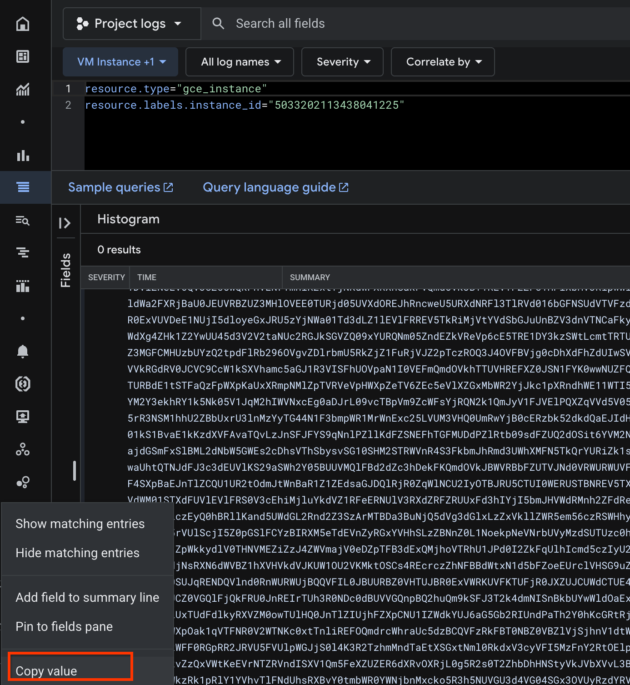

# CTF SHA2

A sample binary that creates a random flag, calculates its SHA2 digest, and
prints this digest out to stderr.

It then uses the flag digest as a nonce to create a Confidential Space
attestation (as a JWT), and prints that out to stderr too.

This binary may be used as a building block for falsifiable claims about various
TEE-related software and hardware components.

## Claim

The main claim about this binary is that for any execution, it generates a
random number, calculates its digest, discards the original number, and creates
an attestation containing the number's digest.

Any falsifier of this claim must consist of just such a number alongside an
attestation containing a nonce which is the digest of that number. That
attestation must successfully verify according to the existing attestation
verification logic, with appropriate reference values (including a specific
image digest confirming this specific binary was used to generate it). If the
provided number is indeed the pre-image of the attestation (JWT) nonce, and all
verification checks pass, then the claim is considered falsified.

Note that a falsification of the claim may be due to one (or more) fundamental
reasons:

- the binary itself has a bug
  - e.g. it does not actually generate a random flag
- Confidential Space has a bug
  - e.g. it allows an attacker to forge an attestation that shows an image
    different from the one actually provided by the attacker; in this case, the
    attacker just needs to compute a flag and its digest locally, and deploy an
    image that gets the flag digest attested while showing the legit image
    digest in the JWT
- attestation verification logic has a bug
  - e.g. it does not correctly validate all the security critical aspects of the
    JWT
- the hash function has a bug
  - e.g. someone finds a way of breaking sha2-256 to calculate pre-images
- other externalities
  - e.g. a quantum computer is constructed that allows brute forcing inputs to
    the sha2-256 to find the pre-image

## Testing

The following script builds the latest version of the binary and Container image
and deploys it to GCP using Terraform.

Note this is not a production set up and it is only used for short-lived
deployments, so we don't check in the terraform state files into this
repository.

```bash
./ctf_sha2/deploy.sh
```

### Inspect the Attestation Token

The `deploy.sh` script will automatically find the attestation token in the
instance logs and print a direct link to <http://jwt.io> to inspect it.

If you wish to inspect the logs manually, you can go to
<https://console.cloud.google.com/compute/instancesDetail/zones/us-west1-b/instances/ctf-sha2-test?project=oak-examples-477357>
and then click on "Logging". Find the entry that printed the attestation token,
expand it, and then click on "Copy Value".



You can then paste the token into <http://jwt.io> or
[CyberChef](<https://gchq.github.io/CyberChef/#recipe=JWT_Decode()>) for
debugging.

[Example token](<https://gchq.github.io/CyberChef/#recipe=JWT_Decode()&input=ZXlKaGJHY2lPaUpTVXpJMU5pSXNJbXRwWkNJNkltd3lUVTUzYUZaV09FY3piVEZHTFhkbk1GcFpVVWMxT1VSVmVVZzFiRGh1TTA5MGMxa3RlSFJxY1RnaUxDSjBlWEFpT2lKS1YxUWlMQ0o0TldNaU9sc2lUVWxKUm0xRVEwTkJORU5uUVhkSlFrRm5TVlJXVkRJeVJtUlVORmg2T0VoUlFrMDFURVZET1VVeVdHZG5ha0ZPUW1kcmNXaHJhVWM1ZHpCQ1FWRnpSa0ZFUTBKcmVrVk1UVUZyUjBFeFZVVkNhRTFEVmxaTmVFVjZRVkpDWjA1V1FrRm5WRU5yVG1oaVIyeHRZak5LZFdGWFJYaEdha0ZWUW1kT1ZrSkJZMVJFVlRGMlpGYzFNRmxYYkhWSlJscHdXbGhqZUVWNlFWSkNaMDVXUWtGdlZFTnJaSFppTW1SeldsTkNUVlJGVFhoR1ZFRlVRbWRPVmtKQmMxUkVSV1IyWWpKa2MxcFRRa1JpUnpreFdrUkZjazFEYTBkQk1WVkZRWGhOYVZFeU9YVmFiV3hyV2xjMU1HRlhSbk5KUms1M1dWZE9iRWxGYkhWa1IxWjVZbGRXYTJGWFJqQmFVMEpFVVZSQlpVWjNNSGxPVkVFMFRVUmpkMDVVVlhkT1JFSmhSbmN3ZVU1VVJYZE5SRmwzVGxSVmQwMTZiR0ZOU1VkVlRWRnpkME5SV1VSV1VWRkhSWGRLVmxWNlJWUk5Ra1ZIUVRGVlJVTkNUVXRSTWtaellWZGFkbU50TlhCWlZFVlhUVUpSUjBFeFZVVkNlRTFPVkZjNU1XSnVVbWhoVnpSblZtMXNiR1I2UlZSTlFrVkhRVEZWUlVOb1RVdFNNamwyV2pKNGJFbEZlRTFSZWtWV1RVSk5SMEV4VlVWRGVFMU5Vakk1ZGxveWVHeEpSVTV6WWpOV2EwMVRkM2RMWjFsRVZsRlJSRVY1VGtSaU1qVnRZVmRTYkdKdVVuQlpWM2RuVlROQ2FGa3lWV2RVUjFab1dtbENSRnBZU2pCaFYxcHdXVEpHTUZwVVEwTkJVMGwzUkZGWlNrdHZXa2xvZG1OT1FWRkZRa0pSUVVSblowVlFRVVJEUTBGUmIwTm5aMFZDUVV3elkxcFZXVGxKYTFCSFQxTkdWR1E0Y1RGeldGRlBSWEZFWkhoV1V6QmljMFF2TXpSU2FVUldkWGc0WkhrMVoyWXdVVTQ1ZDNWMlYydGFOVWMyUkdKa1NHVlpRMDl4WVVSUU5tMDVabmRFWmtWUmVWcDZjRTVUUkUxRFkza3pTV3RMY210VFJUVXhTa1k0TVdWM2RIVmFORFJHWVRsa1pUQXhhRGR2ZUdveFMyOU1WRUZJWlRkcUwyeG5XazEyVFRGRVYweGhWek0xTVZGUFJEYzVjemRsWkZsak5XVm1hVVpHYTJSMU1GSmxWRlUyVFdneGVtVlphbGhZVG5OSlJGSk5UMDVFTm5sVGNYbEdOSEJhYVVOd2RuWjNNR0ZDTUhVemJVWXpRMnRwZEZsUmIyOTZPVmd2WkRscmJtVTVSa1pqWjFGdVJqVkpaMnBUY3pST1EzSjRPVkZCVmpnMGNEaFhkRmhaZFVJd1NWVnJTVVJ3Vml0RVp6ZGxlRmwzYTFwaVYzZGxTREp6VFU5dVNEQm9Sa1oxVVRBNVQzZFRNV1YzWkhVNU9HODNVVGQxZDNOa1ZISkpPR2hRYzA1SFZYRXlRbXM0T0VOQmQwVkJRV0ZQUWpSVVEwSXpha0ZOUW1kT1ZraFNUVUpCWmpoRlFXcEJRVTFDTUVkQk1WVmtSR2RSVjBKQ1ZDOUNjVzFrU1hWaGFtYzVhR0oxUjNWSVNGaFVPVnBhTjFJMFZFRm1RbWRPVmtoVFRVVkhSRUZYWjBKU04xRllLMHd3TlVaRlFVaHdNR3AwYTA5U1psVmtWMmxHZGtKRVEwSnFVVmxKUzNkWlFrSlJWVWhCVVVWRloxbEJkMlpxUWpoQ1oyZHlRbWRGUmtKUlkzZEJiMXAzWVVoU01HTkViM1pNTTBKNVlWaGFhR1JIVm1wWlV6RnFZakkxTUZwWE5UQk1WRmt4V1ZkSk1FMVhWVFJNVkVGM1RVUkJkRTF0U1RGYVF6RnBXWHBLYVV4WFJtcE5NbFpwVFZSVmVWcEhXWHBaZVRWNlpFYzVlVmxYWkd4TWJXUjJZakprYzFwWFJuZGhXRTExV1RJNWRFd3lWVEJOYWxac1RWUlpOVnBVYkdwTmFtUm9XVEpKZUZsNlFUSk1NazVvVEcxT2VXUkVRVTVDWjJ0eGFHdHBSemwzTUVKQlVYTkdRVUZQUTBGblJVRkRaV3BMVVcxU2JrdElSeXRxS3poa2QyMTBXR0lyVDFsVE1GZGFRekl5V1M5Uk9IWlRORTh5YVdwWU0yWTNla2hSWTFrNU5rMDVWMUpxTTJoSVdWTnhjRWcwYURKckwwOXZjVEJwVm05WmNXRnNZalJRTjJrMVFtSnlWMUZKVkVsUFFYWnFWVmQ1VjA1T1pUSTBibmRFUlhsMldGUkVXRU5oZUM5YWMySTJTSFJFVkRKdVQwaE5XVGx2YUM5SUt6Tk9kMnRtY0hGbFpHYzNZalYxWWpnd1YyNVBNVWRLTmtwSWRYaDVWRVV3SzJ0dE1UWjFSMDlVVDFOUkswTm5ka1oyVmpkTGRYVmlTazUyVUZwQ1pHODFVbGd2UTA1clIzTlNNMWhoVTJaQmJVeHJVM2xuTXpZeVRHNDROMUYzYm1wV1IxTXJXbkV4YzI1TFZVTTNWSFEwVW1Sd1lqQjBjRVJ6Yms1MmRrZFFhRUpJZEhwSmVURTVibkUxT0ZrMVpHcFJjVGhNWWxWQ1kxTmxSMWR2U1ZONloydFdaelpuY0d3cmNXaE1PRUprUWpoTmVDdDFPRmt4SzFaTGIyZEtVMXBqWWxWclprSnNja2RCZWxCWWVHSjVNVTV1UVVOMVVETlRia05GV0ZFNFlrbzRlbkZrTjB3MlRHdzFUVTB3TDAxa1MxQnZhRTFrS3pkWFZGQXZhVFF2THpKblNGSkZZUzlxTm5sUFpsbEtkRlpTTkVGaFRHRk1VRGRQWmxSdGIwOXNkRlpVUTJkT1NpdDZZVk0yTkdJek0wazFSelZyUW1aMlRIQm9Zak5RY0ZBM2FYUjJieXMxYjJJMk5DOWtURlpRVFdacFVYcDVORWxwV1Rkd0x5OHpOemhhVTJadldVczRkbEJLYzNjeVltMTBTbEpaVFhOUFMxRktXR1p5ZERndlpFVkJRMmxMTjBKUWVrVlFTWE5YZGlzMlpHdDNiRUpXYWpkR1NtRnhTbEJNTDJkTmJXNUdXRXMyY0Roc1ZUaFNieXN2U0cxMFNITTJTVFJXVm5SNFMzRmtibUpoUm1kM1VXaFhNRk41VGtRcllVUmlaazFzVjJVMFQwazRURWd5YmxGeFNUSklNSFpKWjNkeE1rRTJUV1JaZW5STllYZDZWMWxXZVhCTVp6ZFJRamhUVTI5WGNuUlhjVE5YYUVsWGRuWkNWbEJWUm1wVGR6MGlMQ0pOU1VsSVVFUkRRMEpUVTJkQmQwbENRV2RKVlVGTVpFaGFhWG81ZVdjeE1qUkpWMEV3YVVodFFUTkpkRkozYzNkRVVWbEtTMjlhU1doMlkwNUJVVVZNUWxGQmQyZFpjM2hEZWtGS1FtZE9Wa0pCV1ZSQmJGWlVUVkpOZDBWUldVUldVVkZKUlhkd1JGbFhlSEJhYlRsNVltMXNhRTFTV1hkR1FWbEVWbEZSU0VWM01VNWlNMVoxWkVkR2NHSnBRbGRoVjFZelRWSk5kMFZSV1VSV1VWRkxSWGR3U0dJeU9XNWlSMVZuVkVWNFJFMVNWWGRGZDFsRVZsRlJURVYzZUVoaU1qbHVZa2RWWjFFeWVIWmtWMUY0U1hwQmFFSm5UbFpDUVUxVVIydE9kbUp0V25CYVIxWjFaRWRzYUdKRFFsUmpSMFpxV2xOQ1UySXlPVEJKUlU1Q1RVSTBXRVJVU1RCTlJFVjVUWHBGTTA1VWEzaE9NVzlZUkZSSk0wMUVSWGxOZWtWNFRXcFZlazVHYjNkbldrMTRRM3BCU2tKblRsWkNRVmxVUVd4V1ZFMVNUWGRGVVZsRVZsRlJTVVYzY0VSWlYzaHdXbTA1ZVdKdGJHaE5VbGwzUmtGWlJGWlJVVWhGZHpGT1lqTldkV1JIUm5CaWFVSlhZVmRXTTAxU1RYZEZVVmxFVmxGUlMwVjNjRWhpTWpsdVlrZFZaMVJGZUVSTlVsVjNSWGRaUkZaUlVVeEZkM2hJWWpJNWJtSkhWV2RSTW5oMlpGZFJlRXQ2UVhCQ1owNVdRa0ZOVkVsclRuWmliVnB3V2tkV2RXUkhiR2hpUTBKVVkwZEdhbHBUUWtwaWJsSnNZMjB4YkZwSGJHaGtSMVZuVVRCRmQyZG5TV2xOUVRCSFExTnhSMU5KWWpORVVVVkNRVkZWUVVFMFNVTkVkMEYzWjJkSlMwRnZTVU5CVVVOUlVXNW5kbXRYZEVKTGN6RXlRMGhCUmxsS2FuZDVVV2RHTDJSbmQyWjNTekFyTVRCRGEzQnVOalE1ZFZnM2RHbHhMelp4VmtsbFpXUjVlbTU2Y3pSU1dIaHlSR2hHUkdZMWQxUlNVbUZuT1RGVmVYRTRaWEp5WVM5c2JTdG1RVFJYVlROdVExVmlRa1p4Um5ONmNDOW1halpoWVRrMVFVSkZkRWhsUTJZNGRVTjNNRFpzVUhNNGJYQm5jMGRDTjJGc2NqTldkWEZrUjJka1dqQnNWMnQ2TjFOMVJITm1iVGgzYVVwamFYRmtSRWRwVms1clZVbFNjakk1WjBwR1NsRkNZekJJUlhNNWVUZEVWblp5Ukd4WVZIaFNMelpCTm5aMEwxTm9la3BOZVZOcmJVVnlNemRTVVRVemMwaG1WVzVpTkZWUFJUZEdOR3QyZFVGR01VNUpja1JQYUhkcWFXeDVaV3B1Wm5SRlIxQnNNM2hzYzBoWFRYZFplU3MwZUN0Wk1YTlVjbFJRVFVGdk5tSm1lRlprYUhscE5tVXlXVWxxZW5wdVJXZHZhRkZNZEdsbVNqbEJSV2RNT1VvelRXTnFkalpsZFRsSWJHdFNPR1Z3UTFacFdra3lkbFYwVEhOVk1FWmlaeko0WldWbWFqVjBlRFpwVEZCM2RFeFFNamhvVlRSaFUxSlBkMEkyWmtGcVVsaEljbWQ1Y3pJeVUyZ3JPV3RFTTFBcmFWWkNXVk01UkVoblZrNUpha0kzUlhwR1ltRjFPSEpuTkZWT1drOWtNRVZsZERCR01VUlZUamxqS3lzMWVsaHJibmxWUlRkcmFIWk1hbTFaUTBnMlJVTXhPVGN2TTJoRVluZzVLMDlaVFdRMU5rSlhZemx0TUdwVFlqRXJhbkJhTVc5SmJtOWFURWhWZGpOc1JYTjZkV1ZCWjFoWFZIVmtkVkpLVVcxT1UyVktNa3RPU0NzNFJFY3JjelpoTkZCQmRXdHhOMWQ1YkZab2VFVXJjbFZIU0c5dVpGWjFUemRoU2s5V2RUVkljQzl0U0VVemNXNXdRVzVPWWtkeVNraFhiMnhzVURGdmJYVm9UVFZLV0VJM2QzZHpjREpNU0hoWFJ6WTBVVGgxYlZsUVEyTnljbE5oYTBKamNVNXlhVmhPV2xSNGQxQm9VRmR2VjBkVE1tTnNSalZtZEZSMVlUWTBiekJVZDBsRVFWRkJRbTgwU1VKcVJFTkRRVmxuZDBSbldVUldVakJRUVZGSUwwSkJVVVJCWjBWSFRVSkJSMEV4VldSS1VWRktUVUZqUjBKWFpVSkNVV2RDVFVFNFIwRXhWV1JGZDBWQ0wzZFJSazFCVFVKQlpqaDNTRkZaUkZaU01FOUNRbGxGUmtoMFFtWTBkbFJyVlZGQlpXNVRUekpSTlVZNVVqRmhTVmM0UlUxQ09FZEJNVlZrU1hkUldVMUNZVUZHUW1adWQxUm9UMnMwWkdKS05sTnljbmxISzJ0MlVEVnlWSGtyVFVsSFRrSm5aM0pDWjBWR1FsRmpRa0ZSVTBKblJFSXJUVWgzUjBORGMwZEJVVlZHUW5wQlEyaHVRbTlrU0ZKM1QyazRkbU5JU25Ca2JVWXdXbGRPYUV4WFRuWmlibEpzWW01UmRFNXFWbWhaVkZreVdXcFJkRTFFUVhkTlF6QjVUWHBHYWt4WFJtMU9ha2wwVFZSU2FrMVVVbXhhVkZreVRrUlZNRXh1VGpCaU0wcG9XakpWZFZveU9YWmFNbmhzV1ZoQ2NHTjVOV3BpTWpCMldrUk5lRTVIVm14T1IxcHRUa1JvYTFsNlRtcE5hbFV4VFVkRmRsa3lSWFZaTTBvd1RVbEhRMEpuVGxaSVVqaEZaWHBDTlUxSVpXZGtZVUo2YUc1R2IyUklVbmRQYVRoMlkwaEtjR1J0UmpCYVYwNW9URmRPZG1KdVVteGlibEYwVG1wV2FGbFVXVEpaYWxGMFRVUkJkMDFETUhsTmVrWnFURmRHYlU1cVNYUk5WRkpxVFZSU2JGcFVXVEpPUkZVd1RHNU9NR0l6U21oYU1sVjFXakk1ZGxveWVHeFpXRUp3WTNrMWFtSXlNSFphUkUxNFRrZFdiRTVIV20xT1JHaHJXWHBPYWsxcVZURk5SMFYyV1ROS2MweHRUbmxpUkVGT1FtZHJjV2hyYVVjNWR6QkNRVkZ6UmtGQlQwTkJaMFZCWmxWalNqaG5WMWR0V1N0SGFqVlBXbWhCYVZScU9GWkxSRGxoVmxGUmJGQXpSRnB6V1RWNlRXeHlZbE0yVGtKc2F6Um1jMDUwZHk5a2QwMUdXSFJYZVVsNmIzUTBSVkIwUVROaVYxaGxkMHBSWjFwVVkxQXJaR3d4Y1VneVpraHpSWFIzWjBSMmVERXJlVTlYYVVwek9XMWhhRGhTY0Rsc2VIYzJXRkYwUkdwUlIySlJWVTVGVlVscFdHSmpTMGw0SzNSMlR6aG1NbmRUYUV0WFNHeHRObWwwUmtkeFYzY3lWRkk1TXpGblkyUnRPRWxwVWtGQmMyZHdURVpaZUhjdmJ6aElWbE14Um05RFNtMVNZalVyU21SbVp6SkNRMFJzT1NzNU1UbEtiMDlTYjNnNGFscHVkVU5hZFc1aU1HaG5PR1JtVVdGeWJHOHlaSFEwUzNWbGNIcHRValphVVdkUk5qTlZaRVl2T1VKM1dIVkNjamx5YVVvekwycFdUVVI1VWtSdVpWa3ZaelF4Vld0S2VFVnJOVFpSVm5kSVNYVjFRbTVGZVhaVVpFUjZkWFJ2T1hSakwwZzVSMnMwVDJaaGJEaEhOU3R5VmtKVmJYVnZMM0JFWm1sVlZEVllUVVpUVmtoMGFWYzRZMGRoZFVOclduQjFabUpJTkhwRlFXYzJSRWRwYTBGcmRpdEdibXh5VkZobGIwcFlhekE0Y0M5WlFucDVOWGxVWjNCU2JuazVhMFJuV25SblkyaFBSRW8yWTFsRFQzWnJURFY0UWxaT05USjBUV296TDBSS0x5ODVRa2hSUzAxRGJXa3pSazFwUmxZMVlWaHZUbEZOZFVoc1JYQnZZMHRtYldSMFlXTmpibk14Y2tvNVIzaDVOVVZHVTNkNFZHMDRTR3gzT1ZVeVJ6ZFlSVkpxYlUxb2JHTnNkMnRsVlUxblNISTBOM1JzTVd4UFN6ZEhaR2xyTldORVFURlFUM3BUTm5oRU5HRkpZa05TVm5wU1Jtb3haVlZVUTFsQlkzcFBjRTlaYW5BeVFWaFVSMEpJVFhwVU5XbGtXV05NWVZGb0wzbEZaRU40VjFoR0x6bFVaSFJCT0c5MmQyWnFhblJPTm1KTGIyY3ZXRkZ3UlU1MVQyMWFSMFY0WkRkSWRFMDVibGxyZEVSaVFYSkVWa3RhTTNJek4weHVUMk5ZVWxVelNFWlRWV3M5SWl3aVRVbEpSME5FUTBOQkwwTm5RWGRKUWtGblNWUlpRblpTZVRWbk9XRlpXVTFvTjNSS1V6ZHdSbmRoWmt3MmFrRk9RbWRyY1docmFVYzVkekJDUVZGelJrRkVRMEpwZWtWTVRVRnJSMEV4VlVWQ2FFMURWbFpOZUVWNlFWSkNaMDVXUWtGblZFTnJUbWhpUjJ4dFlqTktkV0ZYUlhoR2FrRlZRbWRPVmtKQlkxUkVWVEYyWkZjMU1GbFhiSFZKUmxwd1dsaGplRVY2UVZKQ1owNVdRa0Z2VkVOclpIWmlNbVJ6V2xOQ1RWUkZUWGhHVkVGVVFtZE9Wa0pCYzFSRVJXUjJZakprYzFwVFFrUmlSemt4V2tSRmFrMURSVWRCTVZWRlFYaE5ZVkV5T1hWYWJXeHJXbGMxTUdGWFJuTkpSazUzV1ZkT2JFbEdTblppTTFGblVUQkZkMGhvWTA1TmFsRjNUVlJGTlUxcVNYaE5SRlYzVjJoalRrMTZVWGROVkVVeVRXcEplRTFFVVRWWGFrTkNhWHBGVEUxQmEwZEJNVlZGUW1oTlExWldUWGhGZWtGU1FtZE9Wa0pCWjFSRGEwNW9Za2RzYldJelNuVmhWMFY0Um1wQlZVSm5UbFpDUVdOVVJGVXhkbVJYTlRCWlYyeDFTVVphY0ZwWVkzaEZla0ZTUW1kT1ZrSkJiMVJEYTJSMllqSmtjMXBUUWsxVVJVMTRSbFJCVkVKblRsWkNRWE5VUkVWa2RtSXlaSE5hVTBKRVlrYzVNVnBFUldwTlEwVkhRVEZWUlVGNFRXRlJNamwxV20xc2ExcFhOVEJoVjBaelNVWk9kMWxYVG14SlJrcDJZak5SWjFFd1JYZG5aMGxwVFVFd1IwTlRjVWRUU1dJelJGRkZRa0ZSVlVGQk5FbERSSGRCZDJkblNVdEJiMGxEUVZGRGRsSjFXbUZ6WTNwQmNXaE5XbVV4VDBSSVNqWk5Sa3hZT0VWWlZsWXJVazQzZUdsUE9VZHdkVUUxTTJsNmJEbFBlR2R3TTA1WWFXc3pSbUpaYmlzM1ltTkphMDFOVTFGd1EzSTJTekJxWWxOUlExcFVObVExVURWUVNsUTFSSEJPUjFscVRFaHJWelkzTDJac0swSjFOMlZUVFdJd2NWSkRZVEZxVXlzelQyaE9TemQwTjFOSllVaHRNVmhrYlZOU1oyaHFkMjluYkV0U2RXc3pRMGR5UmpSYWFXRTVVbU5GTDNBeVRWVTJPVWQ1U2xwd2NVaFpkMVJ3YkU1eU0zZzBla1lyTW01S2F6ZzJSM2wzUkZBcmMwZDNVMUJYWm1OdGNWa3dORlpSUkRkYVVFUkZXbG92Y1dkNlpHOU1OV2xzUlRreVpWRnVRWE41S3padE5reDRRa1ZJU0ZaalJuQm1SSFJPVmxWSmRESldUVU5YVEVKbFQwdFZVV051Tldwek56VTJlR0pzU1c1eGR5OVJkRkZTVWpCQmJqQjVabEpxUW5WSGRtMU5ha0YzUlZSRWJ6VkZWRmt2Wm1NcmJtSlJWbGxLZWs1UlZHTTVSVTl3UmtaWFVIQjNMMXBxUm1OT09VRnRibVJrZUZsVlJWUkdXRkJ0UWxsbGNrMWxlakJNUzA1MFIzQm1TMWxJU0doTlRWUkpNMjFxTUcwdlZqbG1RMkptYURKWllrSlZiazFUTWxOM1pESXdXVk5KVFdrdlNHbEhZWEZQY0VkVmNWaE5aVkZXZHpkd2FFZFVVek5SV1VzNFdrMDJOWE5ETDFGb1NWRjZXR1J6YVV4RVowWkNhWFJXYm14SmRUTnNTWFkyUTNWcFNIWllaVk5LUWxKc1VuaFJPRloxSzNRMlNqZG9RbVJzTUdWMFYwSkxRWFU1Vm5ScE5EWmhaalZqYWtNd00yUnpjR3RJVWpOTlFWVkhZM0pNVjBWVWExRXdiWE5SUVV0MlNVRnNkM2xSVWt4MVVVOUpOVVEyY0VZck5tRm1NVTVpYkN0MlVqZHpURU5pUkZka1RYRnRNVVU1V0RaTGVVWkxaRFpsTTNKdVJUbFBOR1JyUmtwd016VlhkbEl5WjNGSlFXdFZiMkVyVm5FeFRWaE1SbGxITkdsdFlXNWFTMGd3YVdkeVNXSnNZbUYzVWtOeU0wZHlNalJHV0ZGSlJFRlJRVUp2TWsxM1dWUkJUMEpuVGxaSVVUaENRV1k0UlVKQlRVTkJVVmwzUkhkWlJGWlNNRlJCVVVndlFrRlZkMEYzUlVJdmVrRmtRbWRPVmtoUk5FVkdaMUZWUml0bVFrOUZObFJvTVhOdWNFdDFka2xpTmxNNEwyMTBVRXcwZDBoM1dVUldVakJxUWtKbmQwWnZRVlZHSzJaQ1QwVTJWR2d4YzI1d1MzVjJTV0kyVXpndmJYUlFURFIzUkZGWlNrdHZXa2xvZG1OT1FWRkZURUpSUVVSblowbENRVWQwUTNWV05XVkllRmRqWm1aNWJFczVSMUIxYldGRU5sbHFaR056TnpaTFJFSmxNMjFyZVRWSmRFSkpja1ZQWlZweE0zbzBOM3BOTkdSaVMxcElhRVoxYjNFMGVVRmhUekZOZVVGd2JrY3dkemwzU1ZGTVFrUnVaRWx2ZG5ScmR6WnFPUzgyTkdGeFVGZHdUbUZ2UWpWTlFqQlRZV2hEVlVOblNUZ3pSSGc1VTFKeFIyMXFVRWt2VFZSTlpuZEVUR1JGTlVWR09XZEdiVlpKYjBnMk1sbHVSekpoWVM5ell6WnRMemgzU1VzNFYzUlVTbUY2UlVreE5pODRSMUJITkZwVmFIZFVObUZTTTBsSFIyNUZRbEJOWWsxa05WWmFVVEJJZDFaaVNFSkxWMHN6VlhscllWTkRlRzVGWnpoMVlVNTRMM0pvVG1GUFYzVlhkRzl6TkhGTU1EQmtXWGxIVmpkYVdHYzBabkJCY1RjeU5EUlJWV2RyVjFaQmRGWmpWVEpUVUVKcVJHUXpNRTlHU0VGVGJtVnVSRWhTZWxGa1QzUklZWGhNY0RSaE5GZGhXVE5xWWpKV05sTnVNMHhtUlRoNlUzazJSMlYyZUcxT1EwOUpWMWN6ZUc1UVJqaHlkMHQ2TkVGQ1JWQnhSVU5sTXpkNmVuVXpWekZ1ZWxwQlJuUmthMmhRUWs1dWJGZFphMGwxYzFSTmRGVXJPSFkyUlZCTGNFZEpTVkp3YUhCaFJHaDBSMUJLVVhWcmNFVk9UMlpyTWpjeU9HeGxibEI1WTFKbWFuaDNRVGsyVlV0WGNUQmtTMXBETkRWTmQwSkZTemxLYm1kdU9GRmpVRzF3VUcxNE4zQlRUV3RUZUVWWU1sWnZjekpLVG1GT2JVTkxTbVF5Vm1GWWVqaE5Oa1l5WTNoelkxSmthRGxVWWtGWlFXcEhSVVZxUlRGdVRGVklNbGxJUkZNNFdUZDRXVTVHU1VSVFJtRktRV3h4UjJORFZXSjZha2RvY25kSVIybzBkbTlVWlRsYWRteHRibWR5WTBFdmNIUlRkVUpwWkhaemJsSkVkMnRPVUV4dmQwTmtNRTV4ZUZsWlUweE9URGRIY205WlEwWlFlRzlDY0hJckt5czBkbk5EWVZoaGJHSnpPR2xLZUdSVk1rVlFjVWMwVFVJMGVGZExXV2QxZVZRMVEyNUtkV3g0VTBNMVExUXhJbDE5LmV5SmhkV1FpT2lKNk1EZ3pPREUwTnpVNU16ZzJNRFE1T1RZM05EWWlMQ0psZUhBaU9qRTNOVFE1TVRZd016UXNJbWxoZENJNk1UYzFORGt4TWpRek5Dd2lhWE56SWpvaWFIUjBjSE02THk5amIyNW1hV1JsYm5ScFlXeGpiMjF3ZFhScGJtY3VaMjl2WjJ4bFlYQnBjeTVqYjIwaUxDSnVZbVlpT2pFM05UUTVNVEkwTXpRc0luTjFZaUk2SW1oMGRIQnpPaTh2ZDNkM0xtZHZiMmRzWldGd2FYTXVZMjl0TDJOdmJYQjFkR1V2ZGpFdmNISnZhbVZqZEhNdmIyRnJMV1Y0WVcxd2JHVnpMVFEzTnpNMU55OTZiMjVsY3k5MWN5MTNaWE4wTVMxaUwybHVjM1JoYm1ObGN5OWpkR1l0YzJoaE1pMTBaWE4wSWl3aVpXRjBYMjV2Ym1ObElqb2lORFUwTlRJeE1XSTJORFpqTVRreU5UZzRPVFF4Wm1RMk1XTXhZVEJsT1RCbFpUUXpNek00TkRKbU9HWmxOalE0TXpabFpUVmlOalJrTldNNU9XWTRPU0lzSW1WaGRGOXdjbTltYVd4bElqb2lhSFIwY0hNNkx5OWpiRzkxWkM1bmIyOW5iR1V1WTI5dEwyTnZibVpwWkdWdWRHbGhiQzFqYjIxd2RYUnBibWN2WTI5dVptbGtaVzUwYVdGc0xYTndZV05sTDJSdlkzTXZjbVZtWlhKbGJtTmxMM1J2YTJWdUxXTnNZV2x0Y3lJc0luTmxZMkp2YjNRaU9uUnlkV1VzSW05bGJXbGtJam94TVRFeU9Td2lhSGR0YjJSbGJDSTZJa2REVUY5SlRsUkZURjlVUkZnaUxDSnpkMjVoYldVaU9pSkRUMDVHU1VSRlRsUkpRVXhmVTFCQlEwVWlMQ0p6ZDNabGNuTnBiMjRpT2xzaU1qVXdNekF4SWwwc0ltRjBkR1Z6ZEdWeVgzUmpZaUk2V3lKSlRsUkZUQ0pkTENKa1ltZHpkR0YwSWpvaVpHbHpZV0pzWldRdGMybHVZMlV0WW05dmRDSXNJbk4xWW0xdlpITWlPbnNpWTI5dVptbGtaVzUwYVdGc1gzTndZV05sSWpwN0luTjFjSEJ2Y25SZllYUjBjbWxpZFhSbGN5STZXeUpNUVZSRlUxUWlMQ0pUVkVGQ1RFVWlMQ0pWVTBGQ1RFVWlYU3dpYlc5dWFYUnZjbWx1WjE5bGJtRmliR1ZrSWpwN0ltMWxiVzl5ZVNJNlptRnNjMlY5ZlN3aVkyOXVkR0ZwYm1WeUlqcDdJbWx0WVdkbFgzSmxabVZ5Wlc1alpTSTZJbVYxY205d1pTMTNaWE4wTVMxa2IyTnJaWEl1Y0d0bkxtUmxkaTl2WVdzdFpYaGhiWEJzWlhNdE5EYzNNelUzTDJNd2JqYzBNVzR6Y2kweGJUUTJNelV2WTNSbVgzTm9ZVEpBYzJoaE1qVTJPakV3WVRjNE16UmhNVEV3WlRrek1qRmtOekExTldJNE1XWmtaV0kzTnpFM09UTXlZVGt5WmpGa056STJZbVZrTWpJelpUa3dZVEUyWkdReE5qWmpOemdpTENKcGJXRm5aVjlrYVdkbGMzUWlPaUp6YUdFeU5UWTZNVEJoTnpnek5HRXhNVEJsT1RNeU1XUTNNRFUxWWpneFptUmxZamMzTVRjNU16SmhPVEptTVdRM01qWmlaV1F5TWpObE9UQmhNVFprWkRFMk5tTTNPQ0lzSW5KbGMzUmhjblJmY0c5c2FXTjVJam9pVG1WMlpYSWlMQ0pwYldGblpWOXBaQ0k2SW5Ob1lUSTFOam8xTURNeE1XWm1OakJtWmpRM01tSTNaV0V5TUdaak0yVmlNRFUyTnpGbU1USTBORE0wT1RSak1tSTNPRGRtWWpBMFpUWTVNRFZsWXpreU5HWTVabVZtSWl3aVpXNTJJanA3SWtoUFUxUk9RVTFGSWpvaVkzUm1MWE5vWVRJdGRHVnpkQ0lzSWxCQlZFZ2lPaUl2ZFhOeUwyeHZZMkZzTDNOaWFXNDZMM1Z6Y2k5c2IyTmhiQzlpYVc0NkwzVnpjaTl6WW1sdU9pOTFjM0l2WW1sdU9pOXpZbWx1T2k5aWFXNGlMQ0pUVTB4ZlEwVlNWRjlHU1V4Rklqb2lMMlYwWXk5emMyd3ZZMlZ5ZEhNdlkyRXRZMlZ5ZEdsbWFXTmhkR1Z6TG1OeWRDSjlMQ0poY21keklqcGJJaTkxYzNJdmJHOWpZV3d2WW1sdUwyTjBabDl6YUdFeUlsMTlMQ0puWTJVaU9uc2llbTl1WlNJNkluVnpMWGRsYzNReExXSWlMQ0p3Y205cVpXTjBYMmxrSWpvaWIyRnJMV1Y0WVcxd2JHVnpMVFEzTnpNMU55SXNJbkJ5YjJwbFkzUmZiblZ0WW1WeUlqb2lOekkwTkRZM01ERXdOVFU1SWl3aWFXNXpkR0Z1WTJWZmJtRnRaU0k2SW1OMFppMXphR0V5TFhSbGMzUWlMQ0pwYm5OMFlXNWpaVjlwWkNJNklqVXdNek15TURJeE1UTTBNemd3TkRFeU1qVWlmWDBzSW5Sa2VDSTZleUpuWTNCZllYUjBaWE4wWlhKZmRHTmlYM04wWVhSMWN5STZJbFZ3Vkc5RVlYUmxJaXdpWjJOd1gyRjBkR1Z6ZEdWeVgzUmpZbDlrWVhSbElqb2lNakF5TkMwd015MHhNMVF3TURvd01Eb3dNRm9pZlN3aVoyOXZaMnhsWDNObGNuWnBZMlZmWVdOamIzVnVkSE1pT2xzaU56STBORFkzTURFd05UVTVMV052YlhCMWRHVkFaR1YyWld4dmNHVnlMbWR6WlhKMmFXTmxZV05qYjNWdWRDNWpiMjBpWFgwLmxNN2x0NUNpejkzVGhQdTlXNE1kLV9vekJOSmdIVmN3WG9ZcUNUcWRBWmY4QXV2aFZuY3ZDZjJFcHhhcWM0V2pKRFFfRWFDMTRQVnpmS212TFhkVWtkeWp2dHBRd3VLVnI5TUtYNFRjZ2hyZHNQTHpyOUFhZGRjZzl3X19SUWl6QU9jM29Za0N3MWtPdGpYQXNKQVluZ0tWU1FZd2ktUlNCZG9XMzlKd19vRVZ3MWFQMlRpVUx5ZUt5RWYwM0lKaDBBb2FDaWUyLUVwbDhnYWFwMjNFS0N1SW92aEtDSEptczBhNy1uRVRrdUdoNzRabDdqcjBMMkFlQWUzUjVKY1QwZFY0QUVTX2tLOWpYeTNRWlRSNnRMX3k3TXo4al81c3BzUjBXa1dadXZtZHJ3YVZKNmtrckd0RFNuQjdUY3p2TjByMkFKUm41emlJemMyelJnOHB4QQ&ieol=CRLF>)
