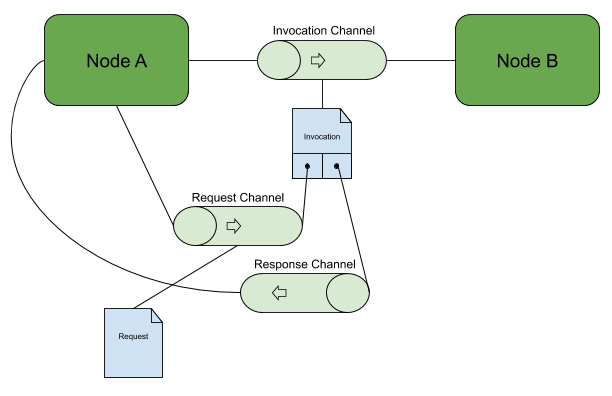
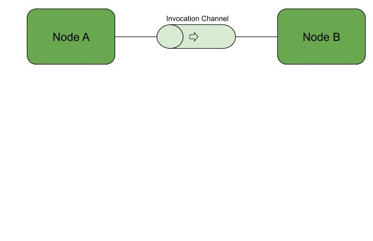

# Oak Concepts

- [Oak Runtime](#oak-runtime)
- [Nodes](#nodes)
  - [WebAssembly](#webassembly)
- [Channels](#channels)
  - [Orphaned Channels](#orphaned-channels)
  - [Invocations](#invocations)
- [Labels](#labels)
- [Pseudo-Nodes](#pseudo-nodes)
- [Oak Application](#oak-application)
- [Remote Attestation](#remote-attestation)
- [Time](#time)

## Oak Runtime

The **Oak Runtime** is the core software component of Project Oak; it is
responsible for executing Oak Modules and enforcing policies on top of data, as
well as producing remote attestations for clients.

Each Oak Runtime instance lives in its own dedicated enclave and is isolated
from both the host as well as other enclaves and Oak Runtime instances on the
same machine.

<!-- From: -->
<!-- https://docs.google.com/drawings/d/1YJ8Rt-nunZ7NJ9diQswbwjEMAtGfzjGVY9ogwhA7hsI -->

## Nodes

The unit of execution in Oak is an **Oak Node**. The code for an Oak Node is a
self-contained [WebAssembly module](https://webassembly.org/docs/modules/) that
is interpreted by an Oak Runtime instance as part of an Oak Application.

Each running Oak Node has a single thread of execution, and also encapsulates an
internal mutable state, corresponding the
[WebAssembly linear memory](https://webassembly.org/docs/semantics/#linear-memory)
on which the Oak Module operates.

This single-threaded execution means that external invocations of the same Oak
Node are inherently serialized; however, the effect of one invocation may modify
internal state and so affect the result of a subsequent external request (by the
same client or a different client).

Clients may therefore wish to only make use of an Oak Node that allows multiple
invocations if it can be shown that the submitted data can only be retrieved in
sufficiently anonymized form in subsequent invocations by other clients.

### WebAssembly

The current version of the Oak Runtime supports
[WebAssembly](https://webassembly.org) as the first-class target language for
Oak Module development. Independent Software Vendor (ISVs) wishing to run their
code as part of Project Oak need to be able to compile their code to
WebAssembly.

WebAssembly has a well-defined, unambiguous
[formal specification](https://webassembly.github.io/spec/core/valid/instructions.html),
and is targeted by most LLVM-based languages (including C++ and Rust), and
others, for example Go.

## Channels

Communication from an Oak Node to the Oak Runtime and to other Nodes is
implemented via **Channels**. A Channel represents a uni-directional stream of
messages, with a receive half and a send half that an Oak Node can read from or
write to respectively. Each half of a Channel is identified by a **handle**,
which is used as a parameter to the corresponding
[host function](abi.md#host-functions) calls. Channel handles are integer values
that are specific to a particular Node (like per-process UNIX file descriptors),
so handle value 3 for Node A identifies a different Channel than handle value 3
for Node B (unless there happens to be a coincidence of numbering).

The messages that are sent over Channels hold two types of content, data and
handles. The data component is just a collection of bytes, but the handles
component allows references to underlying Channels to be copied between Nodes.

The Node that sends a message includes handle values from its own per-Node
numbering space; the Runtime translates these handles into internal references
to the relevant Channel object.

When a Node receives the message, these Runtime-internal references are
converted to _different_ handle values, newly assigned (by the Runtime) in the
numbering space of the receiving Node. (This is analogous to the
[transfer of file descriptors between different UNIX processes](https://en.wikipedia.org/wiki/File_descriptor#File_descriptors_as_capabilities).)

### Orphaned Channels

A Channel is considered _orphaned_ in particular direction if operations on the
Channel in that direction will never accomplish anything.

- The read half of a Channel is orphaned if there are no live references to the
  write half of the Channel, and the Channel is empty. A read operation on an
  orphaned Channel will return `ErrChannelClosed`, indicating that no read
  operations on the Channel will ever succeed in future.
- The write half of a Channel is orphaned if there are no live references to the
  read half of the Channel, regardless of whether the Channel currently contains
  messages or not. A write operation on an orphaned Channel will return
  `ErrChannelClosed`, indicating that any attempt to write messages to the
  Channel would just result in loss of the message.

A Channel that is orphaned in both read and write directions is a Channel that
has no live references to it, and is dropped.

### Invocations

The _invocation pattern_ is used for several kinds of interaction between Nodes
in Oak, and helps to illustrate the use of Channels. In this pattern, Node A has
an invocation channel to Node B, and it gets Node B to do things for it by
sending an invocation message down this Channel. The invocation message contains
no data, but instead contains references to two other ephemeral Channels:

- A reference to the read half of a _request Channel_ that is used to send
  request messages from A to B.
- A reference to the write half of a _response Channel_ that is used to send
  response messages from B to A.

<!-- From: -->
<!-- https://docs.google.com/drawings/d/1-wHDIo1JcXAJg3jrJa54H0x-dLwjjD3U2YZIc_amctQ -->

Node A keeps hold of a handle for the write half of the request channel, and
sends requests to it. It then reads responses from the read half of the response
channel until the operation is complete, then closes both ephemeral Channel
handles.

Node B acts on the invocation message by reading one or more request messages
from the first handle; once it has performed the requested functionality, it
sends one or more response messages via the second handle, and closes both of
its ephemeral Channel handles.

## Labels

### Overview

- Nodes and Channels each have a **Label**, fixed at creation time
- The Runtime keeps track of Labels, and enforces flow of data between Nodes and
  Channels based on them
- Each Label has two **components**: **confidentiality** and **integrity**
- Each component is an unordered set of **tags**
- Each tag is a structured representation of a **security principal**
- A security principal is either a **user** or a **computation**

### Details

Labels are used to enforce information flow control (IFC) between Nodes and
Channels in an Oak Application and the outside world.

#### Runtime

The Oak Runtime keeps track of the Label associated with each Node and each
Channel. When a Node creates a new Node or Channel, the creator Node specifies
the Label to associate with the newly created Node or Channel. The Label does
not change any more after that (apart from explicit declassification operations,
which are not currently supported). Labels are always considered public, and a
Node may inspect its own Label or that of any Channel it has access to, and (if
the Oak Runtime is implemented correctly) this is guaranteed to not allow the
creation of side channels based on Labels.

#### Components

A Label has two components: **confidentiality** and **integrity**.

Each component is represented as an (unordered) set of tags, and each tag refers
to an individual security principal in the system.

The following types of security principals are supported in Oak:

- **user**: specified by a bearer token, public key, or some other assertion of
  a user identity
- **computation**: specified by a measurement (hash) of the WebAssembly module
  running within an Oak Node

Tags and Labels are represented as serialized
[protobuf messages](/oak_abi/proto/label.proto).

Any security principal may be used (as a tag) as part of confidentiality or
integrity components, depending on the required use case.

Intuitively, if the confidentiality component contains tag `t`, the Node or
Channel is allowed to see secrets owned by principal `t`. Similarly, if the
integrity component contains tag `t`, that means the Node or Channel is trusted
by `t`.

#### Information Flow

Labels are compared to decide whether or not data movement is allowed, for
example when a Node sends a value over a Channel. Given two labels `L_a` and
`L_b`, `L_a ⊑ L_b` (pronounced "flows to") if a value from a source labeled
`L_a` can be sent to a destination labeled `L_b`. The "flows to" operator
compares both confidentiality and integrity:

- the **confidentiality** check ensures that the destination is permitted to
  view any secrets that may have influenced the value
- the **integrity** check ensures that the value sent is trusted by the
  destination

More concretely, if `L_a = (C_a, I_a)` (where `C_a` and `I_a` are the
confidentiality and integrity components respectively), and `L_b = (C_b, I_b)`
then `L_a ⊑ L_b` iff `C_a ⊆ C_b` and `I_a ⊇ I_b`. Notably, the integrity part of
the check is "flipped" by convention (see "Integrity Considerations for Secure
Computer Systems" below). More fundamental than adhering to convention, by
flipping the integrity order in this way, we can retain the intuitive meaning
behind integrity tags as representing trust by a principal (trust by a user,
trust on a subject, etc.).

Intuitively, data can only flow from `a` to `b` if:

- `b` is **at least as secret** as `a`
- `a` is **at least as trusted** as `b`

The least privileged label is usually referred to as "public untrusted" (and
represented as `⊥`, pronounced "bottom"), which corresponds to a Node or Channel
which has only observed public data, and its inputs are not endorsed with any
level of integrity; in this label, both confidentiality and integrity components
are empty sets.

As an example, if the `a`'s confidentiality is `{c_0, c_1}`, and `a`'s integrity
is `{i_0, i_1}`, then:

- information can flow from `a` to `b` if `b`'s confidentiality is
  `{c_0, c_1, c_2}`. This is because comparing the confidentiality of `a` and
  `b` through `{c_0, c_1, c_2} ⊇ {c_0, c_1}` shows that `b` is "at least as
  secret" as `a`
- information cannot flow from `a` to `b` if `b`'s confidentiality is `{c_0}`.
  This is because comparing the confidentiality of `a` and `b` through
  `{c_0} ⊉ {c_0, c_1}` shows that `b` is "less secret" as `a` (in particular,
  `b` is not allowed to see secrets owned by `c_1`)
- information cannot flow from `a` to `b` if `b`'s integrity is
  `{i_0, i_1, i_2}`. This is because comparing the integrity of `b` and `a`
  through `{i_0, i_1, i_2} ⊈ {i_0, i_1}` shows that `a` is "less trusted" as `b`
  (in particular, `a` is not trusted by `i_2`)
- information can flow from `a` to `b` if `b`'s integrity is `{i_0}`. This is
  because comparing the integrity of `b` and `a` through `{i_0} ⊆ {i_0, i_1}`
  shows that `a` is "at least as trusted" as `b`

In particular:

- A Node with label `L_w` may write to a Channel with Label `L_c` iff
  `L_w ⊑ L_c`.
- A Node with label `L_r` may read from a Channel with Label `L_c` iff
  `L_c ⊑ L_r`.

If a Node tries to write to or read from a Channel that it is not allowed to,
based on the `⊑` relation, the operation fails immediately (i.e. the read or
write ABI call returns an error to the caller), and no side effects are
performed.

It follows that bi-directional communication between Nodes `a` and `b` is only
allowed (via two uni-directional Channels) if
`(L_a ⊑ L_b) ∧ (L_b ⊑ L_a) ⇒ L_a = L_b`, i.e. if `a` and `b` have identical
confidentiality and integrity.

#### Node and Channel Creation

Labels associated with Nodes and Channels are themselves effectively public, in
the sense that they may be observed from outside the system.

For this reason, when a Node attempts to create a new Node or Channel, an
additional check that the label of the caller Node "flows to" the "public
untrusted" label. This prevents the caller node from encoding non-public
information in the label of the newly created Node or Channel, or even in the
mere fact that such a Node or Channel exists at all.

This restricts the ability to create new Node and Channels to Nodes that are
themselves already "public".

#### Downgrades

A Node may have the privilege to remove one or more confidentiality tags
(**declassification**) and / or add one or more integrity tags
(**endorsement**). Both of these operations are instances of **downgrade**
operations (which is a more general concept).

The set of tags that may be downgraded by a Node is determined by the Oak
Runtime based on the initial or current state of the Node. For instance, the Oak
Runtime grants the privilege to declassify user tags to each instance of gRPC
Server Node, which is trusted to only use it in order to declassify data for the
user that is in fact currently authenticated over a gRPC connection.

When Node A attempts to create another Node B, it specifies the desired label
for B, which is checked by the Oak Runtime to be allowed by the "flows to"
relationship, but A does not have a way to influence the privilege of B; this is
always entirely determined by the Oak Runtime itself, which is trusted to assign
the appropriate privilege to all Nodes.

#### References

More details on Information Flow Control may be found in the following
references:

- [Information Flow Control for Standard OS Abstractions](https://pdos.csail.mit.edu/papers/flume-sosp07.pdf)
- [Flow-Limited Authorization](https://www.cs.cornell.edu/andru/papers/flam/flam-csf15.pdf)
- [Integrity Considerations for Secure Computer Systems](http://seclab.cs.ucdavis.edu/projects/history/papers/biba75.pdf)
- [Protecting Privacy using the Decentralized Label Model](https://www.cs.cornell.edu/andru/papers/iflow-tosem.pdf)

### gRPC and user labels

As [described below](#pseudo-nodes), each incoming gRPC invocation is
represented by a message containing two Channels handles:

- a "request receiver" read handle to a Channel whose Label has:

  - a confidentiality component explicitly specified by the caller as gRPC
    request metadata; this represents the confidentiality guarantees that the
    caller wants to impose on the request message.
  - an integrity component implicitly set by the gRPC pseudo-Node based on some
    trusted authentication mechanism that is performed as part of the gRPC
    connection itself; this represents the actual authority of the caller.

- a "response sender" write handle to a Channel, whose Label has:

  - a confidentiality component implicitly set by the gRPC pseudo-Node based on
    some trusted authentication mechanism that is performed as part of the gRPC
    connection itself; this represents the actual authority of the caller.
  - an empty integrity component.

## Pseudo-Nodes

An Oak Node is limited to exchanging messages with other Nodes via Channels; to
allow interactions with the outside world, the Oak system also provides a number
of **pseudo-Nodes**.

These pseudo-Nodes present as normal Nodes to the 'normal' Nodes in an Oak
Application:

- Pseudo-Node instances are created with `node_create()` as for Wasm Nodes.
- Nodes exchange messages with the pseudo-Nodes over Channels.

However, the pseudo-Nodes are implemented as part of the Oak Runtime (executing
as native C++ code, rather than Wasm code) so that they can interact with the
outside world.

The available pseudo-Nodes are:

- **gRPC server pseudo-Node**: Provides a 'front door' for external interaction
  with an Oak Application, by implementing a gRPC service. External method
  invocations of the Application's gRPC service are delivered to a channel that
  connects from the pseudo-Node to a Node of the Application, as a message with
  no data bytes but with two attached handles (in the following order):
  - A handle for the read half of a channel holding the inbound request, ready
    for the Node to read.
  - A handle for the write half of a channel that the Node should write the
    corresponding response message(s) to.
- **Logging pseudo-Node**: Provides a logging mechanism for Nodes under
  development by including a single inbound channel; anything received on the
  channel will be logged. This Node should only be enabled during application
  development and debugging (due to the potential for information leakage).
- **gRPC client pseudo-Node**: Provides a mechanism for Oak Nodes to make use of
  an external (non-Oak) gRPC service. Method invocations for the gRPC service
  are sent on the channel to the gRPC client pseudo-Node, as a message with no
  data bytes but with two attached handles (in the following order):
  - A handle for the read half of a channel holding the outbound request.
  - A handle for the write half of a channel that the corresponding response
    message(s) should be written to.
- **Storage pseudo-Node**: Provides a proxy mechanism for access to a persistent
  storage mechanism. Nodes that require storage functionality write storage
  requests to a channel that reaches the storage pseudo-Node, then read the
  associated responses from a corresponding outbound channel from the storage
  pseudo-Node.
- **Roughtime client pseudo-Node**: Provides a mechanism for Oak Nodes to
  retrieve a wall clock time using the
  [Roughtime protocol](https://roughtime.googlesource.com/roughtime).

An Oak Application uses any of these pseudo-Nodes (except the first) by
including an entry for them in its `ApplicationConfiguration`, and creating them
at runtime (with `node_create()`).

<!-- From: -->
<!-- https://docs.google.com/drawings/d/1gRCOzXWCEhp1-GF6Rnd9N6be8hs1sENfleCzXdQMOsc -->

## Oak Application

An **Oak Application** is a set of Oak Nodes running within the same enclave,
and connected by unidirectional channels. The initial connectivity graph
consists of a single Application Node with no associated channel.

Once the Application is running, new Nodes can be created (with
[`node_create`](/docs/abi.md#node_create)), new channels can be created (with
[`channel_create`](/docs/abi.md#channel_create)) and the handles to either half
of the channel may be passed between Nodes (over channels).

Typically, the first Application Node creates a
[gRPC server pseudo-Node](#pseudo-nodes) and sets up a channel from the
pseudo-Node to the Application, on which [gRPC method invocations](#invocations)
are delivered.

The list of allowed WebAssembly modules that can be used to instantiate
WebAssembly Nodes, and the initial Node to run, are specified by an
[Application Configuration](/oak_abi/proto/application.proto).

Once a new Oak Application is initialized and its gRPC endpoint available,
clients may connect to it using individually end-to-end encrypted, authenticated
and attested channels. The [remote attestation](#remote-attestation) process
proves to the client that the remote enclave is indeed running a genuine Oak
Runtime and will therefore obey the policies set on the Oak Node; the Oak
Runtime itself may then optionally prove additional details about the Oak Module
and its properties, which may require reasoning about its internal structure.

## Remote Attestation

Remote attestation is a core part of Project Oak.

When a client connects to an Oak Application (currently via a gRPC connection),
the two first establish a fresh ephemeral session key, and then they provide
assertions to each other over a channel encrypted with that key; the client
relies on this assertion to determine whether it is connecting to a valid
version of the Oak Runtime. In particular, the attestation includes a
_measurement_ (i.e. a hash) of the exact version of the Oak Runtime itself in
the remote enclave, cryptographically bound to the gRPC session and signed by
the hardware root of trust for the remote attestation (e.g. Intel in the case of
SGX).

This functionality is currently provided by the
[Enclave Key Exchange Protocol (EKEP)](https://asylo.dev/docs/concepts/ekep.html)
as part of the [Asylo](https://github.com/google/asylo) framework.

The client first validates the cryptographic integrity of the attestation
received from the server, by checking whether the signature corresponds to a
platform with the desired root of trust (e.g. Intel). At this point the client
may also check for revocation of the key used to sign the attestation.

The client then uses the details of the attestation to determine whether the
specific instance of the Oak Runtime running on the server is trustworthy;
currently this is done by the client providing a list of "known good"
measurements to accept, but in the future this may involve more sophisticated
logic including something along the lines of a Binary Transparency log based on
[Google Trillian](https://github.com/google/trillian).

Once the client is satisfied with the remote attestation provided by the remote
Oak Runtime instance, it may then send data over this channel, encrypting them
with the key established as part of the initial key exchange protocol. This
guarantees that the the data are end-to-end encrypted between the client and
that particular enclave instance (i.e. the encryption is terminated _within_ the
remotely attested enclave on the server side).

Note that the measurement of the Oak Runtime does not include any details about
the specific Oak Application that is running; the client only needs to be
convinced of the fact that it is talking to a legitimate version of the Oak
Runtime, and that this version of the Oak Runtime will correctly propagate
labels (possibly related to declassification) that the client specifies,
regardless of the Oak Application that it happens to be running (including
future versions of the same or other Oak Applications).

## Time

The Oak Runtime includes a Roughtime client pseudo-Node, which allows Oak
Applications to retrieve an approximate wall clock time using the
[Roughtime protocol](https://roughtime.googlesource.com/roughtime). Note that
retrieving the current time is relatively slow, and so is best done
infrequently. (Also, retrieving the time involves interaction with external
servers and so has the potential to leak information via the timing of the
requests.)
