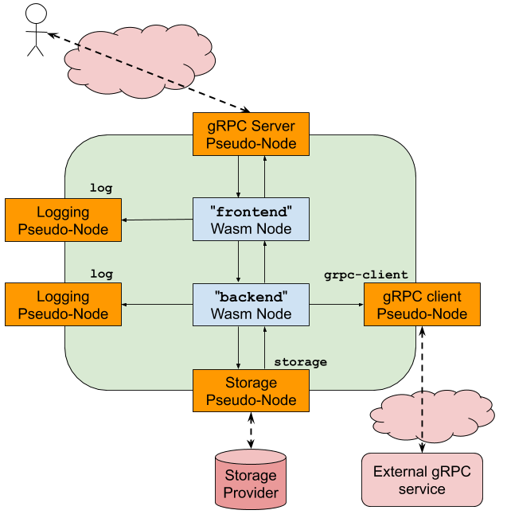

# Oak Concepts

 - [Oak VM](#oak-vm)
 - [Oak Module](#oak-module)
   - [WebAssembly](#webassembly)
 - [Oak Node](#oak-node)
 - [Channels](#channels)
   - [Pre-Defined Channels and Port Names](#pre-defined-channels-and-port-names)
 - [Pseudo-Nodes](#pseudo-nodes)
 - [Oak Application](#oak-application)
 - [Oak Manager](#oak-manager)
    - [Workflow](#workflow)
 - [Remote Attestation](#remote-attestation)
 - [Oak VM Updates](#oak-vm-updates)
 - [Time](#time)

## Oak VM

The **Oak VM** is currently the core software component of Project Oak; it is
responsible for executing Oak Modules and enforcing policies on top of data, as
well as producing remote attestations for clients. Other models are also
possible.

Each Oak VM instance lives in its own dedicated enclave and is isolated from
both the host as well as other enclaves and Oak VM instances on the same
machine.

## Oak Module

The unit of compilation and execution in Oak is an **Oak Module**. Each Oak
Module is a self-contained
[WebAssembly module](https://webassembly.org/docs/modules/) that is interpreted
by an Oak VM instance as part of an Oak Application.

### WebAssembly

The current version of the Oak VM supports
[WebAssembly](https://webassembly.org) as the first-class target language for
Oak Module development. Developers wishing to run their code as part of Project
Oak need to be able to compile their code to WebAssembly.

WebAssembly has a well-defined, unambiguous
[formal specification](https://webassembly.github.io/spec/core/valid/instructions.html),
and is targeted by most LLVM-based languages (including C++ and Rust), and
others, for example Go.

## Oak Node

An **Oak Node** is an instance of an Oak Module running on an Oak VM.

Each Oak Node also encapsulates an internal mutable state, corresponding the
[WebAssembly linear memory](https://webassembly.org/docs/semantics/#linear-memory)
on which the Oak Module operates. Concurrent invocations of the same Oak Node
are serialized so that they do not concurrently access the same underlying
memory, but individual invocations may modify the internal state in such a way
that it is observable in subsequent invocations, potentially by different
clients (assuming this is allowed by the policies associated with the Oak Node
in the first place). Clients may rely on this together with additional
properties related to the Oak Module to decide whether the Oak Node provides
sufficient guarantees for the data they intend to exchange with the Oak Node;
for instance a client may wish to send data to an Oak Node that allows multiple
invocations, but only if it can also be shown that the data can only be
retrieved in sufficiently anonymized form in subsequent invocations by other
clients.

## Channels

Communication from the Oak Node to the Oak VM and to other Nodes is implemented
via **channels**. A channel represents a uni-directional stream of messages,
with a receive half and a send half that an Oak Node can read from or write to
respectively. Each half of a channel is identified by a **handle**, which is
used as a parameter to the corresponding [host function](abi.md#host-functions)
calls.

### Pre-Defined Channels and Port Names

A collection of pre-configured channel halves are available to the Oak Node,
as specified in the `ApplicationConfiguration` used to create the Node.
The handles for these channels can be retrieved by using the `channel_find` host
function (below) to map a *port name* to the relevant channel handle.

## Pseudo-Nodes

An Oak node is limited to exchanging messages with other Nodes via channels; to
allow interactions with the outside world, the Oak system also provides a number
of **pseudo-Nodes**.

These pseudo-Nodes present as normal Nodes to the 'normal' Nodes in an Oak
Application: the normal Nodes exchange messages with the pseudo-Nodes over
channels.  However, the pseudo-Nodes are implemented as part of the Oak Manager
(executing as native C++ code, rather than Wasm code) so that they can interact
with the outside world.

The available pseudo-Nodes are:

 - **gRPC pseudo-node**: Provides a 'front door' for external interaction with
   an Oak Application, by implementing a gRPC service.  External requests to the
   gRPC service are written to an outbound channel from the pseudo-Node, which
   then expects to receive response messages on a corresponding inbound channel.
 - **Logging pseudo-node**: Provides a logging mechanism for Nodes under
   development by including a single inbound channel; anything received on the
   channel will be logged.  This node should only be enabled during application
   development and debugging (due to the potential for information leakage).
 - **Storage pseudo-node**: Provides a proxy mechanism for access to a
   persistent storage mechanism.  Nodes that require storage functionality write
   storage requests to a channel that reaches the storage pseudo-Node, then read
   the associated responses from a corresponding outbound channel from the
   storage pseudo-Node.

An Oak Application which intends to use any of these pseudo-Nodes must include
them (and channels to/from them) in its [Application
Configuration](/oak/proto/manager.proto).  An example configuration that includes
all pseudo-Nodes is depicted below.

<!-- From: -->
<!-- https://docs.google.com/drawings/d/1gRCOzXWCEhp1-GF6Rnd9N6be8hs1sENfleCzXdQMOsc-->

## Oak Application

An **Oak Application** is a set of Oak Nodes running within the same enclave,
and connected by unidirectional channels. The initial connectivity graph is
specified by an [Application Configuration](/oak/proto/manager.proto).  Once the
Application is running, new channels may be created and handles to either half
of the channel may be passed between Nodes, but no new Nodes can be instantiated.

An Oak Application may have one or more entry points from which it can be
invoked by clients over a gRPC connection; this is specified in the connectivity
graph by including a pair of pre-defined channels to a gRPC
[pseudo-Node](#pseudo-nodes).

Once a new Oak Application is initialized and its endpoint available, clients
may connect to it using individually end-to-end encrypted, authenticated and
attested channels. The remote attestation process proves to the client that the
remote enclave is indeed running a genuine Oak VM and will therefore obey the
policies set on the Oak Node; the Oak VM itself may then optionally prove
additional details about the Oak Module and its properties, which may require
reasoning about its internal structure.

## Oak Manager

The **Oak Manager** creates Oak Applications running within a platform provider.

Note that the Oak Manager is not part of the TCB: the actual trusted attestation
only happens between client and the Oak Application running in the enclave at
execution time.

The particular case where the TEE is provided by Intel SGX is shown in the
following system diagram.

<!-- From: -->
<!-- https://docs.google.com/drawings/d/1YJ8Rt-nunZ7NJ9diQswbwjEMAtGfzjGVY9ogwhA7hsI -->

### Workflow

In response to an application creation request, the Oak Manager sends back to
the caller details about the gRPC endpoint of the newly created Oak Application,
initialized with the application configuration specified in the request.

Sample flow:

-   ISV writes an Oak Module for the Oak VM using a high-level language and
    compiles it to WebAssembly.
-   The client connects to the Oak Manager, and requests the creation of an Oak
    Node running the compiled Oak Module.
    +   The module code itself is passed as part of the creation request.
-   The Oak Manager creates a new enclave and initializes it with a fresh Oak
    Node, and then seals the enclave. The Oak Node exposes a gRPC endpoint at a
    newly allocated endpoint (host:port). The endpoint gets forwarded to the
    client as part of the creation response.
    +   Note up to this point no sensitive data has been exchanged.
    +   The client still has no guarantees that the endpoint is in fact running
        an Oak VM, as the Oak Manager is itself untrusted.
-   The client connects to the Oak Node endpoint, and exchanges keys using the
    [Asylo assertion framework](https://asylo.dev/docs/reference/proto/identity/asylo.identity.v1.html).
    +   This allows the client to verify the integrity of the Oak Node and the
        fact that it is indeed running an actual Oak VM, and optionally also
        asserting further properties about the remote system (e.g. possession of
        additional secret keys, etc.).
    +   If the client is satisfied with the attestation, it continues with the
        rest of the exchange, otherwise it aborts immediately.
-   The client sends its (potentially sensitive) data to the Oak Node, alongside
    one or more policies that it requires the Oak Node to enforce on the data.
-   The Oak Node receives the data and performs the desired (and pre-determined)
    computation on top of them, and sends the results back to the client.

The following sequence diagram shows a basic flow of requests between a client,
the Oak Manager and an Oak Application.

<!-- From (Google-internal): http://go/sequencediagram/view/5170404486283264 -->

## Remote Attestation

Remote attestation is a core part of Project Oak. When a client connects to an
Oak Node, the two first establish a fresh ephemeral session key, and then they
provide assertions to each other over a channel encrypted with such key; the
client relies on this assertion to determine whether it is connecting to a valid
version of the Oak VM (see below for what constitutes a valid version). In
particular, the attestation includes a _measurement_ (i.e. a hash) of the Oak
Module running in the remote enclave, cryptographically bound to the session
itself.

The client may then infer additional properties about the Oak Module running on
the remote enclave, e.g. by means of "static attestation" certificates that are
produced as a byproduct of compiling the Oak Module source code itself on an
enclave and having the enclave sign a statement that binds the (hash of the)
compiled Oak Module to some high-level properties of the source code.

TODO: Expand on this.

## Oak VM Updates

Under normal circumstances, a client connecting to an Oak Node validates the
attestation it receives from the Oak Node when establishing the connection
channel. The measurement in the attestation report corresponds to the hash of
the code loaded in enclave memory at the time the connection was established.
Because the Oak VM changes relatively infrequently, the list of known
measurements is small enough that the client is able to just check the inclusion
of the received measurement in the list.

Occasionally, a particular version of the Oak VM may be found to contain
security vulnerabilities or bugs, and we would like to prevent further clients
from connecting to servers using such versions.

TODO: Verifiable log of known versions, Binary Transparency, Key Transparency.

## Time

TODO: Roughtime
