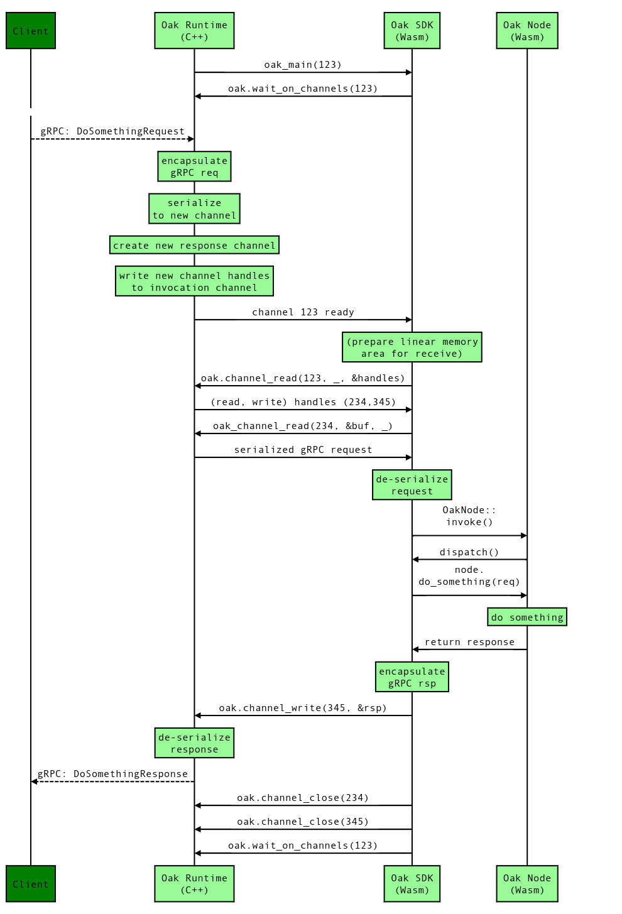

# Programming Oak

This document walks through the basics of programming in Oak.

- [Writing an Oak Node](#writing-an-oak-node)
  - [Per-Node Boilerplate](#per-node-boilerplate)
  - [Generated gRPC service code](#generated-grpc-service-code)
- [Running an Oak Application](#running-an-oak-application)
  - [Creating a Configuration File](#creating-a-configuration-file)
  - [Starting the Oak Application](#starting-the-oak-application)
- [Using an Oak Application from a client](#using-an-oak-application-from-a-client)
- [gRPC Request Processing Path](#grpc-request-processing-path)
- [Nodes, Channels and Handles](#nodes-channels-and-handles)
- [Persistent Storage](#persistent-storage)
- [Using External gRPC Services](#using-external-grpc-services)
- [Testing](#testing)
  - [Testing Multi-Node Applications](#testing-multi-node-applications)

## Writing an Oak Node

Oak Applications are built from a collection of inter-connected Oak **Nodes**,
so the first step is to understand how to build a single Oak Node.

Writing software for the Oak system involves a certain amount of boilerplate, so
this section will cover the hows &ndash; and whys &ndash; of this, using code
taken from the various [examples](../examples/). If you're impatient, you could
start by copying the `hello_world` example in particular, and just try modifying
things from there.

### Per-Node Boilerplate

An Oak Node needs to provide a single
[main entrypoint](abi.md#exported-function), which is the point at which Node
execution begins. However, Node authors don't _have_ to implement this function
themselves; for a Node which receives messages (a combination of bytes and
handles) that can be
[decoded](https://project-oak.github.io/oak/doc/oak/io/trait.Decodable.html)
into a Rust type, there are helper functions in the Oak SDK that make this
easier.

To use these helpers, an Oak Node should be a `struct` of some kind to represent
the internal state of the Node itself (which may be empty), implement the
[`Node`](https://project-oak.github.io/oak/doc/oak/trait.Node.html) trait for
it, then define an
[`entrypoint`](https://project-oak.github.io/oak/doc/oak/macro.entrypoint.html)
so the Oak SDK knows how to instantiate it:

<!-- prettier-ignore-start -->
[embedmd]:# (../examples/machine_learning/module/rust/src/lib.rs Rust /^oak::entrypoint.*/ /}\);$/)
```Rust
oak::entrypoint!(oak_main => {
    oak::logger::init_default();
    Node {
        training_set_size: 1000,
        test_set_size: 1000,
        config: None,
        model: NaiveBayes::new(),
    }
});
```
<!-- prettier-ignore-end -->

If the Node needs per-instance state, this Node `struct` is an ideal place to
store it. For example, the running average example has a `Node` `struct` with a
running sum and count of samples:

<!-- prettier-ignore-start -->
[embedmd]:# (../examples/running_average/module/rust/src/lib.rs Rust /.*struct Node {.*/ /^}/)
```Rust
struct Node {
    sum: u64,
    count: u64,
}
```
<!-- prettier-ignore-end -->

Under the covers the
[`entrypoint!`](https://project-oak.github.io/oak/doc/oak/macro.entrypoint.html)
macro implements a function identified by the name of the entrypoint for you,
with the following default behaviour:

- Take the channel handle passed to the entrypoint and use it for gRPC input.
- Take the newly constructed instance of the Node `struct` returned from the
  argument to the macro.
- Pass this Node `struct` and the channel handle to the
  [`run_event_loop()`](https://project-oak.github.io/oak/doc/oak/fn.run_event_loop.html)
  function.

For Nodes that act as gRPC servers (the normal "front door" for an Oak
Application), the easiest way to use a gRPC service implementation is to wrap it
with the automatically generated `Dispatcher`, as described in the next section.

<!-- prettier-ignore-start -->
[embedmd]:# (../examples/rustfmt/module/rust/src/lib.rs Rust /oak::entrypoint!/ /^}/)
```Rust
oak::entrypoint!(oak_main => {
    oak::logger::init_default();
    FormatServiceDispatcher::new(Node)
}
```
<!-- prettier-ignore-end -->

Alternatively a Node can implement the
[`oak::grpc::ServerNode`](https://project-oak.github.io/oak/doc/oak/grpc/trait.ServerNode.html)
trait (which provides an automatic implementation of the
[`Node`](https://project-oak.github.io/oak/doc/oak/trait.Node.html)). The
[machine learning example](https://github.com/project-oak/oak/blob/master/examples/machine_learning/module/rust/src/lib.rs)
demonstrates this.

### Generated gRPC service code

The Oak SDK provides `oak_utils::compile_protos` to autogenerate Rust code from
a [gRPC service definition](https://grpc.io/docs/guides/concepts/). Adding a
`build.rs` file to the Node that uses this function results in a generated file
appearing in `src/proto/<service>_grpc.rs`.

<!-- prettier-ignore-start -->
[embedmd]:# (../examples/hello_world/module/rust/build.rs Rust /fn main/ /^}/)
```Rust
fn main() {
    oak_utils::compile_protos(
        &["../../proto/hello_world.proto"],
        &["../../proto", "../../../../third_party"],
    );
}
```
<!-- prettier-ignore-end -->

The autogenerated code includes three parts, described in more detail below:

- A server-side trait definition.
- A `Dispatcher` `struct` that handles routing of gRPC method invocations.
- A client-side `struct` to allow easy use of the gRPC service from an Oak Node.

The first part is a trait definition that includes a method for each of the
methods in the gRPC service, taking the relevant (auto-generated) request and
response types. The Oak Node implements the gRPC service by implementing this
trait.

```Rust
pub trait FormatService {
    fn format(&mut self, req: super::rustfmt::FormatRequest) -> grpc::Result<super::rustfmt::FormatResponse>;
}
```

The second part of the autogenerated code includes a `Dispatcher` struct which
maps a request (as a method name and encoded request) to an invocation of the
relevant method on the service trait. This `Dispatcher` struct can then form the
entire implementation of the `ServerNode::invoke()` method described in the
previous section.

Taken altogether, these two parts cover all of the boilerplate needed to have a
Node act as a gRPC server:

- The main `oak_main` entrypoint is auto-generated, and invokes
  `oak::grpc::event_loop` with a `Dispatcher`.
- This `Dispatcher` is created by wrapping a Node `struct` that implements the
  gRPC generated service trait.
- The `Dispatcher` implements `oak::grpc::ServerNode` so the `event_loop()`
  method can call into the relevant per-service method of the Node.

Finally, the third part of the autogenerated code includes a stub implementation
of the client side for the gRPC service. If a Node offers a gRPC service to
other Nodes in the same Application, they can use this client stub code to get
simple access to the service.

## Running an Oak Application

In order to run the Oak Application, each of the Nodes that comprise the
Application must first be compiled into one or more WebAssembly modules, and
these compiled WebAssembly modules are then assembled into an overall
Application Configuration File.

The Application Configuration also includes the port that the Oak Server should
use for its gRPC service to appear on; the resulting (host:port) service
endpoint is connected to by any clients of the Application.

Each of these steps is described in the following sections.

### Creating a Configuration File

In order to load an Oak Application into the Oak Server its configuration must
be serialized into a binary file. The Application first needs to specify a
template configuration file:

<!-- prettier-ignore-start -->
[embedmd]:# (../examples/hello_world/config/config.textproto /node_configs.*/ /initial_entrypoint_name.*/)
```textproto
node_configs {
  name: "app"
  wasm_config {
    module_bytes: "<bytes>"
  }
}
node_configs {
  name: "log"
  log_config {}
}
grpc_port: 8080
initial_node_config_name: "app"
initial_entrypoint_name: "oak_main"
```
<!-- prettier-ignore-end -->

The `module_bytes: "<bytes>"` means that this value will be filled with
WebAssembly module bytes after serialization using the
[_Application Configuration Serializer_](../oak/common/app_config_serializer.cc),
as follows:

```bash
./bazel-bin/oak/common/app_config_serializer \
  --textproto=examples/hello_world/config/config.textproto \
  --modules=app://target/wasm32-unknown-unknown/release/hello_world.wasm \
  --output_file=config.bin"
```

Here:

- The `--textproto` option gives the location of the template configuration file
  described above.
- The `--modules` option gives a comma-separated list of name:filename pairs,
  which provides the WebAssembly module bytes for all of the named `wasm_config`
  entries in the configuration.
- The `--output_file` gives the output location of the assembled Application
  configuration.

All these steps are implemented as a part of the
`./scripts/build_example -e hello_world` script.

### Starting the Oak Application

The Oak Application is then loaded using the Oak Runner:

```bash
./scripts/run_server -a "${PWD}/config.bin"
```

The Oak Runner will launch an [Oak Runtime](concepts.md#oak-vm), and this
Runtime will check the provided Wasm module(s) and application configuration.
Assuming everything is correct (e.g. the Nodes all have a main entrypoint and
only expect to link to the Oak [host functions](abi.md#host-functions)), the Oak
Runtime opens up the gRPC port specified by the Application Configuration. This
port is then used by clients to connect to the Oak Application.

## Using an Oak Application from a client

A client that is outside of the Oak ecosystem can use an Oak Application by
interacting with it as a gRPC service, using the endpoint (host:port) from the
previous section (which would typically be published by the ISV providing the
Oak Application).

The client connects to the gRPC service, and sends (Application-specific) gRPC
requests to it, over a channel that has end-to-end encryption into the Runtime
instance:

<!-- prettier-ignore-start -->
[embedmd]:# (../examples/hello_world/client/hello_world.cc C++ /.*Connect to the/ /CreateTlsChannel.*/)
```C++
  // Connect to the Oak Application.
  auto stub = HelloWorld::NewStub(oak::ApplicationClient::CreateTlsChannel(address, ca_cert));
```
<!-- prettier-ignore-end -->

Because the Oak Application is available as a gRPC service, clients written in
any language that supports gRPC can use the service. For example in Go:

<!-- prettier-ignore-start -->
[embedmd]:# (../examples/translator/client/translator.go Go /.*Connect to the Oak/ /NewTranslatorClient.*/)
```Go
	// Connect to the Oak Application.
	creds, err := credentials.NewClientTLSFromFile(*caCert, "")
	if err != nil {
		glog.Exitf("Failed to set up TLS client credentials from %q: %v", *caCert, err)
	}
	conn, err := grpc.Dial(*address, grpc.WithTransportCredentials(creds))
	if err != nil {
		glog.Exitf("Failed to dial Oak Application at %v: %v", *address, err)
	}
	defer conn.Close()
	client := translator_pb.NewTranslatorClient(conn)
```
<!-- prettier-ignore-end -->

## gRPC Request Processing Path

At this point, the client code can interact with the Node code via gRPC. A
typical sequence for this (using the various helpers described in previous
sections) would be as follows:

- The Node code (Wasm code running in a Wasm interpreter, running in the Oak
  Runtime) is blocked inside a call to the `oak.wait_on_channels()` host
  function from the `oak::grpc::event_loop` helper function.
  - `event_loop()` was invoked directly from the auto-generated `oak_main()`
    exported function.
- The client C++ code builds a gRPC request and sends it to the Oak Runtime.
  - This connection is end-to-end encrypted using TLS.
- The Oak Runtime receives the message and encapsulates it in a `GrpcRequest`
  wrapper message.
- The Oak Runtime serializes the `GrpcRequest` and writes it to the gRPC-in
  channel for the Node. It also creates a new channel for any responses, and
  passes a handle for this response channel alongside the request.
- This unblocks the Node code, and `oak::grpc::event_loop` reads and
  deserializes the incoming gRPC request. It then calls the `Dispatcher`'s
  `invoke()` method with the method name and (serialized) gRPC request.
- The auto-generated `Dispatcher` invokes the relevant method on the `Node`.
- The (user-written) code in this method does its work, and returns a response.
- The auto-generated `Dispatcher` struct encapsulates the response into a
  `GrpcResponse` wrapper message, and serializes into the response channel.
- The Oak Runtime reads this message from the response channel, deserializes it
  and sends the inner response back to the client.
- The client C++ code receives the response.

<!-- From (Google-internal): http://go/sequencediagram/view/5741464478810112 -->


## Nodes, Channels and Handles

So far, we've only discussed writing a single Node for an Oak Application. This
Node communicates with the outside world via a single channel, and the handle
for the read half of this channel is acquired at start-of-day as the parameter
to the `oak_main()` entrypoint. The other half of this single channel is a gRPC
pseudo-Node, which passes on requests from external clients (and which is
automatically created by the Oak Runtime at Application start-of-day).

More sophisticated Applications are normally built from multiple interacting
Nodes, for several reasons:

- Dividing software into well-defined interacting components is a normal way to
  reduce the overall complexity of software design.
- Software that handles sensitive data, or which has additional privileges,
  often separates out the parts that deal with this (the
  ["principle of least privilege"](https://en.wikipedia.org/wiki/Principle_of_least_privilege)),
  to reduce the blast radius if something goes wrong.
- Information flow analysis can be more precise and fine-grained if components
  are smaller and the interactions between them are constrained.

The first step in building a multi-Node Application is to write the code for all
of the Nodes; the `ApplicationConfiguration` needs to include the configuration
and code for any Node that might get run as part of the Application. New Node
types cannot be added after the application starts; any Node that the
Application might need has to be included in the original configuration.

As before, each Node must include a main entrypoint with signature
`fn(u64) -> ()`, but for an internal Node it's entirely up to the ISV as to what
channel handle gets passed to this entrypoint, and as to what messages are sent
down that channel. The application may choose to use protobuf-encoded messages
(as gRPC does) for its internal communications, or something else entirely (e.g.
the [serde crate](https://crates.io/crates/serde)).

Regardless of how the application communicates with the new Node, the typical
pattern for the existing Node is to:

- Create a new channel with the
  [`channel_create`](https://project-oak.github.io/oak/doc/oak/fn.channel_create.html)
  host function, receiving local handles for both halves of the channel.
- Create a new Node instance with the
  [`node_create`](https://project-oak.github.io/oak/doc/oak/fn.node_create.html)
  host function, passing in the handle for the read half of the new channel.
- Afterwards, close the local handle for the read half, as it is no longer
  needed.

For example, the [example Chat application](../examples/chat) creates a Node for
each chat room and saves off the write handle that will be used to send messages
to the room:

<!-- prettier-ignore-start -->
[embedmd]:# (../examples/chat/module/rust/src/lib.rs Rust /.*channel_create\(\)/ /\}$/)
```Rust
        let (wh, rh) = oak::channel_create().unwrap();
        oak::node_create("app", "backend_oak_main", rh).expect("could not create node");
        oak::channel_close(rh.handle).expect("could not close channel");
        Room {
            sender: oak::io::Sender::new(wh),
            admin_token,
        }
```
<!-- prettier-ignore-end-->

The same code (identified by `"room-config"`) will be run for each per-room
Node, but each instance will have its own Web Assembly linear memory (≈heap) and
stack.

The `node_create()` call triggers the Oak Runtime to invoke the main entrypoint
for the new Node (as specified in the Application configuration), passing in the
handle value for the channel read half that was provided as a parameter to
`node_create()`. Note that the actual handle _value_ passed into the main
entrypoint will (almost certainly) be different; internally, the Runtime
translates the creator Node's handle value to a reference to the underlying
channel object, then assigns a new numeric value for the created Node to use to
refer to the underlying channel.

Once a new Node has started, the existing Node can communicate with the new Node
by sending messages over the channel via `channel_write`. Of course, the new
Node only has a handle to the read half of a channel, and so only has a way of
_receiving_.

To cope with this, it's normal for the inbound messages to be accompanied by a
handle for the _write_ half of a different channel, which is then used for
responses &ndash; so the new Node has a way of _sending_ externally, as well as
receiving.

## Persistent Storage

TODO: describe use of storage

## Using External gRPC Services

TODO: describe use of gRPC client pseudo-Node to connect to external gRPC
services.

## Testing

> "Beware of bugs in the above code; I have only proved it correct, not tried
> it." - [Donald Knuth](https://www-cs-faculty.stanford.edu/~knuth/faq.html)

Regardless of how the code for an Oak Application is produced, it's always a
good idea to write tests. The
[oak_tests](https://project-oak.github.io/oak/doc/oak_tests/index.html) crate
allows Node gRPC service methods to be tested with the [Oak SDK](sdk.md)
framework via the Oak Runtime:

<!-- prettier-ignore-start -->
[embedmd]:# (../examples/hello_world/module/rust/src/tests.rs Rust /^.*Test invoking the SayHello Node service method via the Oak runtime.*/ /^}$/)
```Rust
// Test invoking the SayHello Node service method via the Oak runtime.
#[test]
fn test_say_hello() {
    simple_logger::init().unwrap();

    let (runtime, entry_handle) = oak_tests::run_single_module_default(MODULE_CONFIG_NAME)
        .expect("Unable to configure runtime with test wasm!");

    let req = HelloRequest {
        greeting: "world".into(),
    };
    let result: grpc::Result<HelloResponse> = oak_tests::grpc_request(
        &runtime,
        entry_handle,
        "/oak.examples.hello_world.HelloWorld/SayHello",
        &req,
    );
    assert_matches!(result, Ok(_));
    assert_eq!("HELLO world!", result.unwrap().reply);

    runtime.stop_runtime();
}
```
<!-- prettier-ignore-end -->

This has a little bit of boilerplate to explain:

- The `oak_tests` crate provides a `run_single_module_default` method that is
  designed for use with single-Node Applications. It assumes that the Node has a
  main entrypoint called `oak_main`, which is runs in a separate thread. (This
  entrypoint would typically be set up by the
  [`oak::entrypoint!`](https://project-oak.github.io/oak/doc/oak/macro.entrypoint.html)
  macro [described above](#per-node-boilerplate)).
- The injection of the gRPC request has to specify the method name (in
  `oak_tests::grpc_request`).
- The per-Node thread needs to be stopped at the end of the test
  (`oak_runtime::stop`).

However, this extra complication does allow the Node to be tested in a way that
is closer to real execution, and (more importantly) allows testing of a Node
that makes use of the functionality of the Oak TCB.

### Testing Multi-Node Applications

It's also possible to test an Oak Application that's built from multiple Nodes,
using `oak_runtime::application_configuration` to create an application
configuration and then `oak_runtime::Runtime::configure_and_run(configuration)`
to configure and run the Runtime.

<!-- prettier-ignore-start -->
[embedmd]:# (../examples/abitest/tests/src/tests.rs Rust / +let configuration =/ /configure_and_run.*/)
```Rust
    let configuration = oak_runtime::application_configuration(
        build_wasm().expect("failed to build wasm modules"),
        LOG_CONFIG_NAME,
        FRONTEND_CONFIG_NAME,
        FRONTEND_ENTRYPOINT_NAME,
    );

    let (runtime, entry_channel) =
        oak_runtime::configure_and_run(configuration, oak_runtime::RuntimeConfiguration::default())
```
<!-- prettier-ignore-end -->

Any Rust panic originating in an Oak Node must be caught before going through
the Wasm FFI boundary. If you use the `derive(OakExports)` macro, this is
performed for you. To implement this manually you can use the method
[`catch_unwind`](https://doc.rust-lang.org/std/panic/fn.catch_unwind.html) from
the Rust standard library:

<!-- prettier-ignore-start -->
[embedmd]:# (../examples/abitest/module_0/rust/src/lib.rs Rust /^#.*no_mangle.*/ /^}/)
```Rust
#[no_mangle]
pub extern "C" fn frontend_oak_main(in_handle: u64) {
    let _ = std::panic::catch_unwind(|| {
        oak::set_panic_hook();
        let node = FrontendNode::new();
        let dispatcher = OakAbiTestServiceDispatcher::new(node);
        oak::run_event_loop(dispatcher, in_handle);
    });
}
```
<!-- prettier-ignore-end -->
