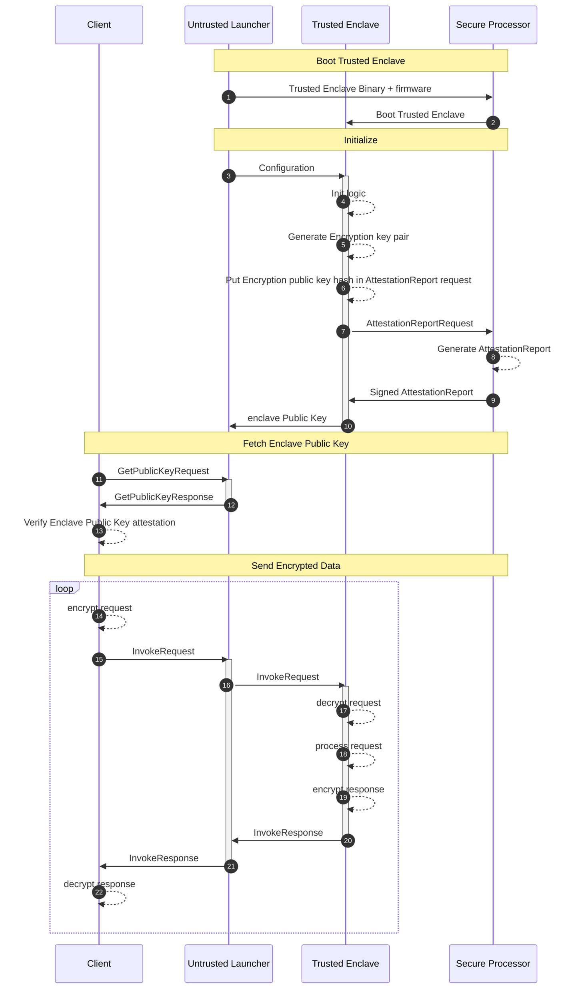

# Remote Attestation

**Remote Attestation** allows a client to remotely verify the TEE hardware
authenticity and the identity of the code running inside the TEE.

If the code of the application is **reproducibly buildable**, the client can
also check that the TEE is running the application that is expected to run.

The Remote Attestation process is based on an **Attestation Report**, a data
structure signed by the TEE platform and containing information identifying the
code that is running inside the TEE. This report can be checked to confirm that
it is signed by the **TEE Provider** (e.g. AMD or Intel), which results in
evidence that the code is running on a genuine TEE platform.

## Workflow Diagram

### Fetch Enclave Public Key

Initially, the client connects to the untrusted launcher and requests the
attested enclave public key. This key was generated in the enclave, but it is
then kept in memory by the corresponding untrusted launcher, so it may be served
to the client without having to reach into the enclave every time.

The client then checks:

- that the attestation report is signed by the TEE manufacturer (e.g. AMD,
  Intel)
- that the attestation report additional data includes the hash of the public
  key, to confirm that the key pair was in fact generated from inside the
  enclave
- that the attestation report measurement corresponds to a trusted version of
  the enclave binary

If any of these checks fails, the client refuses to go ahead.

### Send Encrypted Data

The client also generates an encryption key pair ahead of time (it may be reused
across invocations, or it may be generated for each invocation).

For each invocation (consisting of a request followed by a response) the client
concatenates its public key with the request payload, and encrypts the resulting
blob with the enclave public key using
[Hybrid Encryption](https://developers.google.com/tink/hybrid).

It then sends the encrypted message to the server, which ensures it gets
delivered to the trusted enclave which generated the enclave public key. Only
this enclave has the corresponding secret key, which it uses to decrypt the
client request.

The trusted enclave then processes the client request according to the
application-specific logic, and once that is done, it encrypts the response with
the client public key also using Hybrid Encryption.

The client receives the encrypted response, and decrypts it with its private
key.
