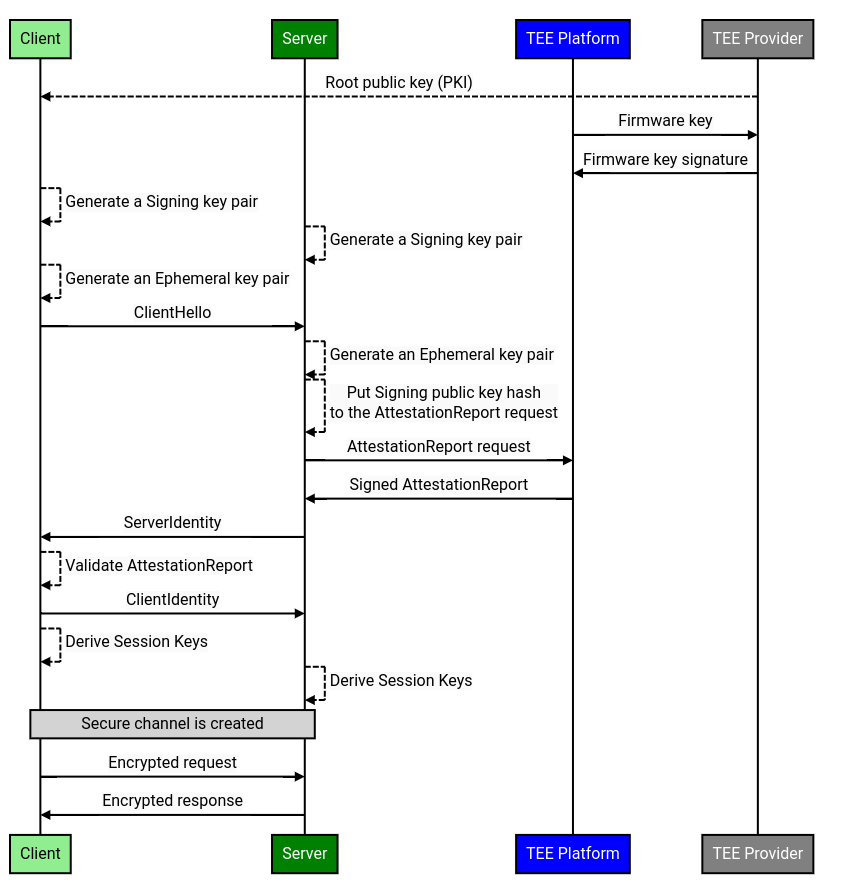

# Remote Attestation

A crucial advantage of a Trusted Execution Environment (TEE) is the ability to
perform **Remote Attestation**. It allows software to remotely check the TEE
platform authenticity and also provides the remote software with the information
about the code running inside the TEE. And if the code of the application is
**reproducibly buildable**, the software can check that the TEE platform is
running the application that is expected to run.

One of the main components used in the remote attestation process is an
**Attestation Report**, which is a data structure signed by the TEE platform and
containing information identifying the code that is running inside the TEE. This
report can be checked to confirm that it is signed by the **TEE Provider** (e.g.
AMD or Intel), which results in evidence that the code is running on a genuine
TEE platform.

## Overview

The Remote Attestation protocol is implemented as a simplification of the
[Enclave Key Exchange Protocol (EKEP)](https://asylo.dev/docs/concepts/ekep.html)
handshake protocol.

The Remote Attestation protocol works on top of the [gRPC](https://grpc.io/)
protocol and consists of 2 stages:

1. Handshake
   - Server proves its identity by sending a cryptographically signed
     Attestation Report
   - Both Client and Server establish an encrypted connection with keys that are
     bound to the TEE platform's firmware
1. Data Exchange
   - The keys generated during the Handshake are used to encrypt data sent
     between Client and Server

Prior to the _Handshake_ both Client and Server each generate an individual
[ECDSA-P256](https://datatracker.ietf.org/doc/html/rfc6979) key pair called
**Signing Key Pair**. These keys are persistent between connections (but
regenerated at startup) and are used to sign **Transcripts**: hashes of previous
handshake messages that are sent in each new handshake message to prevent
[Replay Attacks](https://en.wikipedia.org/wiki/Replay_attack). Each handshake
message also includes a random string so that transcripts always contain new
random values.

Also for each individual connection both Client and Server each generate an
[X25519](https://datatracker.ietf.org/doc/html/rfc7748) Diffie-Hellman key pair
called **Ephemeral Key Pair**. These keys are used to establish a shared secret
between Client and Server.

The shared secret is used to generate 2 shared
[AES-256-GCM](https://datatracker.ietf.org/doc/html/rfc5288) **Session Keys**
that are used during the _Data Exchange_ stage:

- Server Session Key
  - Which is used to encrypt messages sent by the Server
- Client Session Key
  - Which is used to encrypt messages sent by the Client

It's important to node that for each new request **Client** performs the Remote
Attestation from the start in order to create a new pair of Session keys.

## Workflow

The workflow of the Remote Attestation protocol involves 4 interacting entities:

1. Server
   - Server application that processes requests from Clients
   - Runs on a TEE Platform
1. Client
   - Client application that connects to the Server
   - Client is provided with a TEE Provider's Root key
1. TEE Platform
   - Firmware that provides a TEE support (i.e. Intel SGX or AMD-SEV-SNP capable
     CPU)
   - Possesses a firmware key
1. TEE Provider
   - TEE platform provider that can confirm authenticity of the TEE Platform
     firmware keys using its root key
   - Client must have the TEE Provider's root public key
   - It’s important to note that the TEE Provider is an external server (i.e.
     belongs to Intel or AMD)

The complete workflow of the Remote Attestation protocol looks as follows:

1. Pre-handshake steps that are performed at startup:
   - Both **Client** and **Server** generate an individual
     [ECDSA-P256](https://datatracker.ietf.org/doc/html/rfc6979) _Signing_ key
     pair
   - **TEE Provider** creates a signature of the **TEE Platform**'s firmware
     public key
1. **Client** generates an
   [X25519](https://datatracker.ietf.org/doc/html/rfc7748) _Ephemeral_ key pair
1. **Client** sends a `ClientHello` message to the **Server**
   - Which includes a random string
1. **Server** generates an
   [X25519](https://datatracker.ietf.org/doc/html/rfc7748) _Ephemeral_ key pair
1. **Server** sends a request for the `AttestationReport` to the **TEE
   Platform**
   - This request contains
     [SHA-256](https://datatracker.ietf.org/doc/html/rfc6234) hash of the
     **Server**’s _Signing_ public key
1. **TEE Platform** generates an `AttestationReport`
   - **TEE Platform** signs the report using its firmware private key, the
     public key equivalent of which was signed by the **TEE Provider** and could
     be verified by the **Client**
   - The signed `AttestationReport` also gives the **Client** information about
     the TEE itself (its version and etc.) and about the code that is running
     inside the **TEE Platform**
   - Since the hash of the **Server**’s _Signing_ public key was provided in the
     request, it is also signed by the **TEE Platform**
1. **Server** sends `ServerIdentity` to the **Client** which contains:
   - **Server**’s _Ephemeral_ public key
   - New random string
   - _Transcript_: [SHA-256](https://datatracker.ietf.org/doc/html/rfc6234) hash
     of the concatenated `ClientHello` and current `ServerIdentity` (excluding
     the _Transcript_) signed with the **Server**'s _Signing_ private key
   - **Server**’s _Signing_ public key
   - `AttestationReport` signed by the **TEE Platform**'s hardware key, which
     includes a hash of the **Server**’s _Signing_ public key
   - Corresponding **TEE Provider**’s certificate that is signed by the **TEE
     Provider**’s _Root_ key
1. **Client** validates `ServerIdentity`
   - If the corresponding `AttestationReport` is not valid, then the **Client**
     closes the connection and aborts the protocol
1. **Client** sends `ClientIdentity` to the **Server** which contains:
   - **Client**’s _Ephemeral_ public key
   - New random string
   - _Transcript_: [SHA-256](https://datatracker.ietf.org/doc/html/rfc6234) hash
     of the concatenated `ClientHello`, `ServerIdentity` and current
     `ClientIdentity` (excluding the _Transcript_) signed with the **Client**'s
     _Signing_ private key
   - **Client**’s _Signing_ public key
1. **Client** and **Server** use both _Ephemeral_ public keys to create an
   [X25519](https://datatracker.ietf.org/doc/html/rfc7748) _Shared Secret_
1. **Client** and **Server** derive _Session_ keys from the _Shared Secret_ and
   both _Ephemeral_ public keys using a _Key Derivation Function_
   ([HKDF](https://datatracker.ietf.org/doc/html/rfc5869))
   - Each side generates 2
     [AES-256-GCM](https://datatracker.ietf.org/doc/html/rfc5288) _Session_
     keys:
     - Server Session Key
     - Client Session Key
   - **Client** and **Server** use Authenticated Encryption/Decryption
     ([AEAD](https://en.wikipedia.org/wiki/Authenticated_encryption)) for
     communication
1. **Client** and **Server** use generated _Session_ keys for communication
   between them

<!-- From: -->
<!-- https://sequencediagram.googleplex.com/view/6235412701904896 -->

