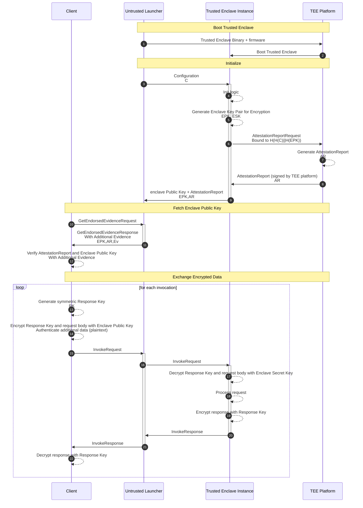

# Remote Attestation

**Remote Attestation** allows a client to remotely verify the TEE hardware
authenticity and the identity of the code running inside the TEE.

If the code of the application is **reproducibly buildable**, the client can
also check that the TEE is running the application that is expected to run. See
also [Transparent Release](https://github.com/project-oak/transparent-release).

The Remote Attestation process is based on an **Attestation Report**, a data
structure signed by the TEE platform and containing information identifying the
code that is running inside the TEE. This report can be verified to confirm that
it is signed by the **TEE Provider** (e.g. AMD or Intel), which results in
evidence that the code is running on a genuine TEE platform.

## Workflow Diagram

### Fetch Enclave Public Key

Initially, the client connects to the untrusted launcher and requests the
attested enclave public key.

The enclave generated the key after its initialization, and it will never change
for the enclave lifetime, so the corresponding untrusted launcher can keep the
enclave public key in memory to serve it to the client directly without having
to interact with the enclave every time.

The untrusted launcher also stores additional evidence to help clients verify
the authenticity of the enclave and its attestation report, e.g. intermediate
certificates, signatures and transparency log inclusion proofs.

The client then checks:

- that the attestation report is signed by the TEE manufacturer (e.g. AMD,
  Intel)
- that the attestation report is bound to the enclave public key, to confirm
  that the key pair was in fact generated from inside the enclave
- that the attestation report is bound to the expected configuration of the
  enclave
- that the attestation report measurement corresponds to a trusted version of
  the enclave binary (e.g. via
  [Transparent Release](https://github.com/project-oak/transparent-release))

If any of these checks fails, the client refuses to go ahead.

### Exchange Encrypted Data

The client also generates an encryption key pair ahead of time (it may be reused
across invocations, or it may be generated for each invocation).

For each invocation (consisting of a request followed by a response) the client
generates a fresh symmetric key for the response, then it concatenates this key
with the request body, and encrypts the resulting blob with the enclave public
key using [Hybrid Encryption](https://www.rfc-editor.org/rfc/rfc9180.html). The
client may also authenticate additional data, which is not encrypted, but is
bound to the ciphertext.

It then sends the encrypted message to the server, which forwards it to the
appropriate trusted enclave which generated the enclave public key. Only this
enclave has the corresponding secret key, which it uses to decrypt the client
request and verify the integrity of the additional data, if present.

The trusted enclave then processes the client request according to the
application-specific logic, and once that is done, it encrypts the response with
the client response key via using symmetric encryption.

The client receives the encrypted response, and decrypts it with the response
key. The response key is then discarded and **not** reused for subsequent
invocations.
