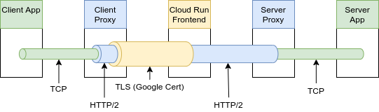

# Oak Functions with Envoy Proxy Experiment

This experiment shows how to create a persistent connection to a Docker
container in Cloud Run. It is done by using
[TCP tunneling over HTTP](https://www.envoyproxy.io/docs/envoy/latest/intro/arch_overview/http/upgrades#tunneling-tcp-over-http)
in Envoy proxy.

The experiment consists of 2 Envoy proxies: _client side_ and _server side_.

<!-- From: -->
<!-- https://drive.google.com/corp/drive/folders/1u0INlJemLnriiU8Aq8G2ajWvCJ6JwyZw -->


- Client side proxy:
  - Listens for TCP connections on a local port
  - Accepts TCP streams and tunnels them over HTTP streams
    - Each individual TCP connection is tunnelled over a dedicated HTTP stream
      (using POST requests)
- Server side proxy:
  - Listens for HTTP streams and unwraps TCP streams from them
  - Forwards TCP streams to the application server

Proxy experiment is organized as follows:

- `curl`
  - Sends an HTTP POST request on `localhost:8000/invoke`
- `client_listener`
  - Tunnels each TCP stream over a dedicated HTTP/2 stream
- `client_cluster`
  - Sends each HTTP/2 stream on `APP_URL:443` using a dedicated TLS connection
  - Checks Google public certificate for each TLS connection
- Cloud Run Frontend
  - Terminates each TLS connection and unwraps a plaintext HTTP/2 stream out of
    it
  - Redirects each plaintext HTTP/2 stream to the Docker container on port
    `8080`
- `server_listener`
  - Unwraps a TCP stream from each HTTP/2 stream
- `server_cluster`
  - Forwards each TCP stream to the server on port `8081`
- `weather_lookup` on `oak_functions`
  - Responds to each HTTP POST request

## Running experiment

Build Docker images:

```bash
./experimental/envoy_proxy/scripts/build.sh
```

### Running on localhost

Run the server:

```bash
docker run --interactive --tty -- --network=host 'gcr.io/oak-ci/envoy-proxy-example-server'
```

Run the client (`localhost` parameter makes the script run the local version of
Envoy Proxy client):

```bash
docker run --interactive --tty --network=host 'gcr.io/oak-ci/envoy-proxy-example-client' localhost
```

### Running in Cloud Run

Export environment variables (the corresponding JSON key can be created in
[GCP console](https://pantheon.corp.google.com/iam-admin/serviceaccounts/details/107443053308787082748/keys?project=oak-ci)):

```bash
export GCP_PROJECT_ID=oak-ci
export GCP_ACCOUNT_FILE=${JSON_KEY_PATH}
```

Deploy the server:

```bash
./experimental/envoy_proxy/scripts/deploy.sh
```

Run the client:

```bash
docker run --interactive --tty --network=host 'gcr.io/oak-ci/envoy-proxy-example-client'
```

Delete the server (_optional_):

```bash
./experimental/envoy_proxy/scripts/delete.sh
```
