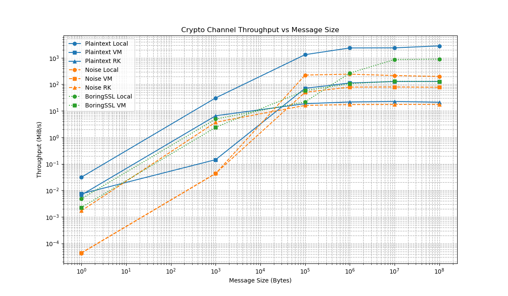

# Crypto Channel Benchmark Report

## 1. Overview

This report summarizes the performance benchmarks conducted on the crypto
channel implementations (Plaintext, Noise, and BoringSSL/TLS) in different
environments (Local TCP, Linux VM, and Restricted Kernel). The benchmarks
evaluate the time and throughput for message exchange of varying sizes.

## 2. Methodology & Process

### 2.1. Environments

- **Local**: Server and client running on the host machine.
- **VM**: Server running inside a Linux VM (QEMU), client running on the host.
- **RK**: Server running inside a Restricted Kernel enclave (QEMU), client
  running on the host.

### 2.2. Configuration & Tuning

- **Test Sizes**: Benchmarks were run for message sizes of 1, 1,000, 100,000,
  1,000,000, 10,000,000, and 100,000,000 bytes.
- **Sample Size**: Reduced to 20 samples per benchmark to ensure completion
  within reasonable timeframes and avoid hanging.
- **Logging**: Debug logging (`println!`) was removed from the server accept
  loop in `linux_server.rs` to eliminate I/O bottlenecks.
- **Security**: Port forwarding in `run_vm.sh` was restricted to `127.0.0.1`
  (localhost) to avoid exposing the VM to the external network.
- **Memory**: Memory for Restricted Kernel (RK) was increased to 1G (from
  default 256M) to support 100MB message sizes, as smaller sizes led to memory
  exhaustion in the guest allocator.

### 2.3. Emulation Limitations

> [!WARNING] **Restricted Kernel (RK)** benchmarks may fail with
> `KERNEL PANIC: INVALID OPCODE!` (at instruction `sha256rnds2`) if the host CPU
> does not support Intel SHA Extensions but QEMU attempts to use them via KVM
> pass-through (`-cpu host`).
>
> To work around this in such environments, the following changes are needed in
> `oak_launcher_utils/src/launcher.rs`:
>
> 1. Disable KVM by commenting out `cmd.arg("-enable-kvm");`.
> 2. Change the CPU model from `host` to `max` via `cmd.args(["-cpu", "max"]);`
>    to allow QEMU to emulate the instruction set fully in software (TCG mode).
>
> The results reported here for RK were obtained using this software emulation
> workaround, which **significantly degrades RK performance** compared to
> hardware-accelerated virtualization (KVM) used for the Linux VM.

### 2.4. Benchmarking Framework

- **Library**: [Criterion.rs](https://github.com/bheisler/criterion.rs) is used
  for robust benchmarking.
- **Warmup**: Each benchmark includes a warmup phase (default 3 seconds) to
  allow the system to stabilize and caches to fill.
- **Iterations**: Criterion dynamically determines the number of iterations per
  sample to achieve statistically significant results within the target time.
- **Sampling**: We configured Criterion to collect **20 samples** per benchmark
  (overriding the default of 100) to keep execution time reasonable, especially
  for large message sizes and emulated environments.
- **Statistics**: Criterion performs statistical analysis and provides estimates
  for Mean and Median. The logs report values in the format
  `[lower_bound estimate upper_bound]` (e.g., for time or throughput),
  representing the confidence interval. In this report's tables, the **Estimate
  (Mean)** is presented.
- **Outliers**: Criterion detects and reports outliers (mild or severe) that
  might skew results.

## 3. Results

### Performance Benchmark Results

| Protocol      | Environment | Size (Bytes) | Time (Mean) | Throughput (Mean) |
| :------------ | :---------- | -----------: | ----------: | ----------------: |
| **BoringSSL** | **Local**   |            1 |   196.96 µs |      4.9582 KiB/s |
|               |             |        1,000 |   193.56 µs |      4.9269 MiB/s |
|               |             |      100,000 |   4.3662 ms |      21.842 MiB/s |
|               |             |    1,000,000 |   3.5769 ms |      266.62 MiB/s |
|               |             |   10,000,000 |   11.039 ms |      863.94 MiB/s |
|               |             |  100,000,000 |   106.80 ms |      892.95 MiB/s |
|               | **VM**      |            1 |   419.04 µs |      2.3305 KiB/s |
|               |             |        1,000 |   398.69 µs |      2.3920 MiB/s |
|               |             |      100,000 |   1.6342 ms |      58.357 MiB/s |
|               |             |    1,000,000 |   8.9911 ms |      106.07 MiB/s |
|               |             |   10,000,000 |   72.954 ms |      130.72 MiB/s |
|               |             |  100,000,000 |   750.45 ms |      127.08 MiB/s |
| **Noise**     | **Local**   |            1 |   22.074 ms |        45.303 B/s |
|               |             |        1,000 |   22.066 ms |      44.256 KiB/s |
|               |             |      100,000 |   425.56 µs |      224.10 MiB/s |
|               |             |    1,000,000 |   3.9293 ms |      242.71 MiB/s |
|               |             |   10,000,000 |   44.336 ms |      215.10 MiB/s |
|               |             |  100,000,000 |   479.68 ms |      198.81 MiB/s |
|               | **RK**      |            1 |   558.44 µs |      1.7487 KiB/s |
|               |             |        1,000 |   255.99 µs |      3.7255 MiB/s |
|               |             |      100,000 |   5.9398 ms |      16.056 MiB/s |
|               |             |    1,000,000 |   55.058 ms |      17.321 MiB/s |
|               |             |   10,000,000 |   546.41 ms |      17.454 MiB/s |
|               |             |  100,000,000 |    5.4376 s |      17.539 MiB/s |
|               | **VM**      |            1 |   21.629 ms |        46.234 B/s |
|               |             |        1,000 |   21.781 ms |      44.837 KiB/s |
|               |             |      100,000 |   1.8973 ms |      50.266 MiB/s |
|               |             |    1,000,000 |   12.102 ms |      78.801 MiB/s |
|               |             |   10,000,000 |   119.63 ms |      79.717 MiB/s |
|               |             |  100,000,000 |    1.2278 s |      77.674 MiB/s |
| **Plaintext** | **Local**   |            1 |   30.298 µs |      32.232 KiB/s |
|               |             |        1,000 |   30.970 µs |      30.793 MiB/s |
|               |             |      100,000 |   72.171 µs |      1.2904 GiB/s |
|               |             |    1,000,000 |   403.48 µs |      2.3082 GiB/s |
|               |             |   10,000,000 |   4.0035 ms |      2.3263 GiB/s |
|               |             |  100,000,000 |   33.724 ms |      2.7616 GiB/s |
|               | **RK**      |            1 |   141.59 µs |      6.8973 KiB/s |
|               |             |        1,000 |   146.07 µs |      6.5288 MiB/s |
|               |             |      100,000 |   5.1042 ms |      18.684 MiB/s |
|               |             |    1,000,000 |   43.944 ms |      21.702 MiB/s |
|               |             |   10,000,000 |   418.81 ms |      22.771 MiB/s |
|               |             |  100,000,000 |    4.5001 s |      21.192 MiB/s |
|               | **VM**      |            1 |   128.08 µs |      7.6246 KiB/s |
|               |             |        1,000 |   6.6185 ms |      147.55 KiB/s |
|               |             |      100,000 |   1.3463 ms |      70.836 MiB/s |
|               |             |    1,000,000 |   8.4710 ms |      112.58 MiB/s |
|               |             |   10,000,000 |   74.466 ms |      128.07 MiB/s |
|               |             |  100,000,000 |   741.27 ms |      128.65 MiB/s |

### Throughput Graph

## 4. Observations & Caveats

> [!IMPORTANT] **RK Performance degradation**: The Restricted Kernel benchmarks
> were run without KVM hardware acceleration. Consequently, their throughput and
> latency are likely significantly worse than they would be with KVM enabled.
> The numbers reported here reflect software emulation overhead.
>
> [!NOTE]
>
> - **VM Plaintext** size 1,000 showed an unexpected latency spike (6.6 ms)
>   compared to larger sizes in some runs, though it seems highly variable.
> - **Noise** latency for small messages (1 and 1000 bytes) in Local and VM is
>   relatively high (milliseconds) compared to microseconds for larger messages
>   or Plaintext, suggesting handshake overhead or lazy evaluation artifacts in
>   the measured block. In RK (No KVM), it seems to scale differently, possibly
>   due to emulation artifacts.
> - **100MB Message Support**: Required increasing guest memory in RK launcher.
