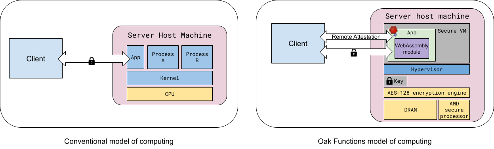

<!-- Oak Logo Start -->
<!-- An HTML element is intentionally used since GitHub recommends this approach to handle different images in dark/light modes. Ref: https://docs.github.com/en/get-started/writing-on-github/getting-started-with-writing-and-formatting-on-github/basic-writing-and-formatting-syntax#specifying-the-theme-an-image-is-shown-to -->
<!-- markdownlint-disable-next-line MD033 -->
<h1><picture><source media="(prefers-color-scheme: dark)" srcset="/docs/oak-logo/svgs/oak-functions-negative-colour.svg?sanitize=true"><source media="(prefers-color-scheme: light)" srcset="/docs/oak-logo/svgs/oak-functions.svg?sanitize=true"></picture></h1>
<!-- Oak Logo End -->

The objective of Oak Functions is to design and implement a general-purpose
computing platform that allows developing stateless applications in a privacy
preserving way. Oak Functions leverages TEEs and remote attestation, Wasm
sandboxing.

At its core, Oak Functions consists of a **trusted runtime** compiled into a
server binary ([`oak_functions_launcher`](/oak_functions_launcher/)) that, for
each incoming client gRPC request, executes a workload that operates on the
request payload, and produces a response which is sent back to the same client.

The Oak Functions trusted runtime ensures that the workload may not violate the
confidentiality of the client request data, preventing observers from learning
anything about the request. As a result, the workload can potentially be
untrusted, meaning that neither the client nor the host needs to know the
identity of the workload or trust it.

From the client point of view, the server provides cryptographic evidence
(backed by an hardware-based Trusted Execution Environment) of its own identity
as part of a remote attestation protocol. The server identity can then be used
to decide whether it is in fact a legitimate version of the trusted runtime.

The main building blocks used in Oak Functions are:

- A Trusted Execution Environment (TEE)
  - protects the confidentiality and integrity of data and code of the workload
    (in this case, the Oak Functions trusted runtime) from its untrusted host,
    other TEE instances and processes, and some hardware attacks
  - in general, TEEs may be VM-based (e.g.
    [AMD SEV](https://developer.amd.com/sev/)) or enclave-based (e.g.
    [Intel SGX](https://www.intel.com/content/www/us/en/developer/tools/software-guard-extensions/overview.html)).
    Oak Functions mainly leverages VM-based TEEs.
- Sandboxing the workload, currently using
  [WebAssembly](https://webassembly.org/) (Wasm)
  - The TEE protects from the host, and anything malicious on it, but to prevent
    malicious behavior in the workload code we need to sandbox it and limit what
    actions it is allowed to perform; for instance, the sandbox prevents the
    code from logging, storing data to disk or outside the TEE boundary,
    creating network connections, and interacting with the untrusted host in any
    way other than what it explicitly allows in a controlled way
- Remote Attestation
  - So that the client can ensure that it is interacting with a legitimate and
    trustworthy instance of Oak Functions trusted runtime.

The following diagram shows how the computing model of Oak Functions differs
from the conventional computing model.

<!-- From: -->
<!-- https://docs.google.com/drawings/d/1ZPeJ93IkyOOJVI8CFSbEeEKn6wVozB-d6E1SekK2QyQ/edit -->

## Features

### Oak Functions Launcher and the Trusted Runtime

The [Oak Functions Launcher](/oak_functions_launcher/), in most cases, starts
the Oak Functions trusted runtime and loads a Wasm module as workload. The Oak
Functions trusted runtime and the Wasm module communicate through
[ABI Functions](/oak_functions_abi/) and [a Rust SDK](/oak_functions_sdk/).The
Oak Functions trusted runtime allows to specify policies such as a fixed size
and processing time for responses returned by the trusted runtime, and a fixed
processing time.

### Remote Attestation

The [Remote Attestation protocol](/docs/remote-attestation.md) implemented in
Oak is currently integrated in Oak Functions.

### In-Memory Database

Oak Functions includes an in-memory database, referred to as "lookup data," that
the untrusted code can query in a read-only manner. The trusted component of the
application can update this database at any time, providing the untrusted logic
with access to the most current data without compromising privacy or security
claims about the application.

## Applications

The assumption is that Oak Functions only covers a subset of the use cases
compared to Oak, but those use cases are the most commonly occurring ones. One
apparent restriction is the use of a read-only in-memory storage. With a
distributed runtime, however, it should be possible to use Oak Functions for
applications that require a larger storage.
