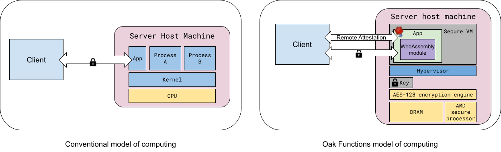

# Oak Functions

The objective of Oak Functions is to design and implement a general-purpose
computing platform that allows developing stateless applications in a privacy
preserving way. Oak Functions leverages TEEs and remote attestation, Wasm
sandboxing, and allows exposing metrics in a Differentially Private way.

At its core, Oak Functions consists of a **trusted runtime** compiled into a
server binary
([`oak_functions_loader`](https://github.com/project-oak/oak/tree/main/oak_functions/loader))
that, for each incoming client gRPC request, executes an untrusted workload that
operates on the request payload, and produces a response which is sent back to
the same client.

The Oak Functions trusted runtime ensures that the untrusted workload may not
violate the confidentiality of the client request data, preventing observers
from learning anything about the request.

From the client point of view, the server provides cryptographic evidence
(backed by an hardware-based Trusted Execution Environment) of its own identity
as part of a remote attestation protocol, which convinces the client that it is
in fact a legitimate version of such a runtime.

The main building blocks used in Oak Functions are:

- A Trusted Execution Environment (TEE)
  - protects the confidentiality and integrity of data and code of the workload
    (in this case, the Oak Functions trusted runtime) from its untrusted host,
    other TEE instances and processes, and some hardware attacks
  - in general, TEEs may be VM-based (e.g.
    [AMD SEV](https://developer.amd.com/sev/)) or enclave-based (e.g.
    [Intel SGX](https://www.intel.com/content/www/us/en/developer/tools/software-guard-extensions/overview.html)).
    Oak Functions mainly leverages VM-based TEEs.
- Sandboxing the workload, currently using
  [WebAssembly](https://webassembly.org/) (Wasm)
  - The TEE protects from the host, and anything malicious on it, but to prevent
    malicious behavior in the workload code we need to sandbox it and limit what
    actions it is allowed to perform; for instance, the sandbox prevents the
    code from logging, storing data to disk or outside the TEE boundary,
    creating network connections, and interacting with the untrusted host in any
    way other than what it explicitly allows in a controlled way
- Remote Attestation
  - So that the client can ensure that it is interacting with a legitimate and
    trustworthy instance of Oak Functions trusted runtime.

The following diagram shows how the computing model of Oak Functions differs
from the conventional computing model.

<!-- From: -->
<!-- https://docs.google.com/drawings/d/1ZPeJ93IkyOOJVI8CFSbEeEKn6wVozB-d6E1SekK2QyQ/edit -->

## Features

### Oak Functions Loader and the Trusted Runtime

[The Oak Functions loader](https://project-oak.github.io/oak/oak_functions/loader)
is responsible for starting the Oak Functions trusted runtime, and loading an
application, with a single Wasm module as the workload. The trusted runtime
instantiates the given Wasm module for each incoming user request, runs the
request through it in order to produce a response, and then terminates the Wasm
instance; each Wasm instance is short lived and cannot persist state outside of
the request lifetime.

As part of our shift to a distributed runtime, in the future, we may allow
native Oak Functions instances that do not run any untrusted Wasm code. An
example is a native Oak Functions instance for collecting differentially private
metrics, deployed on its own TEE instances.

### ABI Functions and the Rust SDK

WebAssembly is very restricted. In order to be able to implement meaningful
applications in a secure way, the trusted runtime provides a limited number of
ABI functions to the Wasm module. The ABI functions allow reading the incoming
request, writing the response, writing log messages, and fetching items from an
in-memory storage. In addition, there are experimental features for publishing
metrics, and machine-learning inference using a TensorFlow model. The full
description of the ABI functions can be found
[here](https://github.com/project-oak/oak/blob/main/docs/oak_functions_abi.md).

A Rust SDK is currently available, and support for other languages may be added
in the future.

### Read-Only Storage

The Oak Functions trusted runtime does not allow the Wasm module to directly
interact with any external resources. However, each Wasm module may have
read-only access to an in-memory storage that is populated with data from an
external data source at startup time. The external data source is specified in
the server configuration file as a URL or a local file path. It is also possible
to specify a refresh interval. This allows the Oak Functions trusted runtime to
periodically refresh the data in the storage, by re-downloading the entirety of
the data from the provided URL or local file path.

The storage is implemented as an in-memory key-value store (in practice a
hashmap), of which there is one instance per Oak Functions trusted runtime
instance, which is shared across invocations of the Wasm module. The property
that this offers is that queries are not observable (e.g. not logged) outside of
the Oak Functions trusted runtime, since they happen within the same process,
which is contained within a single TEE instance.

Oak Functions provides a
[lookup API](https://github.com/project-oak/oak/blob/main/docs/oak_functions_abi.md#storage_get_item)
that the Wasm module can use to look up data from the in-memory storage.

### Policies

The server configuration specifies a policy with fields for various
privacy-related parameters. Currently these parameters specify a fixed size for
responses returned by the trusted runtime, and a fixed processing time. The
policy is used to avoid side channel leaks (e.g., an outside attacker observing
the processing time of a request). The Oak Functions trusted runtime guarantees
that processing every request takes approximately the specified amount of time
and results in a response of exactly the specified size. If processing an
incoming request completes before the specified time in the policy, the response
will not be sent back until the time is elapsed. On the other hand, if
processing the request does not finish within this deadline, the trusted runtime
terminates the process early and responds with an error. Note that we can only
guarantee an approximation of the specified processing time, because the actual
processing time is affected by factors beyond the specific Wasm logic invoked by
the incoming request. These factors include the general server’s state, and how
busy it is overall. Therefore the variation in the actual processing time is in
fact random noise and cannot be used to leak information about the request via
the specific Wasm logic it invoked.

The configuration may in addition specify parameters related to differentially
private metrics, if that feature is enabled. These parameters include a list of
events, a batch size and an epsilon parameter for computing a Laplacian noise.
If metrics are enabled, the trusted runtime collects event counts for events
specified in the configuration, and aggregates them after the batch size is
reached. A laplacian noise, calculated using the specified epsilon parameter, is
then added to the aggregated value, to conform to the differential privacy
requirements, before publishing the results by logging to stdout.

### Remote Attestation

The Remote Attestation protocol implemented in Oak is currently integrated in
Oak Functions.

## Comparison with Oak

Oak Functions is a stripped-down version of Oak, and has borrowed many ideas
from Oak, but is different from Oak in a few ways that are described in this
section.

### Number of Wasm Modules

While an Oak application may have more than one Wasm module, each Oak Functions
application can have only one Wasm module.

Structurally, an Oak Functions application is very similar to a single-node Oak
application. This simplifies the design considerably. Since there is only one
Oak node (i.e., Wasm module), and the native APIs are no longer implemented as
pseudo-nodes, there is no need for message passing over channels. As a
consequence, we no longer require information flow control (IFC) to police the
flow of data from one node to another. The developers do not have to deal with
IFC labels or more advanced concepts and patterns.

Similar to Oak, we have implemented several layers of defense in depth. In
particular, application owners can control which functionalities to enable in a
server configuration file.

### No external interaction and read-only storage

An Oak application can have restricted interactions with the external world via
gRPC and HTTP pseudo-nodes. There is no equivalent functionality in an Oak
Functions application. Instead, as described above, each Oak Functions
application can have a read-only storage that can be refreshed periodically. The
trusted runtime offers a
[lookup API](https://github.com/project-oak/oak/blob/main/docs/oak_functions_abi.md#storage_get_item)
for fetching data from the storage.

## Applications

The assumption is that Oak Functions only covers a subset of the use cases
compared to Oak, but those use cases are the most commonly occurring ones. One
apparent restriction is the use of a read-only in-memory storage. With a
distributed runtime, however, it should be possible to use Oak Functions for
applications that require a larger storage.

We have an experimental support for ML-inference using TensorFlow models in Oak
Functions. The benefit of this, compared to running ML-inference on-device, is
that the model will remain protected and secure.
