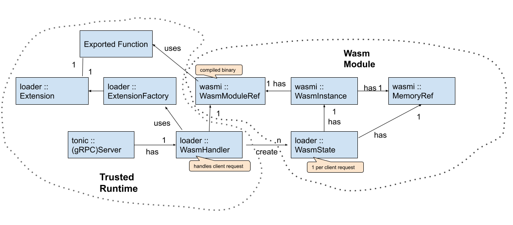

# Oak Functions Loader

The _Oak Functions loader_ is responsible for starting the Oak Functions trusted
runtime, and loading an application with a single Wasm module as the workload.
The trusted runtime instantiates the given Wasm module for each incoming user
request, runs the request through it in order to produce a response, and then
terminates the Wasm instance; each Wasm instance is short lived and cannot
persist state outside of the request lifetime.

## ABI Functions and the Rust SDK

WebAssembly is very restricted. In order to be able to implement meaningful
applications in a secure way, the trusted runtime provides a limited number of
ABI functions to the Wasm module. The ABI functions allow reading the incoming
request, writing the response, writing log messages, and fetching items from an
in-memory storage. In addition, there are experimental features for publishing
metrics, and machine-learning inference using a TensorFlow model. The full
description of the ABI functions can be found
[here](https://github.com/project-oak/oak/blob/main/docs/oak_functions_abi.md).

A Rust SDK is currently available, and support for other languages may be added
in the future.

## Read-Only Storage

The Oak Functions trusted runtime does not allow the Wasm module to directly
interact with any external resources. However, each Wasm module may have
read-only access to an in-memory storage that is populated with data from an
external data source at startup time. The external data source is specified in
the server configuration file as a URL or a local file path. It is also possible
to specify a refresh interval. This allows the Oak Functions trusted runtime to
periodically refresh the data in the storage, by re-downloading the entirety of
the data from the provided URL or local file path.

The storage is implemented as an in-memory key-value store (in practice a
hashmap), of which there is one instance per Oak Functions trusted runtime
instance, which is shared across invocations of the Wasm module. The property
that this offers is that queries are not observable (e.g. not logged) outside of
the Oak Functions trusted runtime, since they happen within the same process,
which is contained within a single TEE instance.

Oak Functions provides a
[lookup API](https://github.com/project-oak/oak/blob/main/docs/oak_functions_abi.md#storage_get_item)
that the Wasm module can use to look up data from the in-memory storage.

## Policies

The server configuration specifies a policy with fields for various
privacy-related parameters. Currently these parameters specify a fixed size for
responses returned by the trusted runtime, and a fixed processing time. The
policy is used to avoid side channel leaks (e.g., an outside attacker observing
the processing time of a request). The Oak Functions trusted runtime guarantees
that processing every request takes approximately the specified amount of time
and results in a response of exactly the specified size. If processing an
incoming request completes before the specified time in the policy, the response
will not be sent back until the time is elapsed. On the other hand, if
processing the request does not finish within this deadline, the trusted runtime
terminates the process early and responds with an error. Note that we can only
guarantee an approximation of the specified processing time, because the actual
processing time is affected by factors beyond the specific Wasm logic invoked by
the incoming request. These factors include the general server’s state, and how
busy it is overall. Therefore the variation in the actual processing time is in
fact random noise and cannot be used to leak information about the request via
the specific Wasm logic it invoked.

The configuration may in addition specify parameters related to differentially
private metrics, if that feature is enabled. These parameters include a list of
events, a batch size and an epsilon parameter for computing a Laplacian noise.
If metrics are enabled, the trusted runtime collects event counts for events
specified in the configuration, and aggregates them after the batch size is
reached. A laplacian noise, calculated using the specified epsilon parameter, is
then added to the aggregated value, to conform to the differential privacy
requirements, before publishing the results by logging to stdout.

## Relationship between types in Oak Functions Loader

<!-- From: -->
<!-- https://docs.google.com/drawings/d/1hOGbe0cHCDfpDjqAhMrqd1dkz4gxcT8Pzm9VxQtPmKA/edit -->

