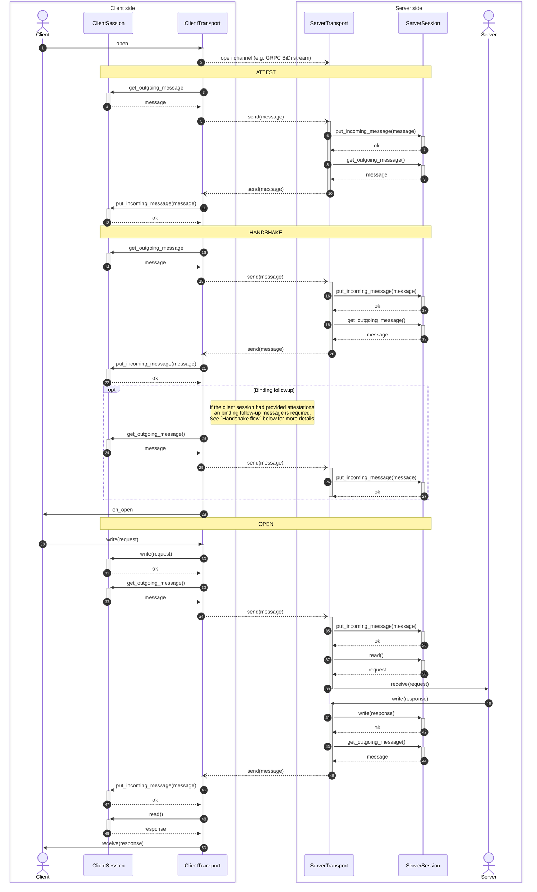
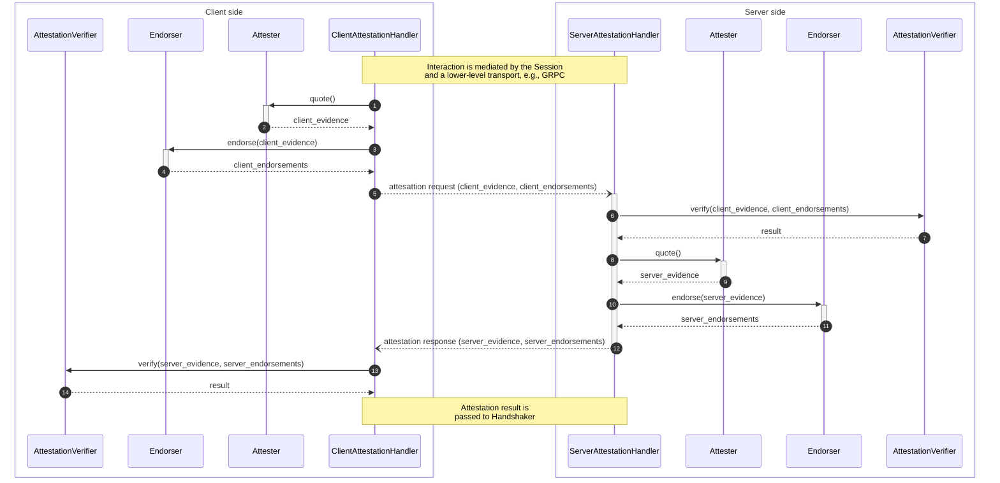
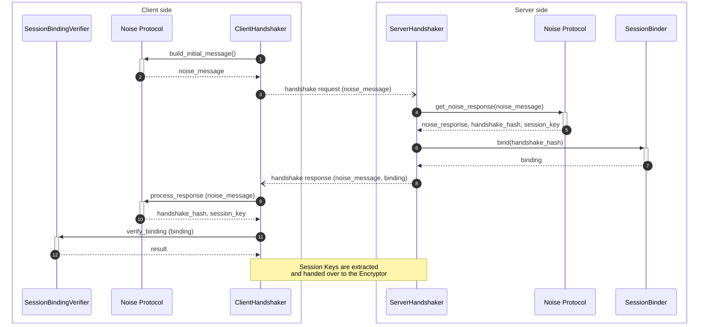
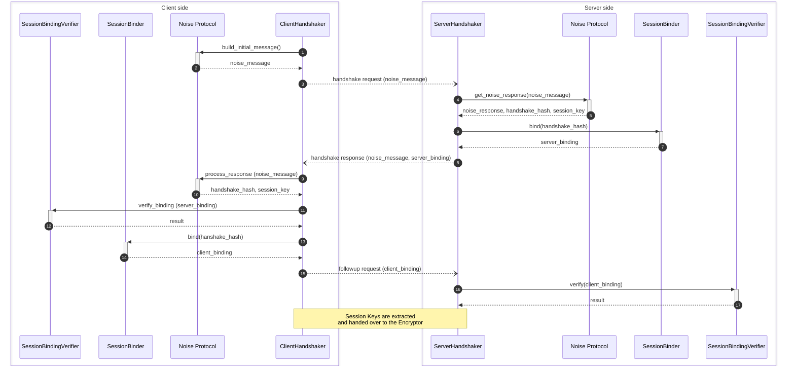

<!-- Oak Logo Start -->
<!-- An HTML element is intentionally used since GitHub recommends this approach to handle different images in dark/light modes. Ref: https://docs.github.com/en/get-started/writing-on-github/getting-started-with-writing-and-formatting-on-github/basic-writing-and-formatting-syntax#specifying-the-theme-an-image-is-shown-to -->
<!-- markdownlint-disable-next-line MD033 -->
<h1><picture><source media="(prefers-color-scheme: dark)" srcset="/docs/oak-logo/svgs/oak-containers-negative-colour.svg?sanitize=true"><source media="(prefers-color-scheme: light)" srcset="/docs/oak-logo/svgs/oak-containers.svg?sanitize=true"></picture></h1>

<!-- Oak Logo End -->

# Encrypted Session SDK

This library provides an implementation of Oak end-to-end encrypted attested
session between the communicating parties, e.g., between Oak enclaves and user
devices or other Oak enclaves. This session is implemented using the
[Noise Protocol Framework](https://noiseprotocol.org/noise.html) in combination
with remote attestation. It offers features such as bidirectional attestation,
streaming sessions, and endorsement/evidence client-side caching.

## Key Features

- **Attestation Verification:** The library allows validating the attestation
  evidence signed by the hardware to ensure the authenticity and integrity of
  the peer execution environment. Additionally the attestation verification
  library provides the ability to rely on an attestation verification service
  that acts as a certificate authority.
- **Noise Handshake:** We rely on the Noise protocol framework to perform the
  handshake and establish a secure communication channel between parties. A
  number of [Noise Patterns](https://noiseexplorer.com/patterns/) are supported.
- **Attestation-to-Handshake Binding:** Each party signs the handshake
  transcript hash with the application keyset to bind the attestation to the
  session.
- **Support for unreliable transport:** The implementation can be adapted to
  handle unreliable connections (e.g., UDP) by incorporating sequence numbers,
  nonce customization, and message duplication prevention mechanisms.

## Design

The SDK comprises two interacting parties: the Client (initiator) and the Server
(responder). The core component is a `Session` object that manages the handshake
process and facilitates message encryption/decryption upon successful handshake
completion. The `Session` object functions as a state machine, offering `read`
and `write` functions for data messages and
`put_incoming_message`/`get_outgoing_message` functions for protocol messages
that can be passed to and from the transport layer.

The session traverses through 3 distinct lifecycle states that represent the
steps involved in the establishment of a session:

- `ATTESTATION`: Exchange of the endorsed attestation evidence and its
  verification
- `HANDSHAKE`: Noise Protocol handshake and binding of the session handshake
  transcript to the attestation evidence
- `OPEN`: Session is open for secure communication

The Session always starts in `ATTESTATION` state, progresses to `HANDSHAKE` and
finally reaches the `OPEN` state. Transition to the next state happens only
after a `put_incoming_message` or `get_outgoing_message` call.

The following sequence diagram illustrates the sequence of messages that lead to
an established session, and how the session is then used to implement a simple
request/response unary RPC. The API and interactions between actor and transport
should be considered as example placeholders for illustrative purposes. Please
refer to the documentation of your chosen transport when integrating.

### Roles

The underlying implementation of Session objects involves a number of
collaborating roles:

- [`Attester`](/oak_attestation_types/src/attester.rs): supplies attestation
  evidence.
- [`Endorser`](/oak_attestation_types/src/endorser.rs): supplies an attestation
  endorsement of the evidence provided by the `Attester`.
- [`AttestationVerifier`](/oak_attestation_verification_types/src/verifier.rs):
  consumes the attestation evidence and its endorsement verifying their
  authenticity.
- [`SessionBinder`](src/session_binding.rs): This creates a binding between the
  supplied endorsed evidence and the session using the session handshake
  transcript hash.
- [`SessionBindingVerifier`](src/session_binding.rs): The binding of the
  handshake hash is verified against the peer's own handshake hash.

The Encrypted Session SDK supports the use of multiple concurrent attestation
implementations under different `ATTESTATION_ID` keys. Each implementation is
composed of one of each `Attester`, `Endorser`, `AttestationVerifier`,
`SessionBinder` and `SessionBindingVerifier`.

### Attestation flow

During the `ATTESTATION` state , the `AttestationHandler`, obtains endorsed
evidence by calling the `Attester`/`Endorser` implementation. Conversely, it
invokes the `AttestationVerifier` validation logic for any received evidence.
When multiple attestations are provided by the peer, an additional
`AttestationAggregator` role is used to combine them into a single pass/fail
verdict.

The following diagram depicts the interaction between the two attestation
providers. The client is configured in `PeerUnidirectional` mode, and the server
is configured in `SelfUnidirectional` mode. Only one mode of attestation is
configured so there is no need for an `AttestationAggregator`.

The following diagram contains the flow for bidirectional attestation flow. In
bidirectional attestation both the client and the server produce endorsed
evidence, and they both verify their peer's. The client transmits its evidence
as part of the initial request to the server. The server only replies with its
own evidence if it is able to verify the client attestation.

### Handshake flow

During the `HANDSHAKE` state, the `Handshaker` initiates the Noise session
proper. It uses the `SessionBinder` and `SessionBindingVerifier` once the
session is established to create and verify the other end's bindings.

The binding of the session has been merged with the Noise handshake flow to
avoid one extra message in the case of attested servers. In the case of attested
clients, the client has to send one extra "follow-up message" after the
handshake proper, with the session bindings.

The following diagram shows the handshake sequence. The client is configured in
`PeerUnidirectional` mode, and the server is configured in `SelfUnidirectional`
mode. Only one mode of attestation is configured.

The following diagram contains the flow for bidirectional attestation. In
bidirectional attestation both the client and the server produce bindings, and
the client has to send one more response to the server with its bindings.

### Encryption flow

Finally, once the session is in `OPEN` state, the `Encryptor` consumes the
session key obtained by the `Handshaker`. This object handles the encryption and
decryption of application messages.

## Getting Started

To use this library, follow these steps:

- Create a `Config` object specifying the desired features of the session
  - Pick the attestation type (Unidirectional or Bidirectional)
  - Add attesters and attestation verifiers
  - Pick the desired Noise handshake pattern
- Use the configuration to create a `Session` object (`ClientSession` for the
  initiator of the connection, `ServerSession` for the responder)
- Use `get_outgoing_message` and `put_incoming_message` to exchange the attested
  evidence and handshake messages until the session becomes open
- Once `is_open` becomes true, the session is ready for use. You can use `read`
  and `write` for plaintext messages and exchange the encrypted messages
  returned by `get_outgoing_message` over the transport layer.

## Customizations

### Support for static pre-exchanged keys

If one or both parties possess a static key where the public component is known
by its peer (perhaps through the use of PKI), it is possible to use it in the
handshake by picking a Noise NK or KK scheme.

### Support for custom encryptors

The default `OrderedChannelEncryptor` includes consecutive nonces in the
encrypted messages and so protects from replay, reorder and packet drop attacks.
This presumes that the order of the messages is preserved by the communication
channel. To support use cases where this is infeasible we allow picking a
different encryptor or implementing your own. It is important in this case that
the user of the SDK implements alternative measures to protect from network
attacks.

### Support for attestation caching

While the primitives that we provide assume that attestation will be exchanged
and verified separately for each established session, it is possible to optimize
this step by implementing your own `AttestationVerifier` and, optionally,
`Attester` to cache the accepted attestation.
