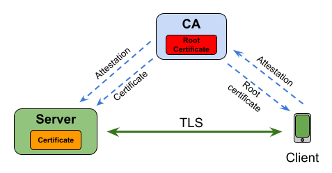
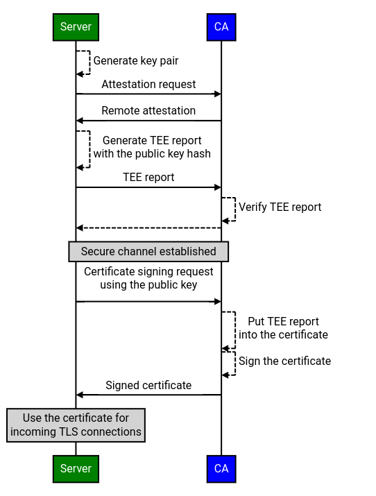
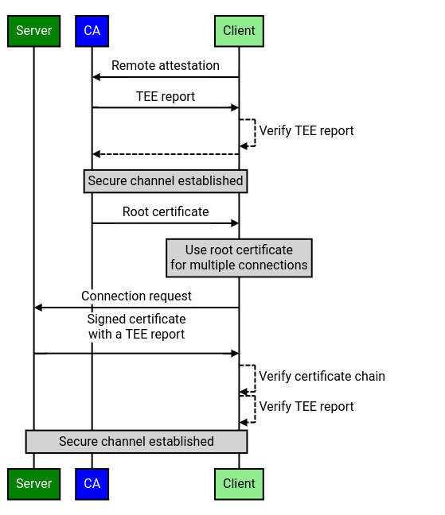

# RFC#01924: Remote Attestation via TLS (Certificate Authority)

## Objective

Remotely attest applications in Trusted Execution Environments (TEEs) over the
TLS protocol.

## Background

A lot of existing applications that would benefit from the remote attestation
use **TLS protocol** to create secure channels with their clients. But
integrating the remote attestation might bring up unnecessary complications in a
form of completely rewriting the application connection logic.

Thus, instead of refactoring existing applications and implementing a new
protocol, we propose to integrate remote attestation into TLS by
cryptographically binding **TLS certificates** to the **TEE firmware**.

## Overview

In order to allow applications to use TLS for remote attestation, we propose to
use a **Certificate Authority (CA)** that generates signed TLS certificates for
TEE applications. The main idea is that instead of attesting TEE applications
themselves, clients attest the CA, which attests TEE applications on behalf of
the clients. Clients can then download the CA’s **root certificate** and use it
for connecting to TEE applications via TLS.

<!-- From: -->
<!-- https://docs.google.com/drawings/d/1PUHf7NW3zV-zPz6zwTGUZI6wBVxy7yIfzxsbUbCw724 -->

When a TEE application starts it sends a Certificate Signing Request to the CA.
The CA remotely attests the TEE application and creates a **signed TLS
certificate** for it, which a TEE application can then use to create TLS
channels with clients. Such certificates are signed by the CA’s root
certificate.

While generating a TLS certificate, the CA embeds the **TEE report** (which is a
data structure signed by the TEE platform that contains information identifying
the code that is running inside the TEE) into it, thus binding the TLS
certificate to the TEE firmware. This way clients can check what payload is
being run inside the TEE they are connecting to.

The TEE report also contains the hash of the **TLS public key** used by the TEE
application. This cryptographically binds TLS credentials with the TEE report
and prevents an attacker from replay attacks, i.e. using the same certificate
for another TEE.

As an _optional_ feature, clients can also **remotely attest** the CA itself
before requesting its root certificate. It will create an implicit trust in the
TEE application's code, since the CA only signs certificates for TEE
applications that it attested itself.

One of the main advantages of this remote attestation approach is that clients
are able to use plain TLS for creating secure channels with TEE applications,
and at the same time trust in this application without directly attesting it.

There are several benefits from implementing _Remote Attestation via TLS_:

- **The ability to run TLS applications as is**
  - The proxy will allow clients to use TLS certificates to connect to TEE
    applications
  - Since attestation will be handled by the proxy - TEE applications could use
    legacy TLS code without the need to support remote attestation logic
- **Support multiple TEEs**
  - Proxy could be dedicated to a specific TEE instance such as Intel SGX ECDSA,
    AMD SEV-SNP, ARM Trustzone etc.
    - It means that the client code wouldn’t need to support multiple
      attestation protocols
  - TEE applications will still be able to run on various TEE machines, since
    the attestation logic is implemented by the proxy

## Attestation

This section presents a high-level attestation workflow overview. The workflow
of the remote attestation involves 4 interacting entities:

- **Certificate Authority (CA)**
  - Remotely attests TEE applications
  - Can be remotely attested by clients
  - Creates signed certificates for TEE applications
  - Distributes its root certificate among the clients
  - [_Optional_] Can run inside the TEE environment
- **Server**
  - TEE application that processes requests from TLS clients
  - Runs inside the TEE environment
- **Client**
  - Client application that connects to applications using TLS
  - Runs on a user device or inside of a browser
- **Provider**
  - TEE platform provider that can confirm authenticity of TEE platform keys
  - It’s important to note that the Provider is an external server (i.e. belongs
    to AMD)

It is assumed that prior to the attestation **Server** remotely attests its TEE
platform key with the **Provider**. **Provider** sends back a signature rooted
in some well-known root key (e.g. AMD root key), thus confirming the
authenticity of TEE platform keys.

### Attestation Workflow

The detailed workflow of the remote attestation is represented by 2 stages.

First stage corresponds to the backend application attestation, which happens
only once when the backend application starts:

1. **Server** generates a TLS key pair
1. **Server** connects to the **CA**
1. **CA** attests the **Server** using a remote attestation protocol
   corresponding to the Server’s TEE
   1. When requesting a TEE report from the TEE firmware, **Server** also puts
      the hash of its TLS public key into it
   1. For example, remote attestation could be done via
      [#1929](https://github.com/project-oak/oak/pull/1929)
1. **Server** sends **CA** a certificate signing request
   1. Communication happens over a secure channel created as part of the remote
      attestation
1. **CA** creates a signed certificate and sends it back to the **Server**
   1. The certificate contains **Server**'s TEE report

<!-- From: -->
<!-- https://sequencediagram.googleplex.com/view/6235412701904896 -->

Second stage corresponds to the client connection:

1. [_Optional_] **Client** remotely attests the **CA**
1. **CA** sends **Client** its root certificate
   1. **Client** trusts that this is a correct certificate, since it was sent
      via a secure channel created during the attestation process
   1. **Client** needs to request the root certificate only once at startup, and
      then the client can use it for all **Server** connections
1. **Client** connects to the **Server** using TLS
1. **Server** sends **Client** a TLS certificate previously signed by **CA**

1. **Client** checks the validity of the **Server**’s TLS certificate
   1. **Client** verifies that the TLS certificate provided by the **Server**
      was signed by the **CA**’s root certificate
   1. **Client** also checks the TEE report provided in the **Server**’s TLS
      certificate
      1. It checks that the TEE report was generated using the genuine TEE
         firmware key
      1. It checks that the TEE report contains the hash of the **Server**’s
         public key
   1. If the **Server**’s TLS certificate is not valid, then the **Client**
      closes the connection and aborts the protocol
1. Since **Client** trusts **CA** (and has its root certificate) it can now
   trust **Server** and establish a secure connection

<!-- From: -->
<!-- https://sequencediagram.googleplex.com/view/6490702202535936 -->

Several important notes:

- Client needs to **trust** in the CA and Server implementation correctness:
  - Main requirements are:
    - CA should correctly attest the Server and sign right certificates
    - Server shouldn’t leak its TLS keys
  - Client can gain trust by accessing the code of the CA and the Server, and
    also by **reproducibly building** binaries on their machine
    - Though it could be done by a third party reviewer that the Client can
      trust
- Client only needs to **attest the CA once** and then use its root certificate
  for multiple connections to any Server
- Remote attestation logic on Servers can be implemented as a **separate
  binary**, that attests to the CA, receives a signed certificate and puts it as
  an input to the TEE application
  - It means that TEE applications can use TLS and **don’t need to support
    remote attestation** themselves
