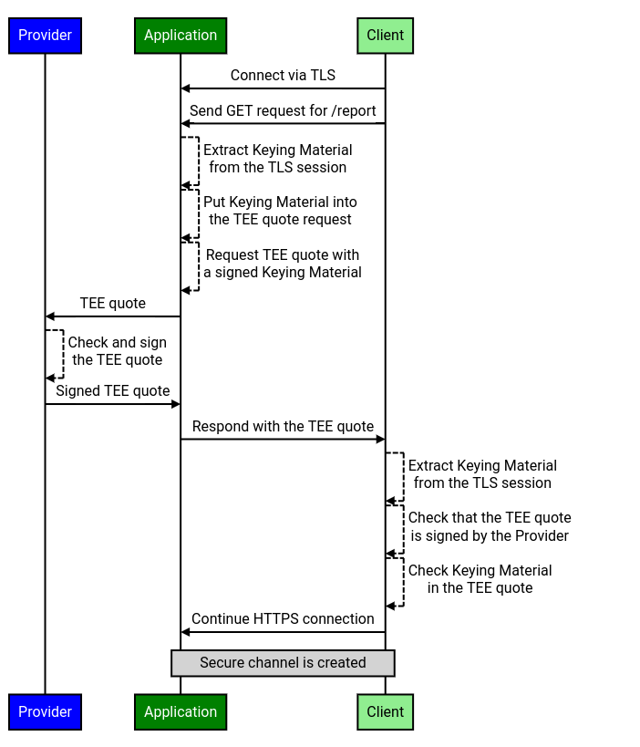

# RFC#01929: Remote Attestation via TLS

## Objective

Remotely attest applications in Trusted Execution Environments (TEEs) over the
TLS protocol.

## Background

A lot of existing applications that would benefit from the remote attestation
use **TLS protocol** to create secure channels with their clients. But
integrating the remote attestation might bring up unnecessary complications in a
form of completely rewriting the application connection logic.

Thus, instead of refactoring existing applications and implementing a new
protocol, we propose to integrate remote attestation into TLS by
cryptographically binding **TLS sessions** to the TEE platform.

## Overview

In order to allow applications to use TLS for remote attestation, we propose to
cryptographically bind assertions to a TLS session, by deriving
[Exported Keying Material](https://tools.ietf.org/html/rfc5705) from an already
established TLS session and producing an assertion based on it, e.g. signing it
with a TEE platform key.

Exported Keying Material is a **pseudo-random string** that may be uniquely
derived for an individual TLS session. It is derived from the TLS session master
secret, and thus can be derived by both participants of the TLS session (and no
other party if [Perfect Forward Secrecy](#parameters) is guaranteed). Exported
Keying Material can be derived at the application level once the TLS session has
been established.

We propose to perform remote attestation at the application level (on top of an
already established and verified TLS session) by deriving Exported Keying
Material and putting it into the TEE report request as custom data (e.g.
`REPORT_DATA` field in an
[SEV-SNP report](https://www.amd.com/system/files/TechDocs/56860.pdf#page=39)).
This assures that Exported Keying Material is signed by the TEE platform. By
sending the TEE report over the TLS session, we cryptographically bind the
session to the TEE platform.

## Attestation

Since Exported Keying Material is derived from the TLS master secret, that is
shared by both participants of the TLS session, this scheme supports
**bi-directional remote attestation**. Which means that both client and server
can run inside the TEE environment and remotely attest each other. Remote
attestation is performed by checking that:

- TEE reports were generated by valid TEE platform
- TEE reports contain correct Exported Keying Material derived from this
  particular TLS session

It’s also important to note that this scheme can work with any combination of
client and server being in a TEE or not (i.e. also supports **unidirectional
remote attestation**).

### Attestation Workflow

This section presents a high-level attestation workflow overview. The workflow
of the remote attestation involves 3 interacting entities:

- **Server**
  - Server application that processes requests from TLS clients
    - Can run inside the TEE environment
- **Client**
  - Client application that connects to applications using TLS
    - Can run inside the TEE environment
- **Provider**
  - TEE platform provider that can confirm authenticity of TEE platform keys
  - It’s important to note that the Provider is an external server (i.e. belongs
    to AMD)

It is assumed that prior to the attestation workflow both **Server** and
**Client** remotely attest their TEE platform keys with the **Provider**.
**Provider** sends back signatures rooted in some well-known root key (i.e. AMD
root key), thus confirming the authenticity of TEE platform keys.

Another important note is that the current version of the attestation protocol
prohibits
[TLS session resumption](https://tools.ietf.org/html/rfc8446#section-2.2),
because the attestation takes place on the application level and it would need
to be redone once the TLS session is resumed.

#### Token Derivation

Exported Keying Material is derived using
[HKDF](https://tools.ietf.org/html/rfc8446#section-7.5) from the TLS session
master secret and a set of parameters:

- _Label_
  - Label is required to disambiguate different applications that use the same
    Exported Keying Material mechanism
- _Context_
  - Allows the application to mix its own data the pseudo-randomly generated
    Exported Keying Material
- _Length_
  - Bit length of the generated value

It’s important to note that with a fixed set of parameters Exported Keying
Material value for a given TLS session stays the same - i.e. it’s a
deterministic algorithm. Thus if both client and server negotiate corresponding
parameters (or they are constant), they can derive equal Exported Keying
Material values.

Prior to being used Exported Keying Material must be prefixed with the purpose
string `TLSAttestationV1`. This purpose string is used to disambiguate the
proper use of the Exported Keying Material, i.e. helps mitigate confusion where
Exported Keying Material that is generated for one purpose is misused for
another.

Exported Keying Material that was derived with a specific set of parameters and
prefixed with the purpose string will be called a **Token** throughout this
document. Such Token is derived separately with a different set of parameters
for any given [assertion](#assertions) type.

##### Parameters

Because Token derivation involves a TLS session master secret, TLS server should
guarantee
[Perfect Forward Secrecy](https://link.springer.com/content/pdf/10.1007/3-540-46885-4_5.pdf#page=7),
which is defined as follows:

| TLS master key will not be compromised even if long-term secrets used in its exchange are compromised |
| ----------------------------------------------------------------------------------------------------- |

This means that if Token parameters are leaked, an attacker would still need the
TLS session master secret, so they won’t be able to reconstruct the Token.

In order to guarantee _Perfect Forward Secrecy_ the server needs to
[[RFC8446](https://tools.ietf.org/html/rfc8446#section-2.2)]:

- Use at least [TLS 1.3](https://tools.ietf.org/html/rfc8446)
- Use one of the following
  [`supported_groups`](https://tools.ietf.org/html/rfc8446#section-4.2.7) for
  key exchange:
  - [Ephemeral Diffie-Hellman (DHE)](https://tools.ietf.org/html/rfc8446#section-7.4.1)
  - [Ephemeral Elliptic Curve Diffie-Hellman (ECDHE)](https://tools.ietf.org/html/rfc8446#section-7.4.2)

###### Label

The **Label** value is needed to distinguish between application level protocols
that rely on Exported Keying Material. Currently we are using the following
Label values:

- `EXPERIMENTAL Google Confidential Computing Client Attestation 1.0`
- `EXPERIMENTAL Google Confidential Computing Server Attestation 1.0`

The main parts of the Label value include:

- `EXPERIMENTAL` prefix
  - Required by [RFC5705](https://tools.ietf.org/html/rfc5705#section-4) to
    avoid possible collisions with existing
    [IANA](https://tools.ietf.org/html/rfc5226)-registered labels
- `Client`/`Server`
  - Separate Label values for clients and servers are necessary to prevent
    ambiguity and confusion about Label usage
- Version
  - Necessary to allow protocol upgrades in the future

##### Context

**Context** is a parameter used to derive separate Tokens for different
[assertion](#assertions) types provided by the firmware. Context value is equal
to the assertion type, for which a Token is derived.

##### Length

Currently the Exported Keying Material **Length** is set to `16` bytes, similar
to the Security Strength for _AES-128_ as defined by
[NIST](https://www.keylength.com/en/4/).

#### Assertions

As defined by the
[Enclave Key Exchange Protocol (EKEP)](https://asylo.dev/docs/concepts/ekep.html#assertion):

| An assertion is a cryptographically verifiable statement of an identity; an identity corresponding to a given assertion is said to be asserted by that assertion |
| ---------------------------------------------------------------------------------------------------------------------------------------------------------------- |

The protocol supports multiple assertion types (e.g. Intel SGX ECDSA, AMD
SEV-SNP, public key), each having a type uniquely identified by a string.

#### Initial Handshake

Since applications can run on various platforms, both client and server need to
negotiate a list of assertions types they can provide and will accept. The
negotiation is performed at the application level prior to remote attestation
and looks as follows:

1. **Client** sends to the **Server** a list of
   [assertions](https://asylo.dev/docs/concepts/ekep.html#client_precommit-message)
   types it will accept
1. **Server** replies with a list of
   [assertions](https://asylo.dev/docs/concepts/ekep.html#server_precommit-message)
   types it will accept

Currently we are using the following assertion types:

- `intel_sgx_ecdsa_0_1_report`
- `amd_sev_snp_0_1_report`
- `vtpm_public_key`
- `eddsa_public_key`

#### Assertion Generation

The _Generate Assertion_ procedure in the workflow is described as follows in
the case of TEE-based remote attestation:

1. Derive a **Token** from the TLS session
   1. **Token** is generated via deriving Exported Keying Material from an
      established TLS session with a specified set of parameters
1. Put the **Token** into the **TEE report** request
   1. This means that when TEE platform signs a **TEE report**, it also signs
      the provided **Token**
1. Request a **TEE report** from hardware
1. Firmware generates and signs a **TEE report**
   1. The signed **TEE report** also gives clients information about the TEE
      itself (its version and etc.) and about the code that is running inside
      the TEE
1. [_Optional_] Combine the firmware generated **TEE report** with a certificate
   signed by the **Provider**’s root key
   1. This is required for checking the validity of **TEE reports** and TEE
      platform keys that were used to sign them

Since Client and Server can exchange multiple assertions, each assertion should
contain a **Token** that was derived using a separate Context parameter.

#### Bidirectional Attestation

The bidirectional workflow of the remote attestation looks as follows:

1. **Client** connects to the **Server** via TLS
   1. Server should guarantee _Perfect Forward Secrecy_
   1. Client checks that provided `supported_groups` for key exchange guarantee
      _Perfect Forward Secrecy_
1. Initial Handshake
   1. Both **Client** and **Server** negotiate assertion types they can provide
      and will accept
1. **Client** generates and sends its (possibly empty) list of assertions to the
   **Server**
1. **Server** checks the validity of the **Client** assertions
   1. It also extracts a Token from the TLS session and compares it to the Token
      from the **Client** assertions
   1. If the **Client** assertion is not valid or the Token does not match, then
      the **Server** closes the connection and aborts the protocol
1. **Server** generates and sends its (possibly empty) list of assertions to the
   **Client**
1. **Client** checks the validity of the **Server** assertions
   1. It also extracts a Token from the TLS session and compares it to the Token
      from the **Server** assertions
   1. If the **Server** assertion is not valid or the Token does not match, then
      the **Client** closes the connection and aborts the protocol
1. Secure attested channel is established

<!-- From: -->
<!-- https://sequencediagram.googleplex.com/view/4888181453357056 -->

