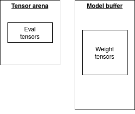
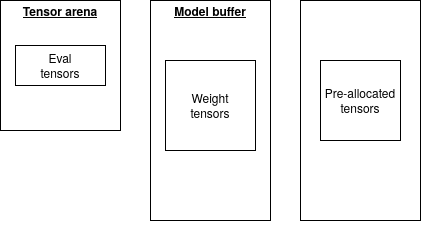
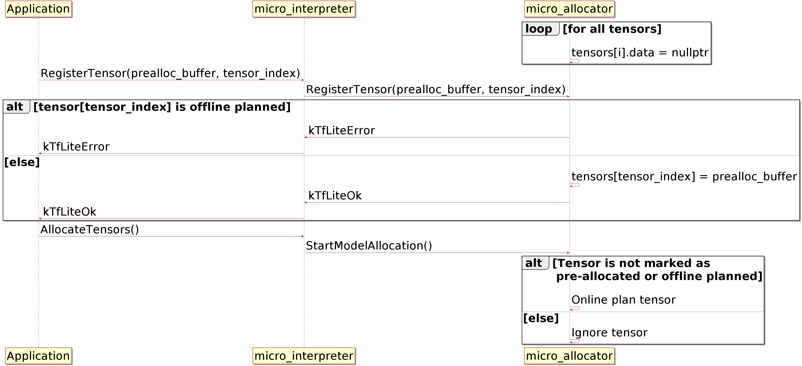

<!-- mdformat off(b/169948621#comment2) -->

<!--ts-->

*   [Pre-allocated tensors](#pre-allocated-tensors)
    *   [Background](#background)
    *   [Current status](#current-status)
    *   [Proposed implementation](#proposed-implementation)
    *   [Performance overview](#performance-overview)
        *   [Cycle aspect](#cycle-aspect)
        *   [Memory aspect](#memory-aspect)
            <!-- Semi-automated TOC generation with instructions from https://github.com/ekalinin/github-markdown-toc#auto-insert-and-update-toc -->

<!--te-->

# Pre-allocated tensors

## Background

Tensors are allocated differently depending on the type of tensor. Weight
tensors are located in the flatbuffer, which is allocated by the application
that calls TensorFlow Lite Micro. EvalTensors are allocated in the tensor arena,
either offline planned as specified in the flatbuffers metadata (described in
this
[RFC](https://docs.google.com/document/d/16aTSHL5wxsq99t6adVbBz1U3K8Y5tBDAvs16iroZDEU)),
or allocated during runtime by the
[memory planner](https://github.com/tensorflow/tflite-micro/tree/main/tensorflow/lite/micro/memory_planner)
(online planned), see
[RFC](https://docs.google.com/document/d/1akpqu0uiPQshmCrnV6dOEFgYM4tCCnI8Zce85PnjHMI).
The tensor arena is allocated by MicroAllocator in TensorFlow Lite Micro, and
the model buffer (represented by a .tflite-file) is allocated by the application
using TensorFlow Lite Micro. An illustration of this can be seen in the image
below.

Is some use cases it could be advantageous to place some of the EvalTensors
outside of the tensor arena, for example: * When sensor output data is stored in
its own defined buffer, outside the tensor arena, and therefore needs to be
copied into the tensor arena before inference. * When the tensor is to be
consumed from a memory location outside the tensor arena, e.g. a separate memory
bank DSP. \
Details regarding the impact on the number of clock cycles and memory
consumption can be found under “Performance overview”. In this RFC we present an
option to allow an application to provide pre-allocated buffers to TensorFlow
Lite Micro for selected tensors. An illustration of the resulting memory layout
with pre-allocated tensors can be seen in the figure below.

## Current status

The purpose of pre-allocating tensors is to reduce the number of clock cycles,
and our initial motivation for this feature was that avoiding the copying of the
buffer described in the Background section would reduce the number of cycles
consumed by the application.

Our second motivation was that by using a buffer outside of the memory arena,
there was an opportunity to significantly reduce the required size of the memory
arena.

An initial investigation into these matters, using the person detection model as
an example, indicates that the performance gain might not be very significant in
many use cases. The reduction in the number of clock cycles looks to be ~1%.
Details regarding this can be found in the Performance overview section.

The reduction in the size of the memory arena is not straightforward to
estimate. As described in the Performance overview section, it depends on the
size of other tensors in the network. In the worst case scenario it might not
reduce the memory arena size at all. If the pre allocated buffer is much larger
than the second largest buffer, then the reduction in size may be significant.

Therefore, our current position is that the performance gain expected from pre
allocating the tensors does not motivate the increased complexity that this
feature would introduce to the TensorFlow Lite Micro framework.

## Proposed implementation

MicroAllocator initializes all tensors to nullptr, and during the allocation
process only allocates the tensors whose data field is nullptr. The application
tells the MicroInterpreter which tensor is preallocated, and supplies a memory
buffer using the RegisterPreallocatedTensor() function.

The MicroInterpreter then assigns the pre-allocated buffer to the tensor
data-field. If the tensor in question is marked as offline planned, as described
in this [RFC](https://docs.google.com/document/d/16aTSHL5wxsq99t6adVbBz1U3K8Y5tBDAvs16iroZDEU),
the MicroInterpreter should not pre-allocated it, and instead return an error.

If multiple tensors are to be pre-allocated, multiple calls to
RegisterPreallocatedTensor() are required. An example can be seen in the MSC
below.

## Performance overview

### Cycle aspect

In this section we try to estimate the number of clock cycles one memcpy() takes
in relation to the total inference time for the person_detection model. The
reason for looking closer at this model is that it has a relatively large input
data size, which should make the cycle consumption of a memcpy() relatively
large. Please note that these numbers are approximate and based on calculations,
not actual benchmarking numbers.

A word aligned memcpy() consumes somewhere between 1 - 4 bytes per cycle
depending on which CPU is used. The input size for the person_detection model
is 96x96 = 9216 bytes. On a reference system without accelerators one memcpy()
of 9216 bytes corresponds to, in order of magnitudes, ~0.01% of the total amount
of clock cycles for one inference. The ratio will differ depending on the input
size and the number of inferences/second.

When using an accelerator, the total inference time will be significantly less
which means that the memcpy()-call will consume a larger part of the total
inference time. Approximations show that one memcpy() of 9216 bytes will consume
~1% of the total execution time for a reference system utilizing an ML HW
accelerator.

### Memory aspect

In this section we'll look at memory savings aspects of pre-allocating tensors
outside the tensor arena. The default memory planner in TFLu is
[GreedyPlanner](https://github.com/tensorflow/tflite-micro/blob/main/tensorflow/lite/micro/memory_planner/greedy_memory_planner.h)
(see
[RFC](https://docs.google.com/document/d/1akpqu0uiPQshmCrnV6dOEFgYM4tCCnI8Zce85PnjHMI)).
One good tool for understanding tensor layout in the tensor arena is using
[PrintMemoryPlan API](https://github.com/tensorflow/tflite-micro/blob/73c5fa4d2bfbfd974552957818de2ab18ff42f39/tensorflow/lite/micro/memory_planner/greedy_memory_planner.h#L84).
If we print the calculated memory layout for the
[person detection model](https://storage.googleapis.com/download.tensorflow.org/data/tf_lite_micro_person_data_int8_grayscale_2020_06_23.zip),
the tensor arena looks like this at each layer:

`Layer 1:
00000000000000000000000000tttttttttttttt........................................
Layer 2:
00000000000000000000000000...........................999999999999999999999999999
Layer 3:
aaaaaaaaaaaaaaaaaaaaaaaaaaaaaaaaaaaaaaaaaaaaaaaaaaaaa999999999999999999999999999
Layer 4:
aaaaaaaaaaaaaaaaaaaaaaaaaaaaaaaaaaaaaaaaaaaaaaaaaaaaabbbbbbbbbbbbb..............
Layer 5:
cccccccccccccccccccccccccc...........................bbbbbbbbbbbbb..............
Layer 6:
ccccccccccccccccccccccccccddddddddddddddddddddddddddd...........................`

The horizontal axis shows offset from the start of the tensor arena. The
vertical axis shows execution order. The dots are "unused" memory for that
specific layer. The letters and numbers represent the EvalTensor index, mapped
to 0-9, then a-z. 't' is the input tensor of layer 1 (equivalent to the input
data to the model) and '0' is the output tensor of layer 1. Hence, '0' is also
the input tensor to layer 2, and '9' is the output tensor of layer 2. And so on.

The reason for showing this illustration is that it becomes obvious that it is
**the largest combination of simultaneously used tensors, of your model, that
defines how large the tensor arena needs to be.** In this example, it's Layer 3.

The combined size of tensors 'a' and '9' defines the size needed for the tensors
arena. As a consequence, to save tensor arena memory by pre-allocation, we must
start by pre-allocating tensor 'a' or '9' outside the arena. This will make the
total size of the tensor arena smaller, which will reduce the total memory
footprint of TensorFlow Lite Micro if the pre-allocated tensor is already
allocated outside of the memory arena, like in the examples given in the
Background section.
