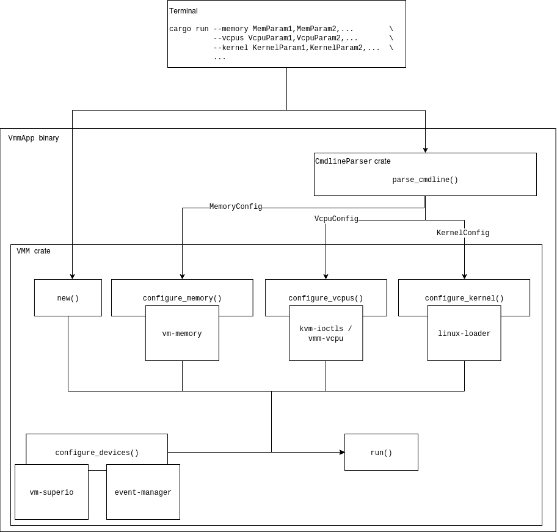
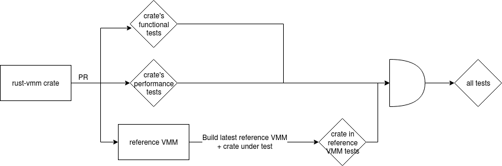

# `rust-vmm` reference VMM Design

## Scope

The reference VMM will not provide any runtime configuration changes to the VM,
the full VM configuration has to be supplied when the VM is started. The simple
command line frontend is oneshot: all the configurations are specified at once,
and the VMM starts with them. To alter its structure, the VMM process must be
killed and re-run with the modified parameters. The core of the reference VMM
is the `vmm` crate, which encapsulates and binds together all the other
functionality-providing crates; the user-facing component is minimalistic and
meant to be discarded when the VMM is forked for new usage, in order for the
user to provide an UI suitable to their needs.

The first iteration of the reference VMM contains a subset of the crates
available in `rust-vmm`:
[`kvm-ioctls`](https://crates.io/crates/kvm-ioctls),
[`kvm-bindings`](https://crates.io/crates/kvm-bindings),
[`vm-memory`](https://crates.io/crates/vm-memory),
[`linux-loader`](https://crates.io/crates/linux-loader),
[`event-manager`](https://crates.io/crates/event-manager),
[`vm-superio`](https://crates.io/crates/vm-superio) and
[`vmm-sys-util`](https://crates.io/crates/vmm-sys-util). Only the serial
console device is supported. The current iteration is adding virtio devices
and vCPU abstractions.

Complex functionalities that require ongoing user interaction with the VMM are
not currently supported. Such functionalities include but are not limited to:
device hotplug, VM pause/resume, snapshotting, migration. Next step is adding
the VM pause/resume support, see
[tracking issue](https://github.com/rust-vmm/vmm-reference/issues/58). As the
necessary building blocks emerge in `rust-vmm`, integration in the `vmm` crate
will not pose a large effort, but the frontend / app will require extensive
modifications, see
[tracking issue](https://github.com/rust-vmm/vmm-reference/issues/55).

## Overview

The reference VMM is composed of 2 major crates packaged in a binary
application: the `vmm` and a oneshot CLI that invokes it. The `vmm` crate
exports an object (`struct Vmm`) that encapsulates all the
functionality-providing `rust-vmm` crates, as dependencies.

Users of the reference VMM can replace the builtin command line parser with
frontends of their own, as long as they are passing a `VMMConfig` object to
the `vmm` crate (object that will store specialized `*Config` objects, e.g.
`struct MemoryConfig` for guest memory configurations, etc.). Alternatively,
users can disregard the `vmm` crate altogether and build their own, referring
to it only for guidelines.



## The `vmm` crate

The `vmm` crate defines and exports a `struct Vmm` that can be instantiated,
configured with all the supported `rust-vmm` building blocks, and run. The
crate consumes its `rust-vmm` dependencies either from
[crates.io](http://crates.io/) or directly from their GitHub repositories, when
they’re sufficiently mature for usage but not yet published. The code compiles
into a single binary, at least until the point in which certain crates (or
features thereof) become mutually incompatible. Should this need arise, we will
combine compatible configurations into multiple VMMs.

### Functionalities

Currently, the only available devices are the serial console, and a single
block device, that is used as the root filesystem. Therefore, the reference
VMM can boot a simple Linux kernel either with a baked-in `initramfs` (no
block device configured) or with a separate rootfs.
`*Config` structs passed by the UI are cached in a `VmmConfig` struct until
`VMM::try_from()`, when the VMM is instantiated and the configurations are
turned into live objects.

The steps to running a guest, presuming the configurations are parsed and
stored, are as follows:

1. Set up KVM. This is done through `kvm-ioctls`. It creates the KVM virtual
   machine in the host kernel.
1. Configure guest memory. This is done through the `vm-memory` crate. This
   creates and registers the guest memory with KVM.
    1. Requirements: KVM set up
    1. Inputs
        1. guest memory size
1. Create event manager for device events. This is done through `event-manager`.
1. Configure the vCPUs. This is done through `vm-vcpu` crate, which for now is a
   local crate, but once the interfaces there get stabilized, they will be
   upstreamed in [`vmm-vcpu`](https://github.com/rust-vmm/vmm-vcpu).
    1. Requirements: KVM is configured, guest memory is configured
    1. Inputs: vCPU registry values - hardcoded / embedded in VMM for the same
       reasons as boot parameters.
    1. Breakdown (`x86_64`):
        1. Configure MPTables. These
           [tables](https://pdos.csail.mit.edu/6.828/2014/readings/ia32/MPspec.pdf)
           tell the guest OS what the multiprocessor configuration looks like,
           and are required even with a single vCPU.
        1. Create KVM `irqchip`. This creates the virtual IOAPIC and virtual
           PIC and sets up future vCPUs for local APIC.
        1. Create vCPUs. An `fd` is registered with KVM for each vCPU.
        1. Configure CPUID. Required (at least) because it’s the means by which
           the guest finds out it’s virtualized.
        1. Configure MSRs (model specific registers). These registers control
           (among others) the processor features. See the
           [reference](https://www.intel.co.uk/content/dam/www/public/us/en/documents/manuals/64-ia-32-architectures-software-developer-system-programming-manual-325384.pdf#G14.8720).
        1. Configure other registers (`kvm_regs`, `kvm_sregs`, `fpu`) and the
           LAPICs.
1. Configure legacy devices. This is done partially through `kvm-ioctls`,
   partially (serial console emulation) through `vm-superio`. Device event
   handling is mediated with `event-manager`.
    1. Requirements: KVM is configured, guest memory is configured, `irqchip`
       is configured (`x86_64`), event manager is configured
    1. Inputs: N/A
    1. Breakdown:
        1. Create dummy speaker. This needs to be emulated because some kernels
           access the speaker’s port, leading to continuous KVM exits for the
           otherwise unhandled device IO.
        1. Create serial console.
1. Configure root block device. This is done through `vm-virtio`. Device event
   handling is mediated with `event-manager`.
    1. Requirements: KVM is configured, guest memory is configured, `irqchip`
       is configured (`x86_64`), event manager is configured
*Note*: Virtio devices are in an early stage, and we offer support now only for
       configuring the root filesystem. We plan on adding support soon for
       network and vsock devices, and on improving the current architecture by
       having a much easier to use and modular one.
1. Load the guest kernel into guest memory. This is done through `linux-loader`.
    1. Requirements: guest memory is configured
    1. Inputs:
        1. path to kernel file
        1. start of high memory (x86_64)
        1. kernel command line
        1. boot parameters - embedded in VMM
            1. Too complex to pass through the command line / other inputs:
               these are arch-dependent structs, built with `bindgen` and
               exported by `linux-loader`, that the user fills in outside
               `linux-loader` with arch- and use case-specific values.
            1. Some can be constants and can be externally specified, unless
               they make the UI unusable. Examples: kernel loader type, kernel
               boot flags, dedicated address for the kernel command line, etc.

## User Interface

The programmatic API of the `vmm` crate consumes predefined `*Config` structures
passed on by the frontend, using the `VMMConfig` structure.

The simple command line parser creates the `*Config` objects from plaintext
parameters, in `key=value` format, delimited by commas. Alternatively, we can
explore a `serde`-compatible format, as long as it does not warrant significant
effort.

```bash
vmm-reference                                                           \
    --memory size_mib=1024                                          \
    --vcpu num=1                                                 \
    --kernel path=/path/to/vmlinux,kernel_load_addr=1024,cmdline="pci=off"   \
    [--block <blkdev_config> - TBD]
    [--net <netdev_config> - TBD]
```

The command line parser is throw-away in the process of users building a new
VMM using the reference VMM as example. It is not considered stable, should
never be used in production, and will not be maintained at the same grade as
the VMM itself. 

As new features are developed in `rust-vmm`, demanding runtime interactions
with the guest (e.g. pause/resume), we will evaluate moving the command line
parser to a separate thread, or other alternatives for an interactive UI.

## Platform support

### Host OS & hypervisor

`rust-vmm` is ultimately meant to be usable across a wide range of host OSes
and hypervisors, with several of the crates already supporting Windows.
Long-term, the reference VMM should support the intersection of all its crates’
supported platforms. Currently, this intersection resolves into Linux hosts
and the KVM hypervisor. The first iteration of the reference VMM supports
only this configuration, returning errors when users attempt to run it on
something else.

### CPU

Long term, the reference VMM will run on `x86_64` and `aarch64` platforms; to
begin with, only Intel `x86_64` CPUs are supported, as there is no support
for a PIO serial console on `aarch64`, and the virtio interfaces are at an
early stage.

### Rust features

The reference VMM will be compiled with all its crates’ features (at least,
while they’re compatible with each other), and will be able to showcase usage
with all of them in turn. Code-wise, there is only one `vmm` crate, which
activates all its dependencies’ features through its TOML. The integration
tests, documentation and examples will demonstrate the various features’
functionalities. Examples of such features are: driving the event manager from
the same thread or a new one, loading ELF and `bzImage` kernels.

To exemplify this: the same reference VMM binary can boot an ELF or a `bzImage`
kernel, with no need to recompile it. Users control what it will boot, through
the specified parameters (the user supplies the kernel image).

### Toolchain

The reference VMM will support both `glibc` and `musl libc` (toolchains:
`x86_64-unknown-linux-gnu`, `x86_64-unknown-linux-musl`) with `glibc` being the
default due to `x86_64-unknown-linux-gnu` being
[Tier 1 supported](https://doc.rust-lang.org/nightly/rustc/platform-support.html#tier-1)
by Rust. Future extensions to `aarch64` support will introduce the
`aarch64-unknown-linux-gnu` and `aarch64-unknown-linux-musl` toolchains,
defaulting (probably) to `aarch64-unknown-linux-gnu` on ARM, because it's also
*Tier 1 supported* since Rust 1.49.

## Testing

The reference VMM runs a minimal battery of unit and integration tests with
every pull request in its repository, leveraging the infrastructure in
`rust-vmm-ci`.
The python integration tests build the VMM with all its dependencies and all
their features compiled-in and boot a guest for several configurations that
make sense (as opposed to, for instance, one configuration with all the
possible devices).

As the command line parser is throw-away in the process of users building a new
VMM using the reference VMM as example, we will not focus testing on it. Its
functionalities are covered by unit tests that exercise the parsing
utilities, and by the end-to-end integration tests that exercise
`cargo run --<params>`. The core component is the `vmm` crate, tested with
native Rust code through
[Rust integration tests](https://doc.rust-lang.org/rust-by-example/testing/integration_testing.html).
Each test spawns a VMM in a child process (to ensure proper cleanup of KVM
resources) and demonstrates that the guest is viable. As devices are added, we
will expand the guest `init`s to run minimal workloads, monitoring the outputs
generated by the devices (metrics included).

Each `rust-vmm` crate is responsible to measure, evaluate, and optimize its
performance in an isolated environment. Putting the pieces together, however,
can bring up unexpected issues that don’t manifest in isolation; therefore,
each crate included in the reference VMM will be tested in a dedicated test
battery that introduces the WIP version (either the `HEAD` in a pull request,
or the upstream one in nightly test runs) in the latest reference VMM
(considered stable). These tests will not block the PR in the crate if they
fail - for instance, the process of changing a crate’s interfaces is expected
to break the reference VMM until it’s updated.


